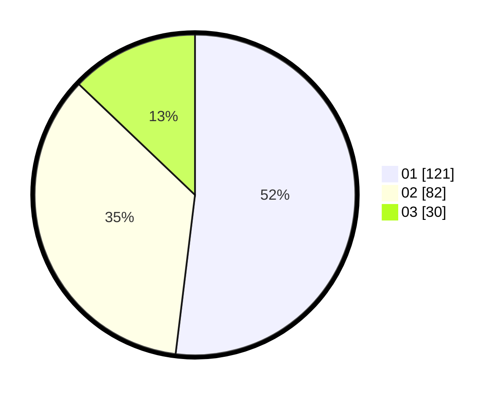

# Hasil

Hasil perolehan suara paslon dapat dilihat pada file paslon-01.txt, paslon-02.txt, dan paslon-03.txt.

Jika tidak ada, artinya data tersebut belum ada pada SIREKAP.

## Perolehan Suara

 * Paslon 01: **121**.
 * Paslon 02: **82**.
 * Paslon 03: **30**.

## Foto C Plano

https://sirekap-obj-formc.kpu.go.id/3093/pemilu/ppwp/31/75/10/10/08/3175101008006-20240214-155109--4a7b03f4-ce92-4636-9884-19b3958495ed.jpg

https://sirekap-obj-formc.kpu.go.id/3093/pemilu/ppwp/31/75/10/10/08/3175101008006-20240214-155410--d4567253-b5b8-41b6-8599-7707d69200d8.jpg

https://sirekap-obj-formc.kpu.go.id/3093/pemilu/ppwp/31/75/10/10/08/3175101008006-20240214-155448--7d6d7344-6cf9-472d-8200-a7fe9510e64e.jpg

## DATA PEMILIH TETAP

Jumlah pemilih dalam DPT: **284**.
 * L: **140**.
 * P: **144**.

## DATA PENGGUNA HAK PILIH

Jumlah pengguna hak pilih dalam DPT: **284**.
 * L: **140**.
 * P: **144**.

Jumlah pengguna hak pilih dalam DPTb: **2**.
 * L: **0**.
 * P: **2**.

Jumlah pengguna hak pilih dalam DPK: **4**.
 * L: **3**.
 * P: **1**.

Jumlah pengguna hak pilih: **290**.
 * L: **143**.
 * P: **147**.

## JUMLAH SUARA SAH DAN TIDAK SAH

JUMLAH SELURUH SUARA SAH: **233**.

JUMLAH SUARA TIDAK SAH: **1**.

JUMLAH SELURUH SUARA SAH DAN SUARA TIDAK SAH: **234**.
