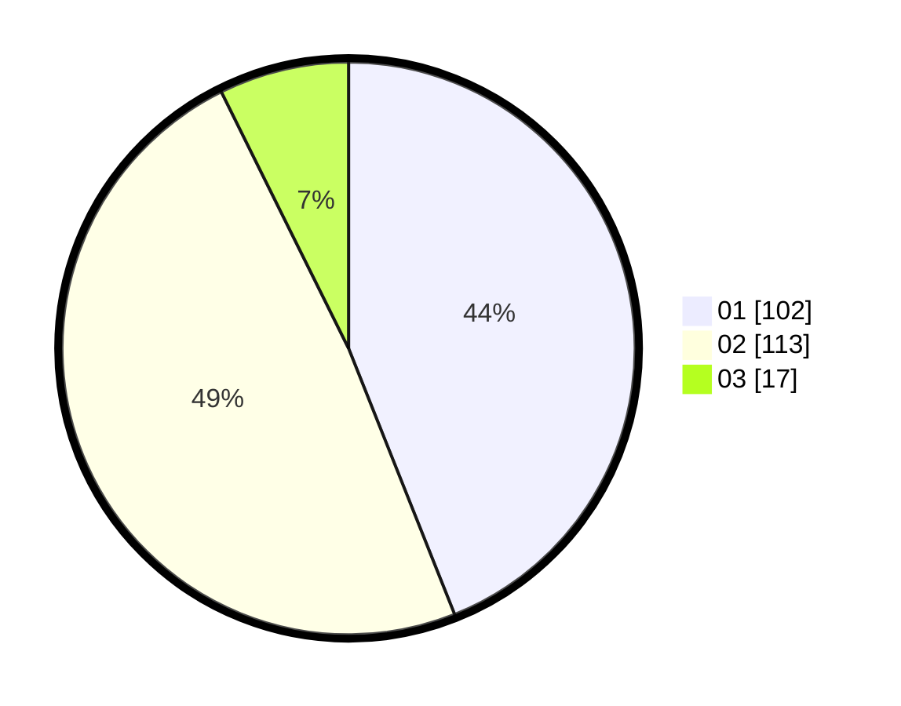

# Hasil

Hasil perolehan suara paslon dapat dilihat pada file paslon-01.txt, paslon-02.txt, dan paslon-03.txt.

Jika tidak ada, artinya data tersebut belum ada pada SIREKAP.

## Perolehan Suara

 * Paslon 01: **102**.
 * Paslon 02: **113**.
 * Paslon 03: **17**.

## Foto C Plano

https://sirekap-obj-formc.kpu.go.id/fd6b/pemilu/ppwp/31/75/10/10/08/3175101008011-20240214-231225--153b3c63-74c2-4415-b15e-5b03b7f821f3.jpg

https://sirekap-obj-formc.kpu.go.id/fd6b/pemilu/ppwp/31/75/10/10/08/3175101008011-20240214-231419--af6c50df-64fc-4821-8ecb-ad6f2d1c64bf.jpg

https://sirekap-obj-formc.kpu.go.id/fd6b/pemilu/ppwp/31/75/10/10/08/3175101008011-20240214-221844--0b9bb051-fa03-4626-8b16-b40d1327c3a0.jpg
