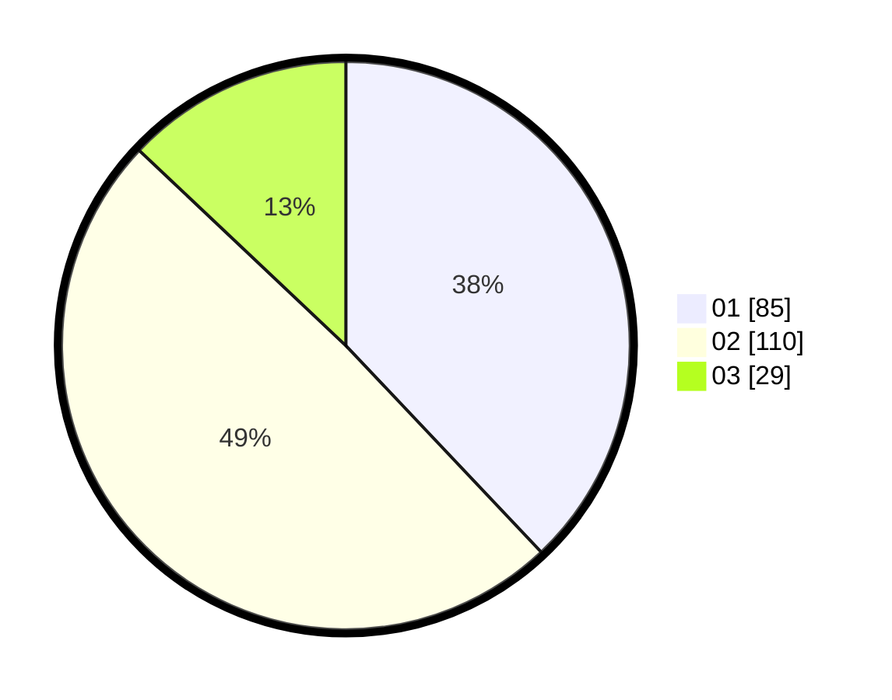

# Hasil

Hasil perolehan suara paslon dapat dilihat pada file paslon-01.txt, paslon-02.txt, dan paslon-03.txt.

Jika tidak ada, artinya data tersebut belum ada pada SIREKAP.

## Perolehan Suara

 * Paslon 01: **85**.
 * Paslon 02: **110**.
 * Paslon 03: **29**.

## Foto C Plano

https://sirekap-obj-formc.kpu.go.id/8787/pemilu/ppwp/31/75/10/10/08/3175101008015-20240214-155031--92f5c8a8-4dc7-4a7d-b1d3-3789ebeadfb9.jpg

https://sirekap-obj-formc.kpu.go.id/8787/pemilu/ppwp/31/75/10/10/08/3175101008015-20240214-155051--41c11434-d7ba-47e9-970d-4078705ab0f0.jpg

https://sirekap-obj-formc.kpu.go.id/8787/pemilu/ppwp/31/75/10/10/08/3175101008015-20240214-155113--6f9621bf-b167-4d0b-93b0-5b591bdb9acb.jpg

## DATA PEMILIH TETAP

Jumlah pemilih dalam DPT: **287**.
 * L: **140**.
 * P: **147**.

## DATA PENGGUNA HAK PILIH

Jumlah pengguna hak pilih dalam DPT: **223**.
 * L: **106**.
 * P: **117**.

Jumlah pengguna hak pilih dalam DPTb: **4**.
 * L: **3**.
 * P: **1**.

Jumlah pengguna hak pilih dalam DPK: **0**.
 * L: **0**.
 * P: **0**.

Jumlah pengguna hak pilih: **227**.
 * L: **109**.
 * P: **118**.

## JUMLAH SUARA SAH DAN TIDAK SAH

JUMLAH SELURUH SUARA SAH: **224**.

JUMLAH SUARA TIDAK SAH: **3**.

JUMLAH SELURUH SUARA SAH DAN SUARA TIDAK SAH: **227**.
