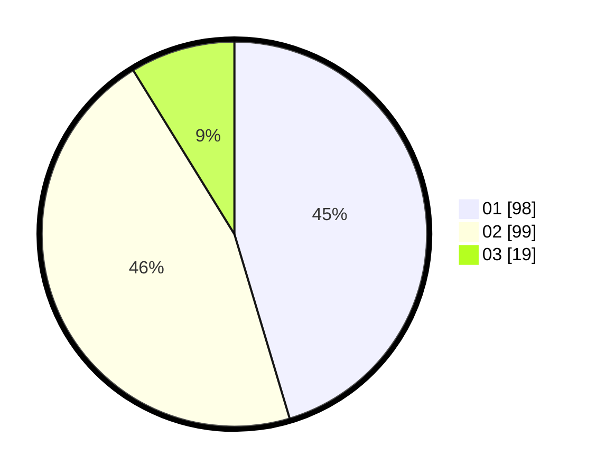

# Hasil

Hasil perolehan suara paslon dapat dilihat pada file paslon-01.txt, paslon-02.txt, dan paslon-03.txt.

Jika tidak ada, artinya data tersebut belum ada pada SIREKAP.

## Perolehan Suara

 * Paslon 01: **98**.
 * Paslon 02: **99**.
 * Paslon 03: **19**.

## Foto C Plano

https://sirekap-obj-formc.kpu.go.id/c47b/pemilu/ppwp/31/75/10/10/08/3175101008017-20240214-200444--331d8f63-10e7-45ac-b5e7-b98aaacf03fb.jpg

https://sirekap-obj-formc.kpu.go.id/c47b/pemilu/ppwp/31/75/10/10/08/3175101008017-20240214-155906--373eb0e9-95e9-4697-9e5a-c2f3e373f8b9.jpg

https://sirekap-obj-formc.kpu.go.id/c47b/pemilu/ppwp/31/75/10/10/08/3175101008017-20240214-160127--043b0d35-af0d-4465-a603-7d1b03e44227.jpg
