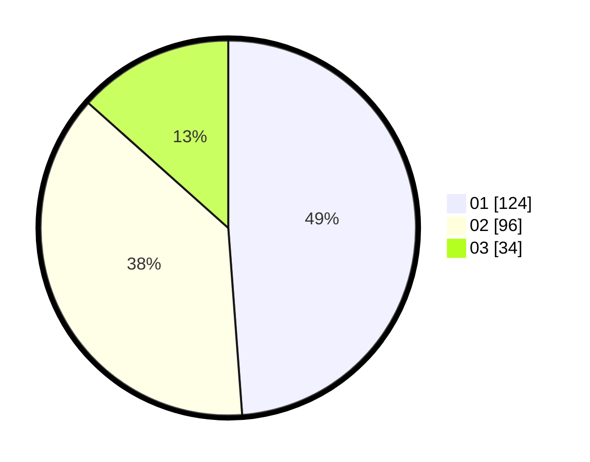

# Hasil

Hasil perolehan suara paslon dapat dilihat pada file paslon-01.txt, paslon-02.txt, dan paslon-03.txt.

Jika tidak ada, artinya data tersebut belum ada pada SIREKAP.

## Perolehan Suara

 * Paslon 01: **124**.
 * Paslon 02: **96**.
 * Paslon 03: **34**.

## Foto C Plano

https://sirekap-obj-formc.kpu.go.id/3fec/pemilu/ppwp/31/75/10/10/08/3175101008019-20240214-155727--2a7dc42c-4205-49cc-b233-e1dda0a849e2.jpg

https://sirekap-obj-formc.kpu.go.id/3fec/pemilu/ppwp/31/75/10/10/08/3175101008019-20240214-200537--ab6603e7-89e1-4aa2-b754-11e2f5209820.jpg

https://sirekap-obj-formc.kpu.go.id/3fec/pemilu/ppwp/31/75/10/10/08/3175101008019-20240214-155514--9fce9866-7b5d-44b7-9e01-dd15910d6c39.jpg

## DATA PEMILIH TETAP

Jumlah pemilih dalam DPT: **284**.
 * L: **143**.
 * P: **141**.

## DATA PENGGUNA HAK PILIH

Jumlah pengguna hak pilih dalam DPT: **245**.
 * L: **111**.
 * P: **129**.

Jumlah pengguna hak pilih dalam DPTb: **12**.
 * L: **6**.
 * P: **6**.

Jumlah pengguna hak pilih dalam DPK: **5**.
 * L: **3**.
 * P: **2**.

Jumlah pengguna hak pilih: **257**.
 * L: **120**.
 * P: **137**.

## JUMLAH SUARA SAH DAN TIDAK SAH

JUMLAH SELURUH SUARA SAH: **254**.

JUMLAH SUARA TIDAK SAH: **2**.

JUMLAH SELURUH SUARA SAH DAN SUARA TIDAK SAH: **256**.
