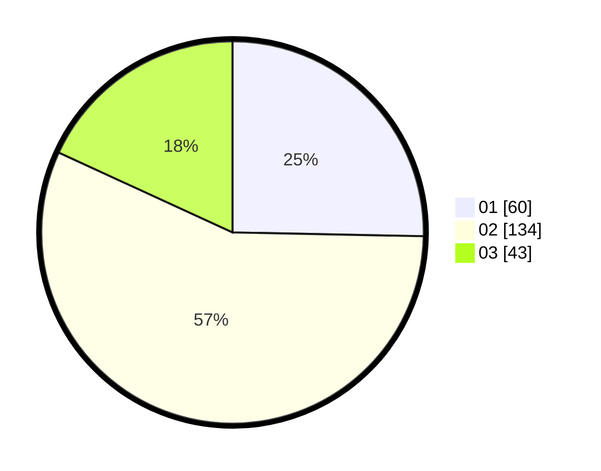

# Hasil

Hasil perolehan suara paslon dapat dilihat pada file paslon-01.txt, paslon-02.txt, dan paslon-03.txt.

Jika tidak ada, artinya data tersebut belum ada pada SIREKAP.

## Perolehan Suara

 * Paslon 01: **60**.
 * Paslon 02: **134**.
 * Paslon 03: **43**.

## Foto C Plano

https://sirekap-obj-formc.kpu.go.id/5b8e/pemilu/ppwp/31/75/10/10/08/3175101008024-20240214-215935--066b34fb-26b8-4e18-8aad-1d96e7ac4773.jpg

https://sirekap-obj-formc.kpu.go.id/5b8e/pemilu/ppwp/31/75/10/10/08/3175101008024-20240214-220006--4e9f1ee5-a61e-431e-9da1-946db3d88eca.jpg

https://sirekap-obj-formc.kpu.go.id/5b8e/pemilu/ppwp/31/75/10/10/08/3175101008024-20240215-130747--150a8ffb-01ae-4f0f-b667-d500f39550a1.jpg

## DATA PEMILIH TETAP

Jumlah pemilih dalam DPT: **293**.
 * L: **135**.
 * P: **158**.

## DATA PENGGUNA HAK PILIH

Jumlah pengguna hak pilih dalam DPT: **233**.
 * L: **103**.
 * P: **130**.

Jumlah pengguna hak pilih dalam DPTb: **4**.
 * L: **1**.
 * P: **3**.

Jumlah pengguna hak pilih dalam DPK: **2**.
 * L: **1**.
 * P: **1**.

Jumlah pengguna hak pilih: **239**.
 * L: **105**.
 * P: **134**.

## JUMLAH SUARA SAH DAN TIDAK SAH

JUMLAH SELURUH SUARA SAH: **237**.

JUMLAH SUARA TIDAK SAH: **2**.

JUMLAH SELURUH SUARA SAH DAN SUARA TIDAK SAH: **239**.
