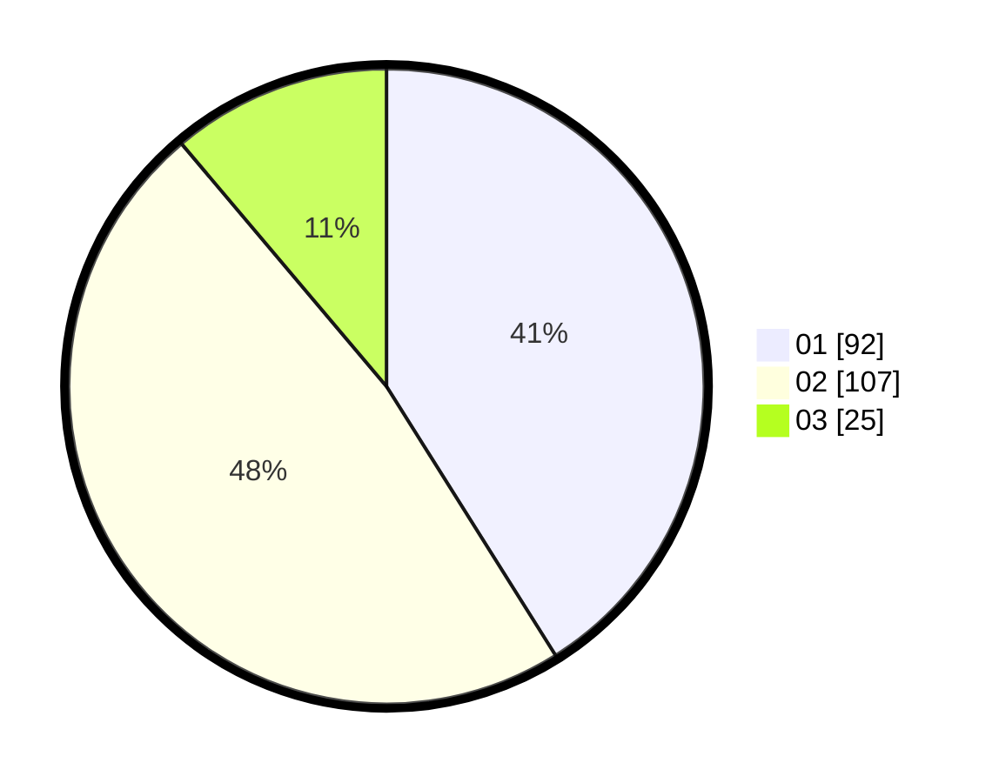

# Hasil

Hasil perolehan suara paslon dapat dilihat pada file paslon-01.txt, paslon-02.txt, dan paslon-03.txt.

Jika tidak ada, artinya data tersebut belum ada pada SIREKAP.

## Perolehan Suara

 * Paslon 01: **92**.
 * Paslon 02: **107**.
 * Paslon 03: **25**.

## Foto C Plano

https://sirekap-obj-formc.kpu.go.id/7fb5/pemilu/ppwp/31/75/10/10/08/3175101008033-20240214-222151--fc4c6130-18e6-47e7-b71c-91c69e2dec78.jpg

https://sirekap-obj-formc.kpu.go.id/7fb5/pemilu/ppwp/31/75/10/10/08/3175101008033-20240214-222319--1a95a2ec-ee57-442d-adcd-bc187df98618.jpg

https://sirekap-obj-formc.kpu.go.id/7fb5/pemilu/ppwp/31/75/10/10/08/3175101008033-20240214-222439--90ad0238-278b-4fe9-ae6e-0168b84d2fdc.jpg
