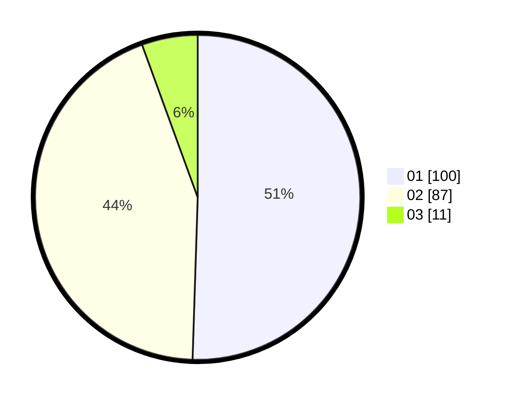

# Hasil

Hasil perolehan suara paslon dapat dilihat pada file paslon-01.txt, paslon-02.txt, dan paslon-03.txt.

Jika tidak ada, artinya data tersebut belum ada pada SIREKAP.

## Perolehan Suara

 * Paslon 01: **100**.
 * Paslon 02: **87**.
 * Paslon 03: **11**.

## Foto C Plano

https://sirekap-obj-formc.kpu.go.id/c28b/pemilu/ppwp/31/75/10/10/08/3175101008034-20240214-194431--86ac0bd7-34f3-4fb9-8633-d7637ab2b592.jpg

https://sirekap-obj-formc.kpu.go.id/c28b/pemilu/ppwp/31/75/10/10/08/3175101008034-20240214-192302--212ab03a-cc1f-4d33-b868-e3da9568055d.jpg

https://sirekap-obj-formc.kpu.go.id/c28b/pemilu/ppwp/31/75/10/10/08/3175101008034-20240214-192423--60378803-643e-49a9-80a3-f0e160540cc4.jpg

## DATA PEMILIH TETAP

Jumlah pemilih dalam DPT: **258**.
 * L: **124**.
 * P: **134**.

## DATA PENGGUNA HAK PILIH

Jumlah pengguna hak pilih dalam DPT: **200**.
 * L: **94**.
 * P: **106**.

Jumlah pengguna hak pilih dalam DPTb: **0**.
 * L: **0**.
 * P: **0**.

Jumlah pengguna hak pilih dalam DPK: **0**.
 * L: **0**.
 * P: **0**.

Jumlah pengguna hak pilih: **200**.
 * L: **94**.
 * P: **106**.

## JUMLAH SUARA SAH DAN TIDAK SAH

JUMLAH SELURUH SUARA SAH: **198**.

JUMLAH SUARA TIDAK SAH: **2**.

JUMLAH SELURUH SUARA SAH DAN SUARA TIDAK SAH: **200**.
