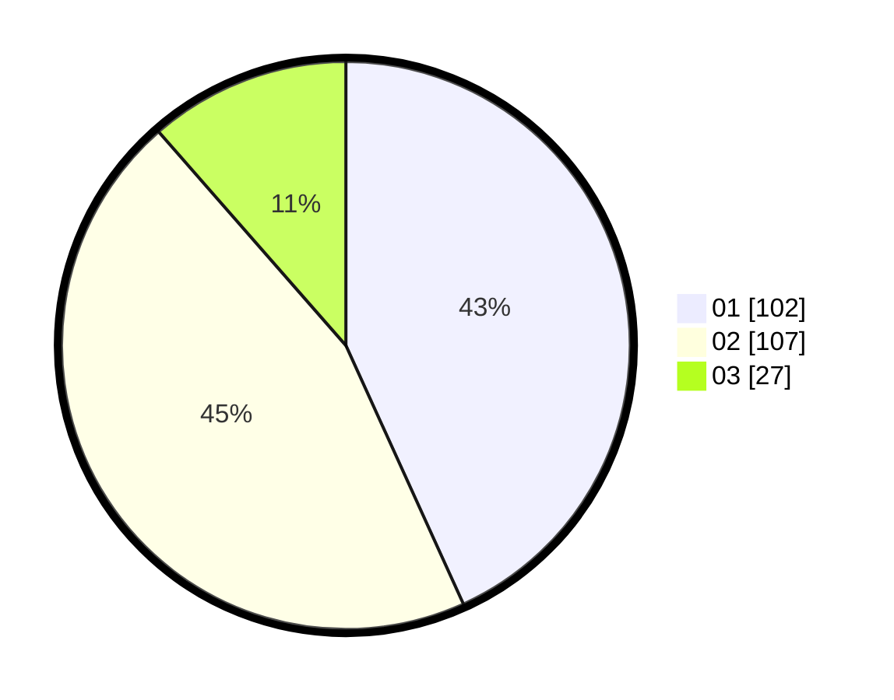

# Hasil

Hasil perolehan suara paslon dapat dilihat pada file paslon-01.txt, paslon-02.txt, dan paslon-03.txt.

Jika tidak ada, artinya data tersebut belum ada pada SIREKAP.

## Perolehan Suara

 * Paslon 01: **102**.
 * Paslon 02: **107**.
 * Paslon 03: **27**.

## Foto C Plano

https://sirekap-obj-formc.kpu.go.id/b0cb/pemilu/ppwp/31/75/10/10/08/3175101008035-20240215-004934--fc373938-a742-4822-aa95-fa4151b8dd0f.jpg

https://sirekap-obj-formc.kpu.go.id/b0cb/pemilu/ppwp/31/75/10/10/08/3175101008035-20240215-005030--c7fa74ad-7f4b-4f9f-bd0f-f537779e7267.jpg

https://sirekap-obj-formc.kpu.go.id/b0cb/pemilu/ppwp/31/75/10/10/08/3175101008035-20240215-005138--d1b185ae-31d5-4c97-b1ec-a4ac215c85e5.jpg
