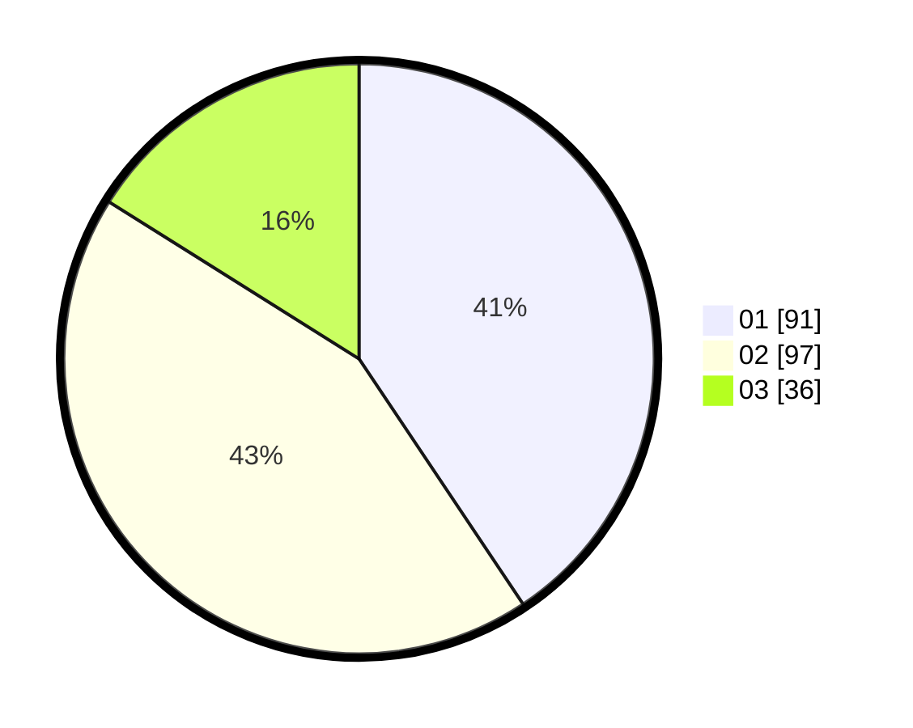

# Hasil

Hasil perolehan suara paslon dapat dilihat pada file paslon-01.txt, paslon-02.txt, dan paslon-03.txt.

Jika tidak ada, artinya data tersebut belum ada pada SIREKAP.

## Perolehan Suara

 * Paslon 01: **91**.
 * Paslon 02: **97**.
 * Paslon 03: **36**.

## Foto C Plano

https://sirekap-obj-formc.kpu.go.id/badb/pemilu/ppwp/31/75/10/10/08/3175101008036-20240215-025617--a4860326-4631-4221-9303-8202c13a959a.jpg

https://sirekap-obj-formc.kpu.go.id/badb/pemilu/ppwp/31/75/10/10/08/3175101008036-20240215-025623--9825fb1a-2936-42e5-84bd-90f9837a9483.jpg

https://sirekap-obj-formc.kpu.go.id/badb/pemilu/ppwp/31/75/10/10/08/3175101008036-20240215-025628--84aa306c-3869-4894-b192-e7c754dc4b99.jpg
