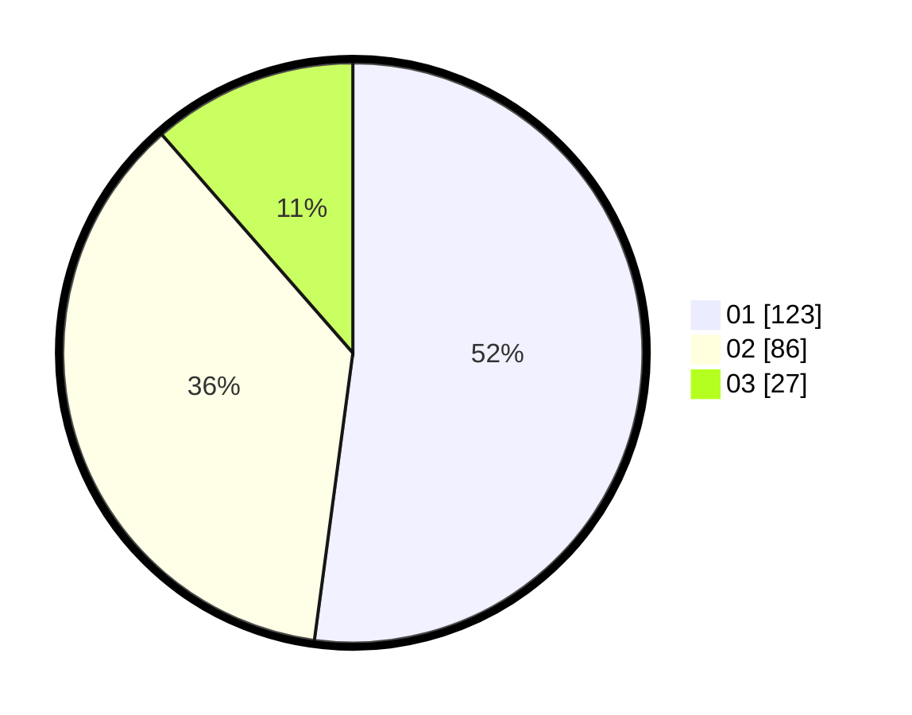

# Hasil

Hasil perolehan suara paslon dapat dilihat pada file paslon-01.txt, paslon-02.txt, dan paslon-03.txt.

Jika tidak ada, artinya data tersebut belum ada pada SIREKAP.

## Perolehan Suara

 * Paslon 01: **123**.
 * Paslon 02: **86**.
 * Paslon 03: **27**.

## Foto C Plano

https://sirekap-obj-formc.kpu.go.id/0400/pemilu/ppwp/31/75/10/10/08/3175101008045-20240214-194408--d1cc6da3-ad9c-49f4-b5cb-2a5820ff228d.jpg

https://sirekap-obj-formc.kpu.go.id/0400/pemilu/ppwp/31/75/10/10/08/3175101008045-20240214-194946--e0e30523-6c12-4847-8f7a-0a88bbc1dae4.jpg

https://sirekap-obj-formc.kpu.go.id/0400/pemilu/ppwp/31/75/10/10/08/3175101008045-20240214-195057--6d1ced62-4b5f-4c2a-ac99-90c1d75958c9.jpg

## DATA PEMILIH TETAP

Jumlah pemilih dalam DPT: **277**.
 * L: **132**.
 * P: **145**.

## DATA PENGGUNA HAK PILIH

Jumlah pengguna hak pilih dalam DPT: **236**.
 * L: **106**.
 * P: **130**.

Jumlah pengguna hak pilih dalam DPTb: **0**.
 * L: **0**.
 * P: **0**.

Jumlah pengguna hak pilih dalam DPK: **0**.
 * L: **0**.
 * P: **0**.

Jumlah pengguna hak pilih: **236**.
 * L: **106**.
 * P: **130**.

## JUMLAH SUARA SAH DAN TIDAK SAH

JUMLAH SELURUH SUARA SAH: **236**.

JUMLAH SUARA TIDAK SAH: **0**.

JUMLAH SELURUH SUARA SAH DAN SUARA TIDAK SAH: **236**.
