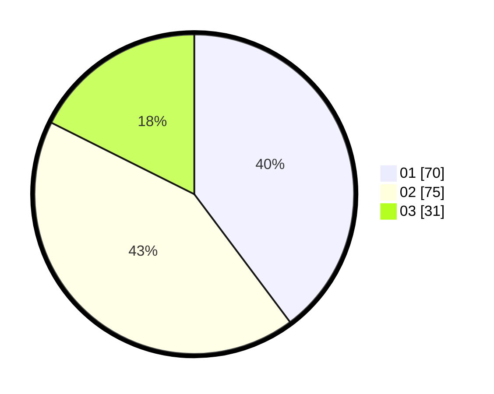

# Hasil

Hasil perolehan suara paslon dapat dilihat pada file paslon-01.txt, paslon-02.txt, dan paslon-03.txt.

Jika tidak ada, artinya data tersebut belum ada pada SIREKAP.

## Perolehan Suara

 * Paslon 01: **70**.
 * Paslon 02: **75**.
 * Paslon 03: **31**.

## Foto C Plano

https://sirekap-obj-formc.kpu.go.id/f860/pemilu/ppwp/31/75/10/10/08/3175101008047-20240214-224618--965848e9-3db3-45e0-bf19-8fc53aa5fbab.jpg

https://sirekap-obj-formc.kpu.go.id/f860/pemilu/ppwp/31/75/10/10/08/3175101008047-20240214-224749--2275cba2-67c4-44a5-922a-8d35d1eb87f4.jpg

https://sirekap-obj-formc.kpu.go.id/f860/pemilu/ppwp/31/75/10/10/08/3175101008047-20240214-224857--8480805e-8cd7-45a6-a9d6-32931a1b4c59.jpg
