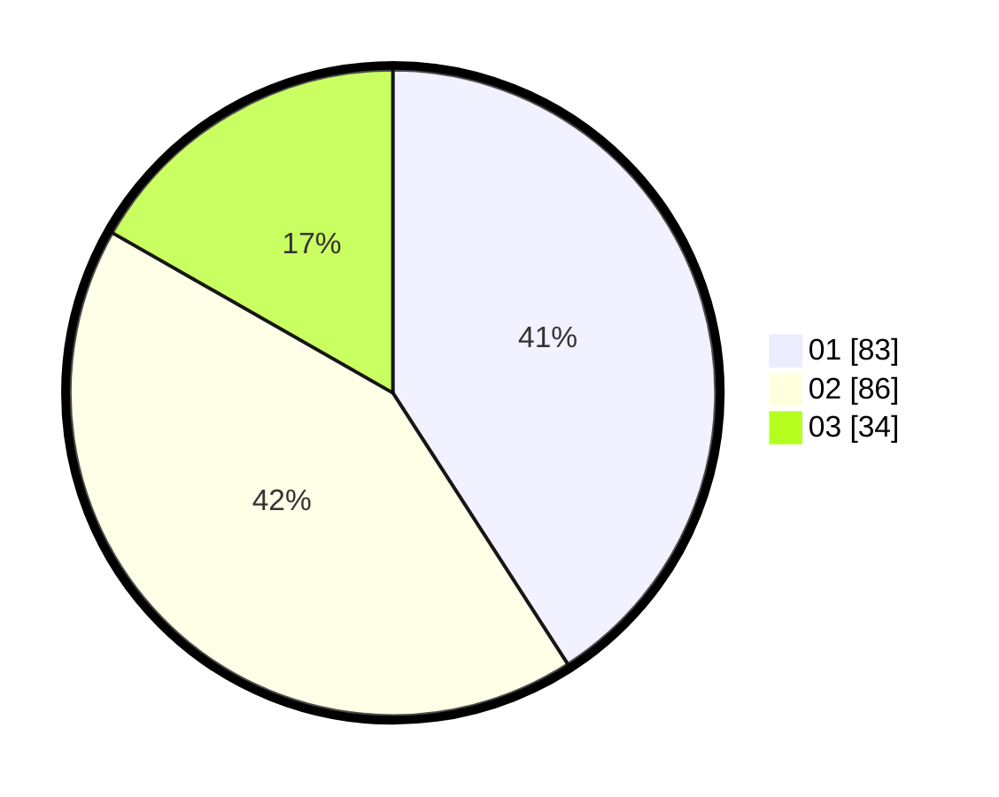

# Hasil

Hasil perolehan suara paslon dapat dilihat pada file paslon-01.txt, paslon-02.txt, dan paslon-03.txt.

Jika tidak ada, artinya data tersebut belum ada pada SIREKAP.

## Perolehan Suara

 * Paslon 01: **83**.
 * Paslon 02: **86**.
 * Paslon 03: **34**.

## Foto C Plano

https://sirekap-obj-formc.kpu.go.id/164f/pemilu/ppwp/31/75/10/10/08/3175101008061-20240214-224521--9b754c4f-4257-4298-b84d-75fa005cf251.jpg

https://sirekap-obj-formc.kpu.go.id/164f/pemilu/ppwp/31/75/10/10/08/3175101008061-20240214-193535--9e048456-59e3-46ef-98f6-02cc500f4305.jpg

https://sirekap-obj-formc.kpu.go.id/164f/pemilu/ppwp/31/75/10/10/08/3175101008061-20240214-224459--1196cba2-64b2-4d26-a125-abf01e5e99dc.jpg
