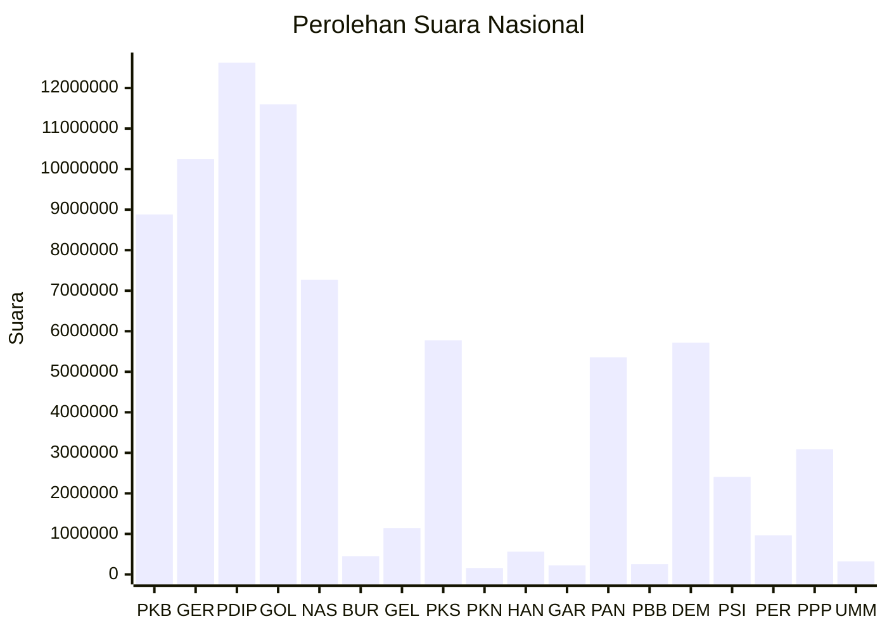

# Hasil

## Menu Wilayah

[ACEH](https://github.com/gigit-pemilu/pemilu-2024-11-aceh/tree/main/pileg-dpr/hitung-suara/sub/11-aceh)
 | 
[BALI](https://github.com/gigit-pemilu/pemilu-2024-51-bali/tree/main/pileg-dpr/hitung-suara/sub/51-bali)
 | 
[BANTEN](https://github.com/gigit-pemilu/pemilu-2024-36-banten/tree/main/pileg-dpr/hitung-suara/sub/36-banten)
 | 
[BENGKULU](https://github.com/gigit-pemilu/pemilu-2024-17-bengkulu/tree/main/pileg-dpr/hitung-suara/sub/17-bengkulu)
 | 
[DI YOGYAKARTA](https://github.com/gigit-pemilu/pemilu-2024-34-di-yogyakarta/tree/main/pileg-dpr/hitung-suara/sub/34-di-yogyakarta)
 | 
[DKI JAKARTA](https://github.com/gigit-pemilu/pemilu-2024-31-dki-jakarta/tree/main/pileg-dpr/hitung-suara/sub/31-dki-jakarta)
 | 
[GORONTALO](https://github.com/gigit-pemilu/pemilu-2024-75-gorontalo/tree/main/pileg-dpr/hitung-suara/sub/75-gorontalo)
 | 
[JAMBI](https://github.com/gigit-pemilu/pemilu-2024-15-jambi/tree/main/pileg-dpr/hitung-suara/sub/15-jambi)
 | 
[JAWA BARAT](https://github.com/gigit-pemilu/pemilu-2024-32-jawa-barat/tree/main/pileg-dpr/hitung-suara/sub/32-jawa-barat)
 | 
[JAWA TENGAH](https://github.com/gigit-pemilu/pemilu-2024-33-jawa-tengah/tree/main/pileg-dpr/hitung-suara/sub/33-jawa-tengah)
 | 
[JAWA TIMUR](https://github.com/gigit-pemilu/pemilu-2024-35-jawa-timur/tree/main/pileg-dpr/hitung-suara/sub/35-jawa-timur)
 | 
[KALIMANTAN BARAT](https://github.com/gigit-pemilu/pemilu-2024-61-kalimantan-barat/tree/main/pileg-dpr/hitung-suara/sub/61-kalimantan-barat)
 | 
[KALIMANTAN SELATAN](https://github.com/gigit-pemilu/pemilu-2024-63-kalimantan-selatan/tree/main/pileg-dpr/hitung-suara/sub/63-kalimantan-selatan)
 | 
[KALIMANTAN TENGAH](https://github.com/gigit-pemilu/pemilu-2024-62-kalimantan-tengah/tree/main/pileg-dpr/hitung-suara/sub/62-kalimantan-tengah)
 | 
[KALIMANTAN TIMUR](https://github.com/gigit-pemilu/pemilu-2024-64-kalimantan-timur/tree/main/pileg-dpr/hitung-suara/sub/64-kalimantan-timur)
 | 
[KALIMANTAN UTARA](https://github.com/gigit-pemilu/pemilu-2024-65-kalimantan-utara/tree/main/pileg-dpr/hitung-suara/sub/65-kalimantan-utara)
 | 
[KEPULAUAN BANGKA BELITUNG](https://github.com/gigit-pemilu/pemilu-2024-19-kepulauan-bangka-belitung/tree/main/pileg-dpr/hitung-suara/sub/19-kepulauan-bangka-belitung)
 | 
[KEPULAUAN RIAU](https://github.com/gigit-pemilu/pemilu-2024-21-kepulauan-riau/tree/main/pileg-dpr/hitung-suara/sub/21-kepulauan-riau)
 | 
[LAMPUNG](https://github.com/gigit-pemilu/pemilu-2024-18-lampung/tree/main/pileg-dpr/hitung-suara/sub/18-lampung)
 | 
[Luar Negeri](https://github.com/gigit-pemilu/pemilu-2024-99-luar-negeri/tree/main/pileg-dpr/hitung-suara/sub/99-luar-negeri)
 | 
[MALUKU](https://github.com/gigit-pemilu/pemilu-2024-81-maluku/tree/main/pileg-dpr/hitung-suara/sub/81-maluku)
 | 
[MALUKU UTARA](https://github.com/gigit-pemilu/pemilu-2024-82-maluku-utara/tree/main/pileg-dpr/hitung-suara/sub/82-maluku-utara)
 | 
[NUSA TENGGARA BARAT](https://github.com/gigit-pemilu/pemilu-2024-52-nusa-tenggara-barat/tree/main/pileg-dpr/hitung-suara/sub/52-nusa-tenggara-barat)
 | 
[NUSA TENGGARA TIMUR](https://github.com/gigit-pemilu/pemilu-2024-53-nusa-tenggara-timur/tree/main/pileg-dpr/hitung-suara/sub/53-nusa-tenggara-timur)
 | 
[PAPUA](https://github.com/gigit-pemilu/pemilu-2024-91-papua/tree/main/pileg-dpr/hitung-suara/sub/91-papua)
 | 
[PAPUA BARAT](https://github.com/gigit-pemilu/pemilu-2024-92-papua-barat/tree/main/pileg-dpr/hitung-suara/sub/92-papua-barat)
 | 
[PAPUA BARAT DAYA](https://github.com/gigit-pemilu/pemilu-2024-96-papua-barat-daya/tree/main/pileg-dpr/hitung-suara/sub/96-papua-barat-daya)
 | 
[PAPUA PEGUNUNGAN](https://github.com/gigit-pemilu/pemilu-2024-95-papua-pegunungan/tree/main/pileg-dpr/hitung-suara/sub/95-papua-pegunungan)
 | 
[PAPUA SELATAN](https://github.com/gigit-pemilu/pemilu-2024-93-papua-selatan/tree/main/pileg-dpr/hitung-suara/sub/93-papua-selatan)
 | 
[PAPUA TENGAH](https://github.com/gigit-pemilu/pemilu-2024-94-papua-tengah/tree/main/pileg-dpr/hitung-suara/sub/94-papua-tengah)
 | 
[RIAU](https://github.com/gigit-pemilu/pemilu-2024-14-riau/tree/main/pileg-dpr/hitung-suara/sub/14-riau)
 | 
[SULAWESI BARAT](https://github.com/gigit-pemilu/pemilu-2024-76-sulawesi-barat/tree/main/pileg-dpr/hitung-suara/sub/76-sulawesi-barat)
 | 
[SULAWESI SELATAN](https://github.com/gigit-pemilu/pemilu-2024-73-sulawesi-selatan/tree/main/pileg-dpr/hitung-suara/sub/73-sulawesi-selatan)
 | 
[SULAWESI TENGAH](https://github.com/gigit-pemilu/pemilu-2024-72-sulawesi-tengah/tree/main/pileg-dpr/hitung-suara/sub/72-sulawesi-tengah)
 | 
[SULAWESI TENGGARA](https://github.com/gigit-pemilu/pemilu-2024-74-sulawesi-tenggara/tree/main/pileg-dpr/hitung-suara/sub/74-sulawesi-tenggara)
 | 
[SULAWESI UTARA](https://github.com/gigit-pemilu/pemilu-2024-71-sulawesi-utara/tree/main/pileg-dpr/hitung-suara/sub/71-sulawesi-utara)
 | 
[SUMATERA BARAT](https://github.com/gigit-pemilu/pemilu-2024-13-sumatera-barat/tree/main/pileg-dpr/hitung-suara/sub/13-sumatera-barat)
 | 
[SUMATERA SELATAN](https://github.com/gigit-pemilu/pemilu-2024-16-sumatera-selatan/tree/main/pileg-dpr/hitung-suara/sub/16-sumatera-selatan)
 | 
[SUMATERA UTARA](https://github.com/gigit-pemilu/pemilu-2024-12-sumatera-utara/tree/main/pileg-dpr/hitung-suara/sub/12-sumatera-utara)

## Grafik

## Tabel

| No. | Nama Partai                           | Suara      | Suara (raw)     | Persentase |
|:--- |:------------------------------------- | ----------:| ---------------:| ----------:|
| 1   | Partai Kebangkitan Bangsa             | 8.882.245  | [8882245][p-1]  | 11,53      |
| 2   | Partai Gerakan Indonesia Raya         | 10.250.015 | [10250015][p-2] | 13,30      |
| 3   | Partai Demokrasi Indonesia Perjuangan | 12.628.098 | [12628098][p-3] | 16,39      |
| 4   | Partai Golongan Karya                 | 11.598.920 | [11598920][p-4] | 15,05      |
| 5   | Partai NasDem                         | 7.272.503  | [7272503][p-5]  | 9,44       |
| 6   | Partai Buruh                          | 451.183    | [451183][p-6]   | 0,59       |
| 7   | Partai Gelombang Rakyat Indonesia     | 1.144.518  | [1144518][p-7]  | 1,49       |
| 8   | Partai Keadilan Sejahtera             | 5.777.553  | [5777553][p-8]  | 7,50       |
| 9   | Partai Kebangkitan Nusantara          | 160.721    | [160721][p-9]   | 0,21       |
| 10  | Partai Hati Nurani Rakyat             | 561.745    | [561745][p-10]  | 0,73       |
| 11  | Partai Garda Republik Indonesia       | 222.365    | [222365][p-11]  | 0,29       |
| 12  | Partai Amanat Nasional                | 5.357.630  | [5357630][p-12] | 6,95       |
| 13  | Partai Bulan Bintang                  | 254.999    | [254999][p-13]  | 0,33       |
| 14  | Partai Demokrat                       | 5.716.253  | [5716253][p-14] | 7,42       |
| 15  | Partai Solidaritas Indonesia          | 2.406.001  | [2406001][p-15] | 3,12       |
| 16  | PARTAI PERINDO                        | 966.322    | [966322][p-16]  | 1,25       |
| 17  | Partai Persatuan Pembangunan          | 3.090.297  | [3090297][p-17] | 4,01       |
| 24  | Partai Ummat                          | 323.198    | [323198][p-24]  | 0,42       |

[p-1]: https://github.com/gigit-pemilu/pemilu-2024/blob/main/pileg-dpr/hitung-suara/sub/partai-1.txt
[p-2]: https://github.com/gigit-pemilu/pemilu-2024/blob/main/pileg-dpr/hitung-suara/sub/partai-2.txt
[p-3]: https://github.com/gigit-pemilu/pemilu-2024/blob/main/pileg-dpr/hitung-suara/sub/partai-3.txt
[p-4]: https://github.com/gigit-pemilu/pemilu-2024/blob/main/pileg-dpr/hitung-suara/sub/partai-4.txt
[p-5]: https://github.com/gigit-pemilu/pemilu-2024/blob/main/pileg-dpr/hitung-suara/sub/partai-5.txt
[p-6]: https://github.com/gigit-pemilu/pemilu-2024/blob/main/pileg-dpr/hitung-suara/sub/partai-6.txt
[p-7]: https://github.com/gigit-pemilu/pemilu-2024/blob/main/pileg-dpr/hitung-suara/sub/partai-7.txt
[p-8]: https://github.com/gigit-pemilu/pemilu-2024/blob/main/pileg-dpr/hitung-suara/sub/partai-8.txt
[p-9]: https://github.com/gigit-pemilu/pemilu-2024/blob/main/pileg-dpr/hitung-suara/sub/partai-9.txt
[p-10]: https://github.com/gigit-pemilu/pemilu-2024/blob/main/pileg-dpr/hitung-suara/sub/partai-10.txt
[p-11]: https://github.com/gigit-pemilu/pemilu-2024/blob/main/pileg-dpr/hitung-suara/sub/partai-11.txt
[p-12]: https://github.com/gigit-pemilu/pemilu-2024/blob/main/pileg-dpr/hitung-suara/sub/partai-12.txt
[p-13]: https://github.com/gigit-pemilu/pemilu-2024/blob/main/pileg-dpr/hitung-suara/sub/partai-13.txt
[p-14]: https://github.com/gigit-pemilu/pemilu-2024/blob/main/pileg-dpr/hitung-suara/sub/partai-14.txt
[p-15]: https://github.com/gigit-pemilu/pemilu-2024/blob/main/pileg-dpr/hitung-suara/sub/partai-15.txt
[p-16]: https://github.com/gigit-pemilu/pemilu-2024/blob/main/pileg-dpr/hitung-suara/sub/partai-16.txt
[p-17]: https://github.com/gigit-pemilu/pemilu-2024/blob/main/pileg-dpr/hitung-suara/sub/partai-17.txt
[p-24]: https://github.com/gigit-pemilu/pemilu-2024/blob/main/pileg-dpr/hitung-suara/sub/partai-24.txt

## Metadata

| Key            | Value               |
| -------------- | ------------------- |
| Time Stamp     | 2024-03-13 06:37:13 |
| Progress       | 543.313/823.378     |
| Progress (%)   | 65,99               |
| Progress (raw) | 543313              |

## Tabel Detail per Wilayah

| #  | Kode Wilayah | Nama Wilayah              | Partai                       |
| -- | ------------ | ------------------------- | ---------------------------- |
| 1  | 11           | ACEH                      | [table-wilayah-11.md][tw-11] |
| 2  | 51           | BALI                      | [table-wilayah-51.md][tw-51] |
| 3  | 36           | BANTEN                    | [table-wilayah-36.md][tw-36] |
| 4  | 17           | BENGKULU                  | [table-wilayah-17.md][tw-17] |
| 5  | 34           | DI YOGYAKARTA             | [table-wilayah-34.md][tw-34] |
| 6  | 31           | DKI JAKARTA               | [table-wilayah-31.md][tw-31] |
| 7  | 75           | GORONTALO                 | [table-wilayah-75.md][tw-75] |
| 8  | 15           | JAMBI                     | [table-wilayah-15.md][tw-15] |
| 9  | 32           | JAWA BARAT                | [table-wilayah-32.md][tw-32] |
| 10 | 33           | JAWA TENGAH               | [table-wilayah-33.md][tw-33] |
| 11 | 35           | JAWA TIMUR                | [table-wilayah-35.md][tw-35] |
| 12 | 61           | KALIMANTAN BARAT          | [table-wilayah-61.md][tw-61] |
| 13 | 63           | KALIMANTAN SELATAN        | [table-wilayah-63.md][tw-63] |
| 14 | 62           | KALIMANTAN TENGAH         | [table-wilayah-62.md][tw-62] |
| 15 | 64           | KALIMANTAN TIMUR          | [table-wilayah-64.md][tw-64] |
| 16 | 65           | KALIMANTAN UTARA          | [table-wilayah-65.md][tw-65] |
| 17 | 19           | KEPULAUAN BANGKA BELITUNG | [table-wilayah-19.md][tw-19] |
| 18 | 21           | KEPULAUAN RIAU            | [table-wilayah-21.md][tw-21] |
| 19 | 18           | LAMPUNG                   | [table-wilayah-18.md][tw-18] |
| 20 | 99           | Luar Negeri               | [table-wilayah-99.md][tw-99] |
| 21 | 81           | MALUKU                    | [table-wilayah-81.md][tw-81] |
| 22 | 82           | MALUKU UTARA              | [table-wilayah-82.md][tw-82] |
| 23 | 52           | NUSA TENGGARA BARAT       | [table-wilayah-52.md][tw-52] |
| 24 | 53           | NUSA TENGGARA TIMUR       | [table-wilayah-53.md][tw-53] |
| 25 | 91           | PAPUA                     | [table-wilayah-91.md][tw-91] |
| 26 | 92           | PAPUA BARAT               | [table-wilayah-92.md][tw-92] |
| 27 | 96           | PAPUA BARAT DAYA          | [table-wilayah-96.md][tw-96] |
| 28 | 95           | PAPUA PEGUNUNGAN          | [table-wilayah-95.md][tw-95] |
| 29 | 93           | PAPUA SELATAN             | [table-wilayah-93.md][tw-93] |
| 30 | 94           | PAPUA TENGAH              | [table-wilayah-94.md][tw-94] |
| 31 | 14           | RIAU                      | [table-wilayah-14.md][tw-14] |
| 32 | 76           | SULAWESI BARAT            | [table-wilayah-76.md][tw-76] |
| 33 | 73           | SULAWESI SELATAN          | [table-wilayah-73.md][tw-73] |
| 34 | 72           | SULAWESI TENGAH           | [table-wilayah-72.md][tw-72] |
| 35 | 74           | SULAWESI TENGGARA         | [table-wilayah-74.md][tw-74] |
| 36 | 71           | SULAWESI UTARA            | [table-wilayah-71.md][tw-71] |
| 37 | 13           | SUMATERA BARAT            | [table-wilayah-13.md][tw-13] |
| 38 | 16           | SUMATERA SELATAN          | [table-wilayah-16.md][tw-16] |
| 39 | 12           | SUMATERA UTARA            | [table-wilayah-12.md][tw-12] |

[tw-11]: https://github.com/gigit-pemilu/pemilu-2024/blob/main/pileg-dpr/hitung-suara/sub/table-wilayah-11.md
[tw-51]: https://github.com/gigit-pemilu/pemilu-2024/blob/main/pileg-dpr/hitung-suara/sub/table-wilayah-51.md
[tw-36]: https://github.com/gigit-pemilu/pemilu-2024/blob/main/pileg-dpr/hitung-suara/sub/table-wilayah-36.md
[tw-17]: https://github.com/gigit-pemilu/pemilu-2024/blob/main/pileg-dpr/hitung-suara/sub/table-wilayah-17.md
[tw-34]: https://github.com/gigit-pemilu/pemilu-2024/blob/main/pileg-dpr/hitung-suara/sub/table-wilayah-34.md
[tw-31]: https://github.com/gigit-pemilu/pemilu-2024/blob/main/pileg-dpr/hitung-suara/sub/table-wilayah-31.md
[tw-75]: https://github.com/gigit-pemilu/pemilu-2024/blob/main/pileg-dpr/hitung-suara/sub/table-wilayah-75.md
[tw-15]: https://github.com/gigit-pemilu/pemilu-2024/blob/main/pileg-dpr/hitung-suara/sub/table-wilayah-15.md
[tw-32]: https://github.com/gigit-pemilu/pemilu-2024/blob/main/pileg-dpr/hitung-suara/sub/table-wilayah-32.md
[tw-33]: https://github.com/gigit-pemilu/pemilu-2024/blob/main/pileg-dpr/hitung-suara/sub/table-wilayah-33.md
[tw-35]: https://github.com/gigit-pemilu/pemilu-2024/blob/main/pileg-dpr/hitung-suara/sub/table-wilayah-35.md
[tw-61]: https://github.com/gigit-pemilu/pemilu-2024/blob/main/pileg-dpr/hitung-suara/sub/table-wilayah-61.md
[tw-63]: https://github.com/gigit-pemilu/pemilu-2024/blob/main/pileg-dpr/hitung-suara/sub/table-wilayah-63.md
[tw-62]: https://github.com/gigit-pemilu/pemilu-2024/blob/main/pileg-dpr/hitung-suara/sub/table-wilayah-62.md
[tw-64]: https://github.com/gigit-pemilu/pemilu-2024/blob/main/pileg-dpr/hitung-suara/sub/table-wilayah-64.md
[tw-65]: https://github.com/gigit-pemilu/pemilu-2024/blob/main/pileg-dpr/hitung-suara/sub/table-wilayah-65.md
[tw-19]: https://github.com/gigit-pemilu/pemilu-2024/blob/main/pileg-dpr/hitung-suara/sub/table-wilayah-19.md
[tw-21]: https://github.com/gigit-pemilu/pemilu-2024/blob/main/pileg-dpr/hitung-suara/sub/table-wilayah-21.md
[tw-18]: https://github.com/gigit-pemilu/pemilu-2024/blob/main/pileg-dpr/hitung-suara/sub/table-wilayah-18.md
[tw-99]: https://github.com/gigit-pemilu/pemilu-2024/blob/main/pileg-dpr/hitung-suara/sub/table-wilayah-99.md
[tw-81]: https://github.com/gigit-pemilu/pemilu-2024/blob/main/pileg-dpr/hitung-suara/sub/table-wilayah-81.md
[tw-82]: https://github.com/gigit-pemilu/pemilu-2024/blob/main/pileg-dpr/hitung-suara/sub/table-wilayah-82.md
[tw-52]: https://github.com/gigit-pemilu/pemilu-2024/blob/main/pileg-dpr/hitung-suara/sub/table-wilayah-52.md
[tw-53]: https://github.com/gigit-pemilu/pemilu-2024/blob/main/pileg-dpr/hitung-suara/sub/table-wilayah-53.md
[tw-91]: https://github.com/gigit-pemilu/pemilu-2024/blob/main/pileg-dpr/hitung-suara/sub/table-wilayah-91.md
[tw-92]: https://github.com/gigit-pemilu/pemilu-2024/blob/main/pileg-dpr/hitung-suara/sub/table-wilayah-92.md
[tw-96]: https://github.com/gigit-pemilu/pemilu-2024/blob/main/pileg-dpr/hitung-suara/sub/table-wilayah-96.md
[tw-95]: https://github.com/gigit-pemilu/pemilu-2024/blob/main/pileg-dpr/hitung-suara/sub/table-wilayah-95.md
[tw-93]: https://github.com/gigit-pemilu/pemilu-2024/blob/main/pileg-dpr/hitung-suara/sub/table-wilayah-93.md
[tw-94]: https://github.com/gigit-pemilu/pemilu-2024/blob/main/pileg-dpr/hitung-suara/sub/table-wilayah-94.md
[tw-14]: https://github.com/gigit-pemilu/pemilu-2024/blob/main/pileg-dpr/hitung-suara/sub/table-wilayah-14.md
[tw-76]: https://github.com/gigit-pemilu/pemilu-2024/blob/main/pileg-dpr/hitung-suara/sub/table-wilayah-76.md
[tw-73]: https://github.com/gigit-pemilu/pemilu-2024/blob/main/pileg-dpr/hitung-suara/sub/table-wilayah-73.md
[tw-72]: https://github.com/gigit-pemilu/pemilu-2024/blob/main/pileg-dpr/hitung-suara/sub/table-wilayah-72.md
[tw-74]: https://github.com/gigit-pemilu/pemilu-2024/blob/main/pileg-dpr/hitung-suara/sub/table-wilayah-74.md
[tw-71]: https://github.com/gigit-pemilu/pemilu-2024/blob/main/pileg-dpr/hitung-suara/sub/table-wilayah-71.md
[tw-13]: https://github.com/gigit-pemilu/pemilu-2024/blob/main/pileg-dpr/hitung-suara/sub/table-wilayah-13.md
[tw-16]: https://github.com/gigit-pemilu/pemilu-2024/blob/main/pileg-dpr/hitung-suara/sub/table-wilayah-16.md
[tw-12]: https://github.com/gigit-pemilu/pemilu-2024/blob/main/pileg-dpr/hitung-suara/sub/table-wilayah-12.md

## Tabel Detail per Partai

| #  | Kode Partai | Nama Partai                           | Wilayah                     |
| -- | ----------- | ------------------------------------- | --------------------------- |
| 1  | 1           | Partai Kebangkitan Bangsa             | [table-partai-1.md][tp-1]   |
| 2  | 2           | Partai Gerakan Indonesia Raya         | [table-partai-2.md][tp-2]   |
| 3  | 3           | Partai Demokrasi Indonesia Perjuangan | [table-partai-3.md][tp-3]   |
| 4  | 4           | Partai Golongan Karya                 | [table-partai-4.md][tp-4]   |
| 5  | 5           | Partai NasDem                         | [table-partai-5.md][tp-5]   |
| 6  | 6           | Partai Buruh                          | [table-partai-6.md][tp-6]   |
| 7  | 7           | Partai Gelombang Rakyat Indonesia     | [table-partai-7.md][tp-7]   |
| 8  | 8           | Partai Keadilan Sejahtera             | [table-partai-8.md][tp-8]   |
| 9  | 9           | Partai Kebangkitan Nusantara          | [table-partai-9.md][tp-9]   |
| 10 | 10          | Partai Hati Nurani Rakyat             | [table-partai-10.md][tp-10] |
| 11 | 11          | Partai Garda Republik Indonesia       | [table-partai-11.md][tp-11] |
| 12 | 12          | Partai Amanat Nasional                | [table-partai-12.md][tp-12] |
| 13 | 13          | Partai Bulan Bintang                  | [table-partai-13.md][tp-13] |
| 14 | 14          | Partai Demokrat                       | [table-partai-14.md][tp-14] |
| 15 | 15          | Partai Solidaritas Indonesia          | [table-partai-15.md][tp-15] |
| 16 | 16          | PARTAI PERINDO                        | [table-partai-16.md][tp-16] |
| 17 | 17          | Partai Persatuan Pembangunan          | [table-partai-17.md][tp-17] |
| 18 | 24          | Partai Ummat                          | [table-partai-24.md][tp-24] |

[tp-1]: https://github.com/gigit-pemilu/pemilu-2024/blob/main/pileg-dpr/hitung-suara/sub/table-partai-1.md
[tp-2]: https://github.com/gigit-pemilu/pemilu-2024/blob/main/pileg-dpr/hitung-suara/sub/table-partai-2.md
[tp-3]: https://github.com/gigit-pemilu/pemilu-2024/blob/main/pileg-dpr/hitung-suara/sub/table-partai-3.md
[tp-4]: https://github.com/gigit-pemilu/pemilu-2024/blob/main/pileg-dpr/hitung-suara/sub/table-partai-4.md
[tp-5]: https://github.com/gigit-pemilu/pemilu-2024/blob/main/pileg-dpr/hitung-suara/sub/table-partai-5.md
[tp-6]: https://github.com/gigit-pemilu/pemilu-2024/blob/main/pileg-dpr/hitung-suara/sub/table-partai-6.md
[tp-7]: https://github.com/gigit-pemilu/pemilu-2024/blob/main/pileg-dpr/hitung-suara/sub/table-partai-7.md
[tp-8]: https://github.com/gigit-pemilu/pemilu-2024/blob/main/pileg-dpr/hitung-suara/sub/table-partai-8.md
[tp-9]: https://github.com/gigit-pemilu/pemilu-2024/blob/main/pileg-dpr/hitung-suara/sub/table-partai-9.md
[tp-10]: https://github.com/gigit-pemilu/pemilu-2024/blob/main/pileg-dpr/hitung-suara/sub/table-partai-10.md
[tp-11]: https://github.com/gigit-pemilu/pemilu-2024/blob/main/pileg-dpr/hitung-suara/sub/table-partai-11.md
[tp-12]: https://github.com/gigit-pemilu/pemilu-2024/blob/main/pileg-dpr/hitung-suara/sub/table-partai-12.md
[tp-13]: https://github.com/gigit-pemilu/pemilu-2024/blob/main/pileg-dpr/hitung-suara/sub/table-partai-13.md
[tp-14]: https://github.com/gigit-pemilu/pemilu-2024/blob/main/pileg-dpr/hitung-suara/sub/table-partai-14.md
[tp-15]: https://github.com/gigit-pemilu/pemilu-2024/blob/main/pileg-dpr/hitung-suara/sub/table-partai-15.md
[tp-16]: https://github.com/gigit-pemilu/pemilu-2024/blob/main/pileg-dpr/hitung-suara/sub/table-partai-16.md
[tp-17]: https://github.com/gigit-pemilu/pemilu-2024/blob/main/pileg-dpr/hitung-suara/sub/table-partai-17.md
[tp-24]: https://github.com/gigit-pemilu/pemilu-2024/blob/main/pileg-dpr/hitung-suara/sub/table-partai-24.md

