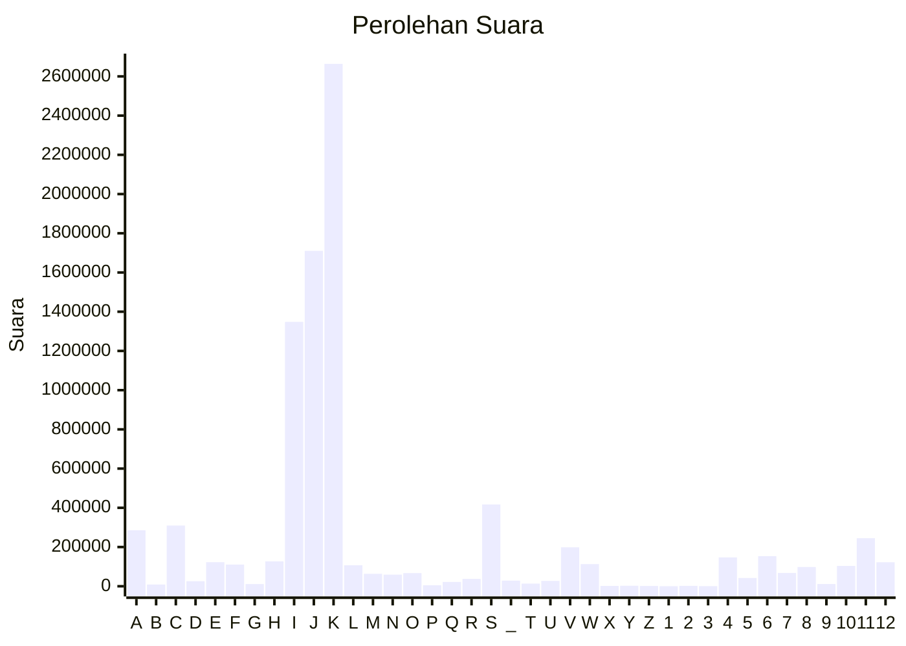

# Hasil

Partai **Partai Kebangkitan Bangsa**

## Grafik

## Tabel

| #  | Label | Kode Wilayah | Nama Wilayah              | Suara     | Suara (raw) | Persentase |
|:-- |:----- |:------------ |:------------------------- | ---------:| -----------:| ----------:|
| 1  | A     | 11           | ACEH                      | 285.754   | 285754      | 3,22       |
| 2  | B     | 51           | BALI                      | 8.756     | 8756        | 0,10       |
| 3  | C     | 36           | BANTEN                    | 309.810   | 309810      | 3,49       |
| 4  | D     | 17           | BENGKULU                  | 25.656    | 25656       | 0,29       |
| 5  | E     | 34           | DI YOGYAKARTA             | 122.845   | 122845      | 1,38       |
| 6  | F     | 31           | DKI JAKARTA               | 110.637   | 110637      | 1,25       |
| 7  | G     | 75           | GORONTALO                 | 11.083    | 11083       | 0,12       |
| 8  | H     | 15           | JAMBI                     | 127.087   | 127087      | 1,43       |
| 9  | I     | 32           | JAWA BARAT                | 1.348.330 | 1348330     | 15,18      |
| 10 | J     | 33           | JAWA TENGAH               | 1.710.282 | 1710282     | 19,26      |
| 11 | K     | 35           | JAWA TIMUR                | 2.663.921 | 2663921     | 29,99      |
| 12 | L     | 61           | KALIMANTAN BARAT          | 107.050   | 107050      | 1,21       |
| 13 | M     | 63           | KALIMANTAN SELATAN        | 63.364    | 63364       | 0,71       |
| 14 | N     | 62           | KALIMANTAN TENGAH         | 59.212    | 59212       | 0,67       |
| 15 | O     | 64           | KALIMANTAN TIMUR          | 66.920    | 66920       | 0,75       |
| 16 | P     | 65           | KALIMANTAN UTARA          | 5.163     | 5163        | 0,06       |
| 17 | Q     | 19           | KEPULAUAN BANGKA BELITUNG | 21.862    | 21862       | 0,25       |
| 18 | R     | 21           | KEPULAUAN RIAU            | 37.431    | 37431       | 0,42       |
| 19 | S     | 18           | LAMPUNG                   | 417.048   | 417048      | 4,70       |
| 20 | _     | 99           | Luar Negeri               | 28.580    | 28580       | 0,32       |
| 21 | T     | 81           | MALUKU                    | 13.470    | 13470       | 0,15       |
| 22 | U     | 82           | MALUKU UTARA              | 27.299    | 27299       | 0,31       |
| 23 | V     | 52           | NUSA TENGGARA BARAT       | 198.520   | 198520      | 2,24       |
| 24 | W     | 53           | NUSA TENGGARA TIMUR       | 112.882   | 112882      | 1,27       |
| 25 | X     | 91           | PAPUA                     | 1.761     | 1761        | 0,02       |
| 26 | Y     | 92           | PAPUA BARAT               | 2.578     | 2578        | 0,03       |
| 27 | Z     | 96           | PAPUA BARAT DAYA          | 1.434     | 1434        | 0,02       |
| 28 | 1     | 95           | PAPUA PEGUNUNGAN          | 0         | 0           | 0,00       |
| 29 | 2     | 93           | PAPUA SELATAN             | 2.104     | 2104        | 0,02       |
| 30 | 3     | 94           | PAPUA TENGAH              | 595       | 595         | 0,01       |
| 31 | 4     | 14           | RIAU                      | 147.049   | 147049      | 1,66       |
| 32 | 5     | 76           | SULAWESI BARAT            | 42.045    | 42045       | 0,47       |
| 33 | 6     | 73           | SULAWESI SELATAN          | 153.594   | 153594      | 1,73       |
| 34 | 7     | 72           | SULAWESI TENGAH           | 67.971    | 67971       | 0,77       |
| 35 | 8     | 74           | SULAWESI TENGGARA         | 98.095    | 98095       | 1,10       |
| 36 | 9     | 71           | SULAWESI UTARA            | 11.234    | 11234       | 0,13       |
| 37 | 10    | 13           | SUMATERA BARAT            | 103.762   | 103762      | 1,17       |
| 38 | 11    | 16           | SUMATERA SELATAN          | 244.763   | 244763      | 2,76       |
| 39 | 12    | 12           | SUMATERA UTARA            | 122.298   | 122298      | 1,38       |

