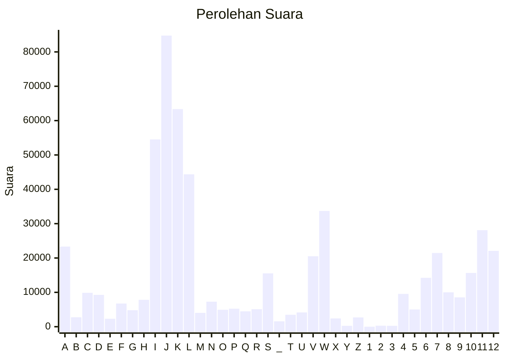

# Hasil

Partai **Partai Hati Nurani Rakyat**

## Grafik

## Tabel

| #  | Label | Kode Wilayah | Nama Wilayah              | Suara  | Suara (raw) | Persentase |
|:-- |:----- |:------------ |:------------------------- | ------:| -----------:| ----------:|
| 1  | A     | 11           | ACEH                      | 23.324 | 23324       | 4,13       |
| 2  | B     | 51           | BALI                      | 2.745  | 2745        | 0,49       |
| 3  | C     | 36           | BANTEN                    | 9.869  | 9869        | 1,75       |
| 4  | D     | 17           | BENGKULU                  | 9.269  | 9269        | 1,64       |
| 5  | E     | 34           | DI YOGYAKARTA             | 2.311  | 2311        | 0,41       |
| 6  | F     | 31           | DKI JAKARTA               | 6.743  | 6743        | 1,19       |
| 7  | G     | 75           | GORONTALO                 | 4.806  | 4806        | 0,85       |
| 8  | H     | 15           | JAMBI                     | 7.829  | 7829        | 1,39       |
| 9  | I     | 32           | JAWA BARAT                | 54.523 | 54523       | 9,66       |
| 10 | J     | 33           | JAWA TENGAH               | 84.752 | 84752       | 15,02      |
| 11 | K     | 35           | JAWA TIMUR                | 63.347 | 63347       | 11,22      |
| 12 | L     | 61           | KALIMANTAN BARAT          | 44.362 | 44362       | 7,86       |
| 13 | M     | 63           | KALIMANTAN SELATAN        | 4.020  | 4020        | 0,71       |
| 14 | N     | 62           | KALIMANTAN TENGAH         | 7.291  | 7291        | 1,29       |
| 15 | O     | 64           | KALIMANTAN TIMUR          | 4.933  | 4933        | 0,87       |
| 16 | P     | 65           | KALIMANTAN UTARA          | 5.238  | 5238        | 0,93       |
| 17 | Q     | 19           | KEPULAUAN BANGKA BELITUNG | 4.479  | 4479        | 0,79       |
| 18 | R     | 21           | KEPULAUAN RIAU            | 5.089  | 5089        | 0,90       |
| 19 | S     | 18           | LAMPUNG                   | 15.531 | 15531       | 2,75       |
| 20 | _     | 99           | Luar Negeri               | 1.571  | 1571        | 0,28       |
| 21 | T     | 81           | MALUKU                    | 3.466  | 3466        | 0,61       |
| 22 | U     | 82           | MALUKU UTARA              | 4.151  | 4151        | 0,74       |
| 23 | V     | 52           | NUSA TENGGARA BARAT       | 20.520 | 20520       | 3,64       |
| 24 | W     | 53           | NUSA TENGGARA TIMUR       | 33.700 | 33700       | 5,97       |
| 25 | X     | 91           | PAPUA                     | 2.412  | 2412        | 0,43       |
| 26 | Y     | 92           | PAPUA BARAT               | 264    | 264         | 0,05       |
| 27 | Z     | 96           | PAPUA BARAT DAYA          | 2.700  | 2700        | 0,48       |
| 28 | 1     | 95           | PAPUA PEGUNUNGAN          | 0      | 0           | 0,00       |
| 29 | 2     | 93           | PAPUA SELATAN             | 292    | 292         | 0,05       |
| 30 | 3     | 94           | PAPUA TENGAH              | 261    | 261         | 0,05       |
| 31 | 4     | 14           | RIAU                      | 9.540  | 9540        | 1,69       |
| 32 | 5     | 76           | SULAWESI BARAT            | 5.012  | 5012        | 0,89       |
| 33 | 6     | 73           | SULAWESI SELATAN          | 14.225 | 14225       | 2,52       |
| 34 | 7     | 72           | SULAWESI TENGAH           | 21.457 | 21457       | 3,80       |
| 35 | 8     | 74           | SULAWESI TENGGARA         | 10.005 | 10005       | 1,77       |
| 36 | 9     | 71           | SULAWESI UTARA            | 8.543  | 8543        | 1,51       |
| 37 | 10    | 13           | SUMATERA BARAT            | 15.651 | 15651       | 2,77       |
| 38 | 11    | 16           | SUMATERA SELATAN          | 28.098 | 28098       | 4,98       |
| 39 | 12    | 12           | SUMATERA UTARA            | 22.077 | 22077       | 3,91       |

