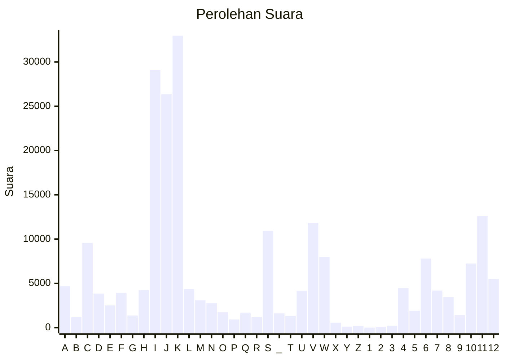

# Hasil

Partai **Partai Garda Republik Indonesia**

## Grafik

## Tabel

| #  | Label | Kode Wilayah | Nama Wilayah              | Suara  | Suara (raw) | Persentase |
|:-- |:----- |:------------ |:------------------------- | ------:| -----------:| ----------:|
| 1  | A     | 11           | ACEH                      | 4.695  | 4695        | 2,11       |
| 2  | B     | 51           | BALI                      | 1.186  | 1186        | 0,53       |
| 3  | C     | 36           | BANTEN                    | 9.577  | 9577        | 4,29       |
| 4  | D     | 17           | BENGKULU                  | 3.838  | 3838        | 1,72       |
| 5  | E     | 34           | DI YOGYAKARTA             | 2.502  | 2502        | 1,12       |
| 6  | F     | 31           | DKI JAKARTA               | 3.930  | 3930        | 1,76       |
| 7  | G     | 75           | GORONTALO                 | 1.370  | 1370        | 0,61       |
| 8  | H     | 15           | JAMBI                     | 4.243  | 4243        | 1,90       |
| 9  | I     | 32           | JAWA BARAT                | 29.102 | 29102       | 13,05      |
| 10 | J     | 33           | JAWA TENGAH               | 26.367 | 26367       | 11,82      |
| 11 | K     | 35           | JAWA TIMUR                | 32.971 | 32971       | 14,78      |
| 12 | L     | 61           | KALIMANTAN BARAT          | 4.373  | 4373        | 1,96       |
| 13 | M     | 63           | KALIMANTAN SELATAN        | 3.072  | 3072        | 1,38       |
| 14 | N     | 62           | KALIMANTAN TENGAH         | 2.744  | 2744        | 1,23       |
| 15 | O     | 64           | KALIMANTAN TIMUR          | 1.745  | 1745        | 0,78       |
| 16 | P     | 65           | KALIMANTAN UTARA          | 924    | 924         | 0,41       |
| 17 | Q     | 19           | KEPULAUAN BANGKA BELITUNG | 1.694  | 1694        | 0,76       |
| 18 | R     | 21           | KEPULAUAN RIAU            | 1.185  | 1185        | 0,53       |
| 19 | S     | 18           | LAMPUNG                   | 10.919 | 10919       | 4,90       |
| 20 | _     | 99           | Luar Negeri               | 1.614  | 1614        | 0,72       |
| 21 | T     | 81           | MALUKU                    | 1.317  | 1317        | 0,59       |
| 22 | U     | 82           | MALUKU UTARA              | 4.162  | 4162        | 1,87       |
| 23 | V     | 52           | NUSA TENGGARA BARAT       | 11.835 | 11835       | 5,31       |
| 24 | W     | 53           | NUSA TENGGARA TIMUR       | 7.978  | 7978        | 3,58       |
| 25 | X     | 91           | PAPUA                     | 558    | 558         | 0,25       |
| 26 | Y     | 92           | PAPUA BARAT               | 109    | 109         | 0,05       |
| 27 | Z     | 96           | PAPUA BARAT DAYA          | 192    | 192         | 0,09       |
| 28 | 1     | 95           | PAPUA PEGUNUNGAN          | 0      | 0           | 0,00       |
| 29 | 2     | 93           | PAPUA SELATAN             | 98     | 98          | 0,04       |
| 30 | 3     | 94           | PAPUA TENGAH              | 207    | 207         | 0,09       |
| 31 | 4     | 14           | RIAU                      | 4.457  | 4457        | 2,00       |
| 32 | 5     | 76           | SULAWESI BARAT            | 1.900  | 1900        | 0,85       |
| 33 | 6     | 73           | SULAWESI SELATAN          | 7.794  | 7794        | 3,49       |
| 34 | 7     | 72           | SULAWESI TENGAH           | 4.187  | 4187        | 1,88       |
| 35 | 8     | 74           | SULAWESI TENGGARA         | 3.449  | 3449        | 1,55       |
| 36 | 9     | 71           | SULAWESI UTARA            | 1.407  | 1407        | 0,63       |
| 37 | 10    | 13           | SUMATERA BARAT            | 7.242  | 7242        | 3,25       |
| 38 | 11    | 16           | SUMATERA SELATAN          | 12.600 | 12600       | 5,65       |
| 39 | 12    | 12           | SUMATERA UTARA            | 5.493  | 5493        | 2,46       |

