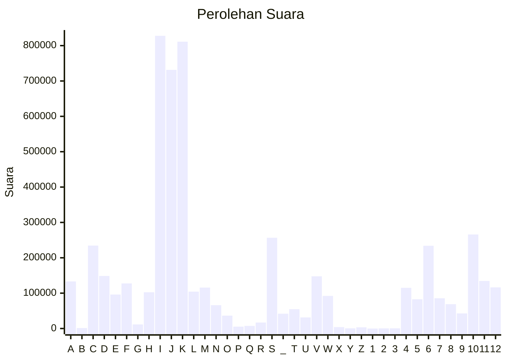

# Hasil

Partai **Partai Amanat Nasional**

## Grafik

## Tabel

| #  | Label | Kode Wilayah | Nama Wilayah              | Suara   | Suara (raw) | Persentase |
|:-- |:----- |:------------ |:------------------------- | -------:| -----------:| ----------:|
| 1  | A     | 11           | ACEH                      | 133.146 | 133146      | 2,49       |
| 2  | B     | 51           | BALI                      | 1.325   | 1325        | 0,02       |
| 3  | C     | 36           | BANTEN                    | 234.547 | 234547      | 4,38       |
| 4  | D     | 17           | BENGKULU                  | 148.668 | 148668      | 2,78       |
| 5  | E     | 34           | DI YOGYAKARTA             | 96.125  | 96125       | 1,79       |
| 6  | F     | 31           | DKI JAKARTA               | 127.402 | 127402      | 2,38       |
| 7  | G     | 75           | GORONTALO                 | 11.469  | 11469       | 0,21       |
| 8  | H     | 15           | JAMBI                     | 102.550 | 102550      | 1,91       |
| 9  | I     | 32           | JAWA BARAT                | 827.832 | 827832      | 15,45      |
| 10 | J     | 33           | JAWA TENGAH               | 731.375 | 731375      | 13,65      |
| 11 | K     | 35           | JAWA TIMUR                | 811.170 | 811170      | 15,14      |
| 12 | L     | 61           | KALIMANTAN BARAT          | 104.346 | 104346      | 1,95       |
| 13 | M     | 63           | KALIMANTAN SELATAN        | 115.684 | 115684      | 2,16       |
| 14 | N     | 62           | KALIMANTAN TENGAH         | 65.989  | 65989       | 1,23       |
| 15 | O     | 64           | KALIMANTAN TIMUR          | 36.427  | 36427       | 0,68       |
| 16 | P     | 65           | KALIMANTAN UTARA          | 5.369   | 5369        | 0,10       |
| 17 | Q     | 19           | KEPULAUAN BANGKA BELITUNG | 7.443   | 7443        | 0,14       |
| 18 | R     | 21           | KEPULAUAN RIAU            | 16.885  | 16885       | 0,32       |
| 19 | S     | 18           | LAMPUNG                   | 256.652 | 256652      | 4,79       |
| 20 | _     | 99           | Luar Negeri               | 41.877  | 41877       | 0,78       |
| 21 | T     | 81           | MALUKU                    | 54.678  | 54678       | 1,02       |
| 22 | U     | 82           | MALUKU UTARA              | 31.477  | 31477       | 0,59       |
| 23 | V     | 52           | NUSA TENGGARA BARAT       | 147.698 | 147698      | 2,76       |
| 24 | W     | 53           | NUSA TENGGARA TIMUR       | 92.153  | 92153       | 1,72       |
| 25 | X     | 91           | PAPUA                     | 3.899   | 3899        | 0,07       |
| 26 | Y     | 92           | PAPUA BARAT               | 670     | 670         | 0,01       |
| 27 | Z     | 96           | PAPUA BARAT DAYA          | 3.455   | 3455        | 0,06       |
| 28 | 1     | 95           | PAPUA PEGUNUNGAN          | 0       | 0           | 0,00       |
| 29 | 2     | 93           | PAPUA SELATAN             | 365     | 365         | 0,01       |
| 30 | 3     | 94           | PAPUA TENGAH              | 604     | 604         | 0,01       |
| 31 | 4     | 14           | RIAU                      | 115.029 | 115029      | 2,15       |
| 32 | 5     | 76           | SULAWESI BARAT            | 82.759  | 82759       | 1,54       |
| 33 | 6     | 73           | SULAWESI SELATAN          | 234.138 | 234138      | 4,37       |
| 34 | 7     | 72           | SULAWESI TENGAH           | 85.553  | 85553       | 1,60       |
| 35 | 8     | 74           | SULAWESI TENGGARA         | 68.837  | 68837       | 1,28       |
| 36 | 9     | 71           | SULAWESI UTARA            | 42.735  | 42735       | 0,80       |
| 37 | 10    | 13           | SUMATERA BARAT            | 265.963 | 265963      | 4,96       |
| 38 | 11    | 16           | SUMATERA SELATAN          | 134.589 | 134589      | 2,51       |
| 39 | 12    | 12           | SUMATERA UTARA            | 116.305 | 116305      | 2,17       |

