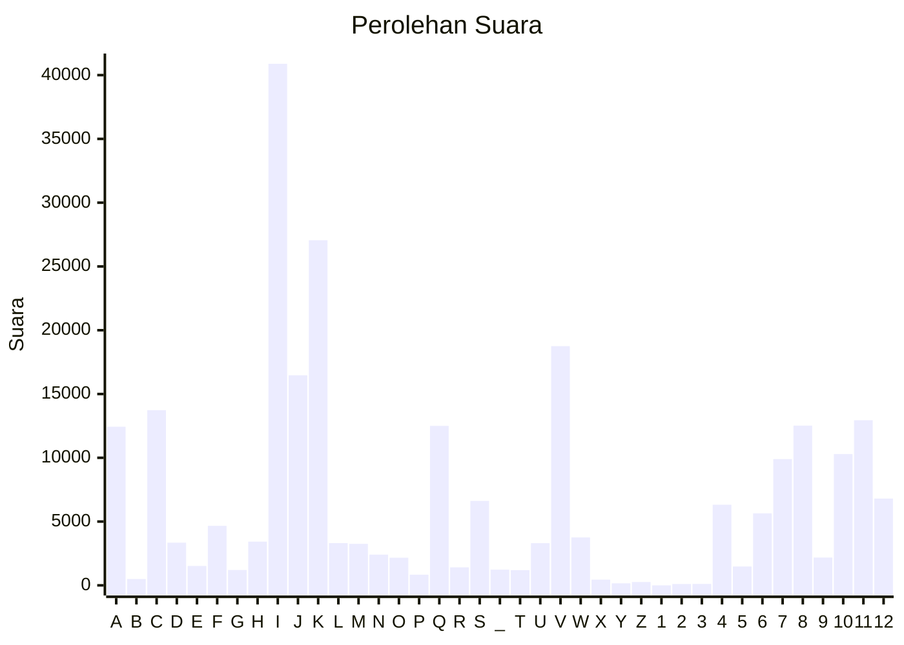

# Hasil

Partai **Partai Bulan Bintang**

## Grafik

## Tabel

| #  | Label | Kode Wilayah | Nama Wilayah              | Suara  | Suara (raw) | Persentase |
|:-- |:----- |:------------ |:------------------------- | ------:| -----------:| ----------:|
| 1  | A     | 11           | ACEH                      | 12.438 | 12438       | 4,87       |
| 2  | B     | 51           | BALI                      | 497    | 497         | 0,19       |
| 3  | C     | 36           | BANTEN                    | 13.730 | 13730       | 5,38       |
| 4  | D     | 17           | BENGKULU                  | 3.347  | 3347        | 1,31       |
| 5  | E     | 34           | DI YOGYAKARTA             | 1.517  | 1517        | 0,59       |
| 6  | F     | 31           | DKI JAKARTA               | 4.663  | 4663        | 1,83       |
| 7  | G     | 75           | GORONTALO                 | 1.204  | 1204        | 0,47       |
| 8  | H     | 15           | JAMBI                     | 3.428  | 3428        | 1,34       |
| 9  | I     | 32           | JAWA BARAT                | 40.890 | 40890       | 16,03      |
| 10 | J     | 33           | JAWA TENGAH               | 16.469 | 16469       | 6,45       |
| 11 | K     | 35           | JAWA TIMUR                | 27.056 | 27056       | 10,60      |
| 12 | L     | 61           | KALIMANTAN BARAT          | 3.311  | 3311        | 1,30       |
| 13 | M     | 63           | KALIMANTAN SELATAN        | 3.255  | 3255        | 1,28       |
| 14 | N     | 62           | KALIMANTAN TENGAH         | 2.408  | 2408        | 0,94       |
| 15 | O     | 64           | KALIMANTAN TIMUR          | 2.166  | 2166        | 0,85       |
| 16 | P     | 65           | KALIMANTAN UTARA          | 836    | 836         | 0,33       |
| 17 | Q     | 19           | KEPULAUAN BANGKA BELITUNG | 12.502 | 12502       | 4,90       |
| 18 | R     | 21           | KEPULAUAN RIAU            | 1.412  | 1412        | 0,55       |
| 19 | S     | 18           | LAMPUNG                   | 6.619  | 6619        | 2,59       |
| 20 | _     | 99           | Luar Negeri               | 1.227  | 1227        | 0,48       |
| 21 | T     | 81           | MALUKU                    | 1.187  | 1187        | 0,47       |
| 22 | U     | 82           | MALUKU UTARA              | 3.308  | 3308        | 1,30       |
| 23 | V     | 52           | NUSA TENGGARA BARAT       | 18.753 | 18753       | 7,35       |
| 24 | W     | 53           | NUSA TENGGARA TIMUR       | 3.753  | 3753        | 1,47       |
| 25 | X     | 91           | PAPUA                     | 448    | 448         | 0,18       |
| 26 | Y     | 92           | PAPUA BARAT               | 159    | 159         | 0,06       |
| 27 | Z     | 96           | PAPUA BARAT DAYA          | 261    | 261         | 0,10       |
| 28 | 1     | 95           | PAPUA PEGUNUNGAN          | 0      | 0           | 0,00       |
| 29 | 2     | 93           | PAPUA SELATAN             | 104    | 104         | 0,04       |
| 30 | 3     | 94           | PAPUA TENGAH              | 113    | 113         | 0,04       |
| 31 | 4     | 14           | RIAU                      | 6.323  | 6323        | 2,48       |
| 32 | 5     | 76           | SULAWESI BARAT            | 1.475  | 1475        | 0,58       |
| 33 | 6     | 73           | SULAWESI SELATAN          | 5.643  | 5643        | 2,21       |
| 34 | 7     | 72           | SULAWESI TENGAH           | 9.900  | 9900        | 3,88       |
| 35 | 8     | 74           | SULAWESI TENGGARA         | 12.524 | 12524       | 4,91       |
| 36 | 9     | 71           | SULAWESI UTARA            | 2.181  | 2181        | 0,85       |
| 37 | 10    | 13           | SUMATERA BARAT            | 10.297 | 10297       | 4,04       |
| 38 | 11    | 16           | SUMATERA SELATAN          | 12.947 | 12947       | 5,07       |
| 39 | 12    | 12           | SUMATERA UTARA            | 6.804  | 6804        | 2,67       |

