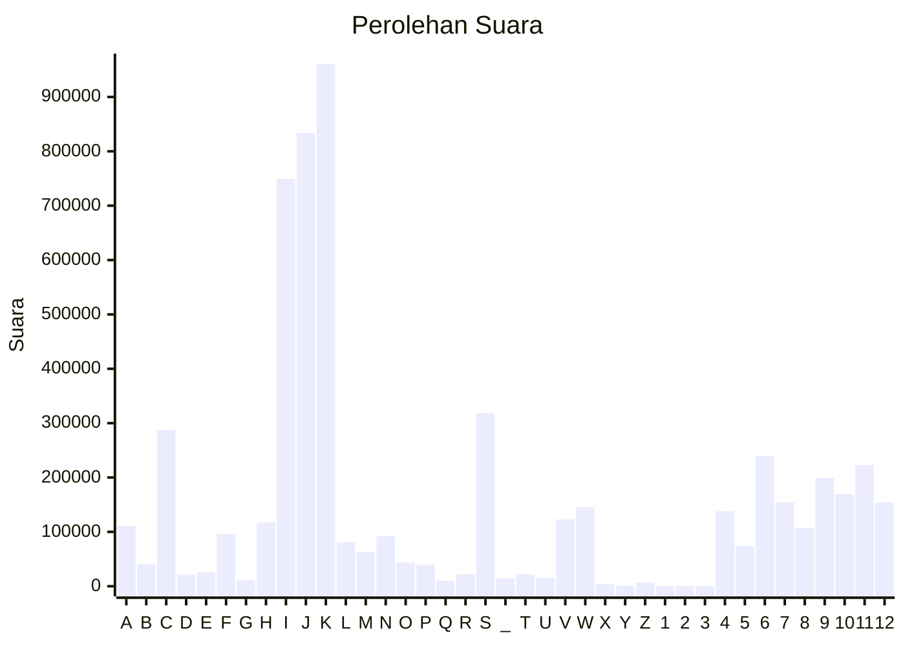

# Hasil

Partai **Partai Demokrat**

## Grafik

## Tabel

| #  | Label | Kode Wilayah | Nama Wilayah              | Suara   | Suara (raw) | Persentase |
|:-- |:----- |:------------ |:------------------------- | -------:| -----------:| ----------:|
| 1  | A     | 11           | ACEH                      | 111.286 | 111286      | 1,95       |
| 2  | B     | 51           | BALI                      | 40.310  | 40310       | 0,71       |
| 3  | C     | 36           | BANTEN                    | 287.780 | 287780      | 5,04       |
| 4  | D     | 17           | BENGKULU                  | 21.287  | 21287       | 0,37       |
| 5  | E     | 34           | DI YOGYAKARTA             | 25.935  | 25935       | 0,45       |
| 6  | F     | 31           | DKI JAKARTA               | 96.478  | 96478       | 1,69       |
| 7  | G     | 75           | GORONTALO                 | 10.729  | 10729       | 0,19       |
| 8  | H     | 15           | JAMBI                     | 117.378 | 117378      | 2,05       |
| 9  | I     | 32           | JAWA BARAT                | 749.183 | 749183      | 13,11      |
| 10 | J     | 33           | JAWA TENGAH               | 833.864 | 833864      | 14,59      |
| 11 | K     | 35           | JAWA TIMUR                | 960.888 | 960888      | 16,81      |
| 12 | L     | 61           | KALIMANTAN BARAT          | 80.952  | 80952       | 1,42       |
| 13 | M     | 63           | KALIMANTAN SELATAN        | 62.482  | 62482       | 1,09       |
| 14 | N     | 62           | KALIMANTAN TENGAH         | 91.938  | 91938       | 1,61       |
| 15 | O     | 64           | KALIMANTAN TIMUR          | 43.567  | 43567       | 0,76       |
| 16 | P     | 65           | KALIMANTAN UTARA          | 39.222  | 39222       | 0,69       |
| 17 | Q     | 19           | KEPULAUAN BANGKA BELITUNG | 9.952   | 9952        | 0,17       |
| 18 | R     | 21           | KEPULAUAN RIAU            | 21.844  | 21844       | 0,38       |
| 19 | S     | 18           | LAMPUNG                   | 318.688 | 318688      | 5,58       |
| 20 | _     | 99           | Luar Negeri               | 14.393  | 14393       | 0,25       |
| 21 | T     | 81           | MALUKU                    | 22.063  | 22063       | 0,39       |
| 22 | U     | 82           | MALUKU UTARA              | 15.419  | 15419       | 0,27       |
| 23 | V     | 52           | NUSA TENGGARA BARAT       | 123.031 | 123031      | 2,15       |
| 24 | W     | 53           | NUSA TENGGARA TIMUR       | 145.886 | 145886      | 2,55       |
| 25 | X     | 91           | PAPUA                     | 3.606   | 3606        | 0,06       |
| 26 | Y     | 92           | PAPUA BARAT               | 950     | 950         | 0,02       |
| 27 | Z     | 96           | PAPUA BARAT DAYA          | 6.803   | 6803        | 0,12       |
| 28 | 1     | 95           | PAPUA PEGUNUNGAN          | 232     | 232         | 0,00       |
| 29 | 2     | 93           | PAPUA SELATAN             | 357     | 357         | 0,01       |
| 30 | 3     | 94           | PAPUA TENGAH              | 429     | 429         | 0,01       |
| 31 | 4     | 14           | RIAU                      | 138.086 | 138086      | 2,42       |
| 32 | 5     | 76           | SULAWESI BARAT            | 73.783  | 73783       | 1,29       |
| 33 | 6     | 73           | SULAWESI SELATAN          | 239.078 | 239078      | 4,18       |
| 34 | 7     | 72           | SULAWESI TENGAH           | 154.270 | 154270      | 2,70       |
| 35 | 8     | 74           | SULAWESI TENGGARA         | 107.413 | 107413      | 1,88       |
| 36 | 9     | 71           | SULAWESI UTARA            | 198.832 | 198832      | 3,48       |
| 37 | 10    | 13           | SUMATERA BARAT            | 169.272 | 169272      | 2,96       |
| 38 | 11    | 16           | SUMATERA SELATAN          | 223.039 | 223039      | 3,90       |
| 39 | 12    | 12           | SUMATERA UTARA            | 154.137 | 154137      | 2,70       |

