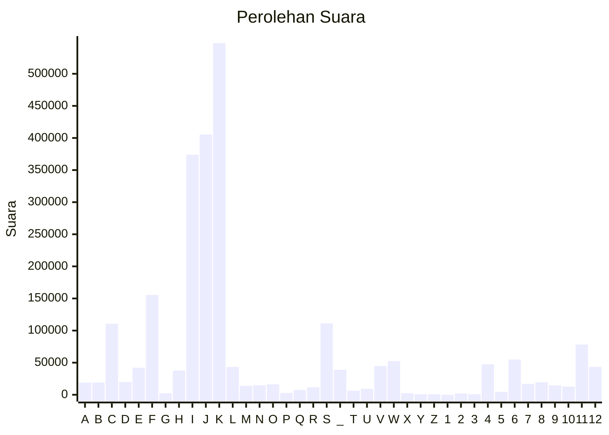

# Hasil

Partai **Partai Solidaritas Indonesia**

## Grafik

## Tabel

| #  | Label | Kode Wilayah | Nama Wilayah              | Suara   | Suara (raw) | Persentase |
|:-- |:----- |:------------ |:------------------------- | -------:| -----------:| ----------:|
| 1  | A     | 11           | ACEH                      | 18.969  | 18969       | 0,79       |
| 2  | B     | 51           | BALI                      | 19.053  | 19053       | 0,79       |
| 3  | C     | 36           | BANTEN                    | 110.682 | 110682      | 4,60       |
| 4  | D     | 17           | BENGKULU                  | 19.868  | 19868       | 0,83       |
| 5  | E     | 34           | DI YOGYAKARTA             | 42.125  | 42125       | 1,75       |
| 6  | F     | 31           | DKI JAKARTA               | 155.409 | 155409      | 6,46       |
| 7  | G     | 75           | GORONTALO                 | 2.330   | 2330        | 0,10       |
| 8  | H     | 15           | JAMBI                     | 37.807  | 37807       | 1,57       |
| 9  | I     | 32           | JAWA BARAT                | 373.959 | 373959      | 15,54      |
| 10 | J     | 33           | JAWA TENGAH               | 405.382 | 405382      | 16,84      |
| 11 | K     | 35           | JAWA TIMUR                | 547.949 | 547949      | 22,77      |
| 12 | L     | 61           | KALIMANTAN BARAT          | 43.430  | 43430       | 1,80       |
| 13 | M     | 63           | KALIMANTAN SELATAN        | 14.014  | 14014       | 0,58       |
| 14 | N     | 62           | KALIMANTAN TENGAH         | 14.993  | 14993       | 0,62       |
| 15 | O     | 64           | KALIMANTAN TIMUR          | 16.384  | 16384       | 0,68       |
| 16 | P     | 65           | KALIMANTAN UTARA          | 2.907   | 2907        | 0,12       |
| 17 | Q     | 19           | KEPULAUAN BANGKA BELITUNG | 7.509   | 7509        | 0,31       |
| 18 | R     | 21           | KEPULAUAN RIAU            | 11.663  | 11663       | 0,48       |
| 19 | S     | 18           | LAMPUNG                   | 111.136 | 111136      | 4,62       |
| 20 | _     | 99           | Luar Negeri               | 38.957  | 38957       | 1,62       |
| 21 | T     | 81           | MALUKU                    | 6.438   | 6438        | 0,27       |
| 22 | U     | 82           | MALUKU UTARA              | 9.245   | 9245        | 0,38       |
| 23 | V     | 52           | NUSA TENGGARA BARAT       | 44.852  | 44852       | 1,86       |
| 24 | W     | 53           | NUSA TENGGARA TIMUR       | 52.562  | 52562       | 2,18       |
| 25 | X     | 91           | PAPUA                     | 2.274   | 2274        | 0,09       |
| 26 | Y     | 92           | PAPUA BARAT               | 847     | 847         | 0,04       |
| 27 | Z     | 96           | PAPUA BARAT DAYA          | 938     | 938         | 0,04       |
| 28 | 1     | 95           | PAPUA PEGUNUNGAN          | 0       | 0           | 0,00       |
| 29 | 2     | 93           | PAPUA SELATAN             | 1.928   | 1928        | 0,08       |
| 30 | 3     | 94           | PAPUA TENGAH              | 979     | 979         | 0,04       |
| 31 | 4     | 14           | RIAU                      | 47.414  | 47414       | 1,97       |
| 32 | 5     | 76           | SULAWESI BARAT            | 4.560   | 4560        | 0,19       |
| 33 | 6     | 73           | SULAWESI SELATAN          | 54.876  | 54876       | 2,28       |
| 34 | 7     | 72           | SULAWESI TENGAH           | 16.891  | 16891       | 0,70       |
| 35 | 8     | 74           | SULAWESI TENGGARA         | 19.480  | 19480       | 0,81       |
| 36 | 9     | 71           | SULAWESI UTARA            | 14.482  | 14482       | 0,60       |
| 37 | 10    | 13           | SUMATERA BARAT            | 12.723  | 12723       | 0,53       |
| 38 | 11    | 16           | SUMATERA SELATAN          | 78.340  | 78340       | 3,26       |
| 39 | 12    | 12           | SUMATERA UTARA            | 43.334  | 43334       | 1,80       |

