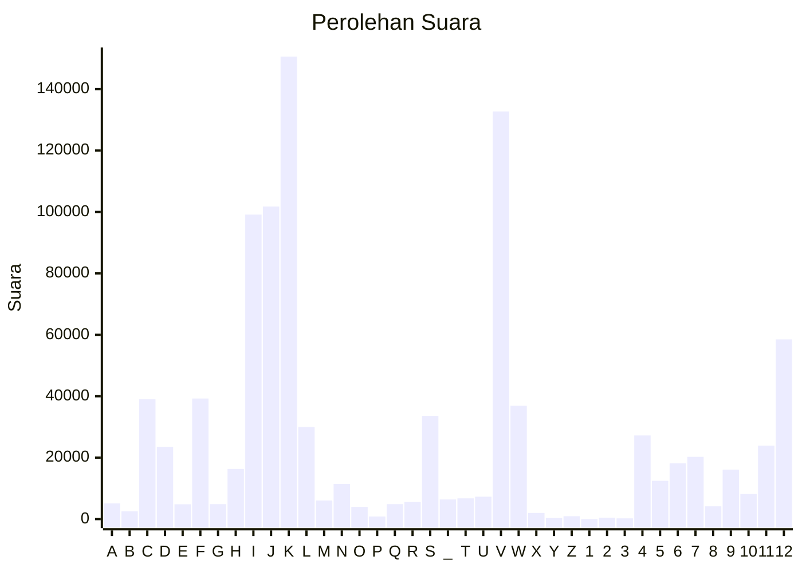

# Hasil

Partai **PARTAI PERINDO**

## Grafik

## Tabel

| #  | Label | Kode Wilayah | Nama Wilayah              | Suara   | Suara (raw) | Persentase |
|:-- |:----- |:------------ |:------------------------- | -------:| -----------:| ----------:|
| 1  | A     | 11           | ACEH                      | 5.100   | 5100        | 0,53       |
| 2  | B     | 51           | BALI                      | 2.528   | 2528        | 0,26       |
| 3  | C     | 36           | BANTEN                    | 39.007  | 39007       | 4,04       |
| 4  | D     | 17           | BENGKULU                  | 23.517  | 23517       | 2,43       |
| 5  | E     | 34           | DI YOGYAKARTA             | 4.827   | 4827        | 0,50       |
| 6  | F     | 31           | DKI JAKARTA               | 39.267  | 39267       | 4,06       |
| 7  | G     | 75           | GORONTALO                 | 4.873   | 4873        | 0,50       |
| 8  | H     | 15           | JAMBI                     | 16.329  | 16329       | 1,69       |
| 9  | I     | 32           | JAWA BARAT                | 99.149  | 99149       | 10,26      |
| 10 | J     | 33           | JAWA TENGAH               | 101.754 | 101754      | 10,53      |
| 11 | K     | 35           | JAWA TIMUR                | 150.604 | 150604      | 15,59      |
| 12 | L     | 61           | KALIMANTAN BARAT          | 29.964  | 29964       | 3,10       |
| 13 | M     | 63           | KALIMANTAN SELATAN        | 6.035   | 6035        | 0,62       |
| 14 | N     | 62           | KALIMANTAN TENGAH         | 11.464  | 11464       | 1,19       |
| 15 | O     | 64           | KALIMANTAN TIMUR          | 3.982   | 3982        | 0,41       |
| 16 | P     | 65           | KALIMANTAN UTARA          | 837     | 837         | 0,09       |
| 17 | Q     | 19           | KEPULAUAN BANGKA BELITUNG | 4.883   | 4883        | 0,51       |
| 18 | R     | 21           | KEPULAUAN RIAU            | 5.568   | 5568        | 0,58       |
| 19 | S     | 18           | LAMPUNG                   | 33.595  | 33595       | 3,48       |
| 20 | _     | 99           | Luar Negeri               | 6.383   | 6383        | 0,66       |
| 21 | T     | 81           | MALUKU                    | 6.752   | 6752        | 0,70       |
| 22 | U     | 82           | MALUKU UTARA              | 7.285   | 7285        | 0,75       |
| 23 | V     | 52           | NUSA TENGGARA BARAT       | 132.732 | 132732      | 13,74      |
| 24 | W     | 53           | NUSA TENGGARA TIMUR       | 36.893  | 36893       | 3,82       |
| 25 | X     | 91           | PAPUA                     | 2.000   | 2000        | 0,21       |
| 26 | Y     | 92           | PAPUA BARAT               | 330     | 330         | 0,03       |
| 27 | Z     | 96           | PAPUA BARAT DAYA          | 938     | 938         | 0,10       |
| 28 | 1     | 95           | PAPUA PEGUNUNGAN          | 0       | 0           | 0,00       |
| 29 | 2     | 93           | PAPUA SELATAN             | 435     | 435         | 0,05       |
| 30 | 3     | 94           | PAPUA TENGAH              | 235     | 235         | 0,02       |
| 31 | 4     | 14           | RIAU                      | 27.230  | 27230       | 2,82       |
| 32 | 5     | 76           | SULAWESI BARAT            | 12.469  | 12469       | 1,29       |
| 33 | 6     | 73           | SULAWESI SELATAN          | 18.135  | 18135       | 1,88       |
| 34 | 7     | 72           | SULAWESI TENGAH           | 20.275  | 20275       | 2,10       |
| 35 | 8     | 74           | SULAWESI TENGGARA         | 4.160   | 4160        | 0,43       |
| 36 | 9     | 71           | SULAWESI UTARA            | 16.106  | 16106       | 1,67       |
| 37 | 10    | 13           | SUMATERA BARAT            | 8.169   | 8169        | 0,85       |
| 38 | 11    | 16           | SUMATERA SELATAN          | 23.909  | 23909       | 2,47       |
| 39 | 12    | 12           | SUMATERA UTARA            | 58.503  | 58503       | 6,05       |

