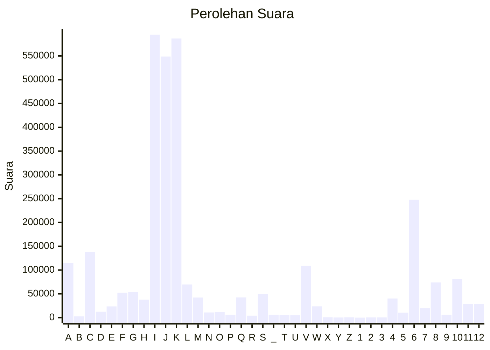

# Hasil

Partai **Partai Persatuan Pembangunan**

## Grafik

## Tabel

| #  | Label | Kode Wilayah | Nama Wilayah              | Suara   | Suara (raw) | Persentase |
|:-- |:----- |:------------ |:------------------------- | -------:| -----------:| ----------:|
| 1  | A     | 11           | ACEH                      | 114.707 | 114707      | 3,71       |
| 2  | B     | 51           | BALI                      | 2.649   | 2649        | 0,09       |
| 3  | C     | 36           | BANTEN                    | 137.866 | 137866      | 4,46       |
| 4  | D     | 17           | BENGKULU                  | 12.386  | 12386       | 0,40       |
| 5  | E     | 34           | DI YOGYAKARTA             | 23.563  | 23563       | 0,76       |
| 6  | F     | 31           | DKI JAKARTA               | 52.287  | 52287       | 1,69       |
| 7  | G     | 75           | GORONTALO                 | 53.357  | 53357       | 1,73       |
| 8  | H     | 15           | JAMBI                     | 37.871  | 37871       | 1,23       |
| 9  | I     | 32           | JAWA BARAT                | 594.856 | 594856      | 19,25      |
| 10 | J     | 33           | JAWA TENGAH               | 548.759 | 548759      | 17,76      |
| 11 | K     | 35           | JAWA TIMUR                | 586.741 | 586741      | 18,99      |
| 12 | L     | 61           | KALIMANTAN BARAT          | 69.729  | 69729       | 2,26       |
| 13 | M     | 63           | KALIMANTAN SELATAN        | 42.235  | 42235       | 1,37       |
| 14 | N     | 62           | KALIMANTAN TENGAH         | 10.882  | 10882       | 0,35       |
| 15 | O     | 64           | KALIMANTAN TIMUR          | 12.150  | 12150       | 0,39       |
| 16 | P     | 65           | KALIMANTAN UTARA          | 6.111   | 6111        | 0,20       |
| 17 | Q     | 19           | KEPULAUAN BANGKA BELITUNG | 42.546  | 42546       | 1,38       |
| 18 | R     | 21           | KEPULAUAN RIAU            | 4.175   | 4175        | 0,14       |
| 19 | S     | 18           | LAMPUNG                   | 49.527  | 49527       | 1,60       |
| 20 | _     | 99           | Luar Negeri               | 6.013   | 6013        | 0,19       |
| 21 | T     | 81           | MALUKU                    | 5.339   | 5339        | 0,17       |
| 22 | U     | 82           | MALUKU UTARA              | 4.860   | 4860        | 0,16       |
| 23 | V     | 52           | NUSA TENGGARA BARAT       | 109.043 | 109043      | 3,53       |
| 24 | W     | 53           | NUSA TENGGARA TIMUR       | 23.620  | 23620       | 0,76       |
| 25 | X     | 91           | PAPUA                     | 772     | 772         | 0,02       |
| 26 | Y     | 92           | PAPUA BARAT               | 278     | 278         | 0,01       |
| 27 | Z     | 96           | PAPUA BARAT DAYA          | 715     | 715         | 0,02       |
| 28 | 1     | 95           | PAPUA PEGUNUNGAN          | 0       | 0           | 0,00       |
| 29 | 2     | 93           | PAPUA SELATAN             | 510     | 510         | 0,02       |
| 30 | 3     | 94           | PAPUA TENGAH              | 448     | 448         | 0,01       |
| 31 | 4     | 14           | RIAU                      | 40.211  | 40211       | 1,30       |
| 32 | 5     | 76           | SULAWESI BARAT            | 10.348  | 10348       | 0,33       |
| 33 | 6     | 73           | SULAWESI SELATAN          | 247.684 | 247684      | 8,01       |
| 34 | 7     | 72           | SULAWESI TENGAH           | 19.826  | 19826       | 0,64       |
| 35 | 8     | 74           | SULAWESI TENGGARA         | 73.928  | 73928       | 2,39       |
| 36 | 9     | 71           | SULAWESI UTARA            | 5.821   | 5821        | 0,19       |
| 37 | 10    | 13           | SUMATERA BARAT            | 81.244  | 81244       | 2,63       |
| 38 | 11    | 16           | SUMATERA SELATAN          | 28.419  | 28419       | 0,92       |
| 39 | 12    | 12           | SUMATERA UTARA            | 28.821  | 28821       | 0,93       |

