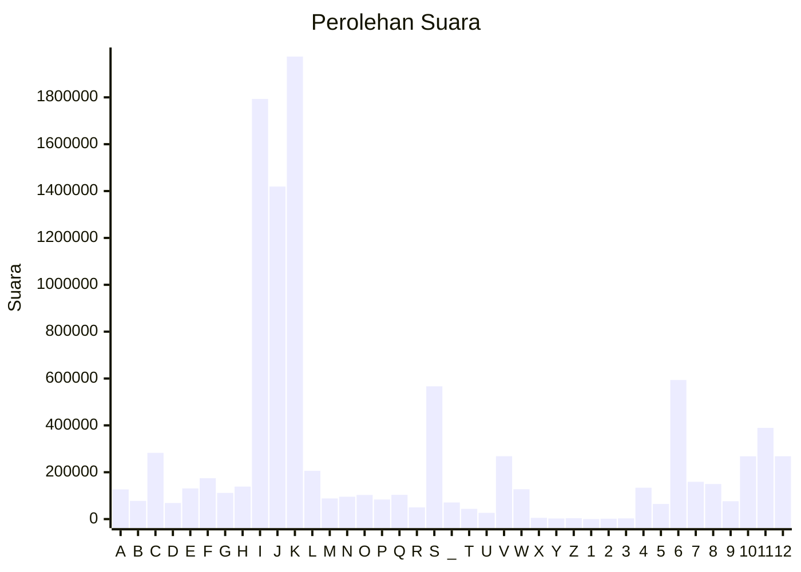

# Hasil

Partai **Partai Gerakan Indonesia Raya**

## Grafik

## Tabel

| #  | Label | Kode Wilayah | Nama Wilayah              | Suara     | Suara (raw) | Persentase |
|:-- |:----- |:------------ |:------------------------- | ---------:| -----------:| ----------:|
| 1  | A     | 11           | ACEH                      | 126.713   | 126713      | 1,24       |
| 2  | B     | 51           | BALI                      | 77.534    | 77534       | 0,76       |
| 3  | C     | 36           | BANTEN                    | 282.735   | 282735      | 2,76       |
| 4  | D     | 17           | BENGKULU                  | 68.533    | 68533       | 0,67       |
| 5  | E     | 34           | DI YOGYAKARTA             | 131.070   | 131070      | 1,28       |
| 6  | F     | 31           | DKI JAKARTA               | 174.408   | 174408      | 1,70       |
| 7  | G     | 75           | GORONTALO                 | 111.852   | 111852      | 1,09       |
| 8  | H     | 15           | JAMBI                     | 138.731   | 138731      | 1,35       |
| 9  | I     | 32           | JAWA BARAT                | 1.793.084 | 1793084     | 17,49      |
| 10 | J     | 33           | JAWA TENGAH               | 1.419.157 | 1419157     | 13,85      |
| 11 | K     | 35           | JAWA TIMUR                | 1.974.116 | 1974116     | 19,26      |
| 12 | L     | 61           | KALIMANTAN BARAT          | 206.123   | 206123      | 2,01       |
| 13 | M     | 63           | KALIMANTAN SELATAN        | 88.131    | 88131       | 0,86       |
| 14 | N     | 62           | KALIMANTAN TENGAH         | 95.554    | 95554       | 0,93       |
| 15 | O     | 64           | KALIMANTAN TIMUR          | 102.898   | 102898      | 1,00       |
| 16 | P     | 65           | KALIMANTAN UTARA          | 83.494    | 83494       | 0,81       |
| 17 | Q     | 19           | KEPULAUAN BANGKA BELITUNG | 103.508   | 103508      | 1,01       |
| 18 | R     | 21           | KEPULAUAN RIAU            | 50.146    | 50146       | 0,49       |
| 19 | S     | 18           | LAMPUNG                   | 566.696   | 566696      | 5,53       |
| 20 | _     | 99           | Luar Negeri               | 70.821    | 70821       | 0,69       |
| 21 | T     | 81           | MALUKU                    | 43.585    | 43585       | 0,43       |
| 22 | U     | 82           | MALUKU UTARA              | 26.480    | 26480       | 0,26       |
| 23 | V     | 52           | NUSA TENGGARA BARAT       | 268.325   | 268325      | 2,62       |
| 24 | W     | 53           | NUSA TENGGARA TIMUR       | 127.427   | 127427      | 1,24       |
| 25 | X     | 91           | PAPUA                     | 5.273     | 5273        | 0,05       |
| 26 | Y     | 92           | PAPUA BARAT               | 2.473     | 2473        | 0,02       |
| 27 | Z     | 96           | PAPUA BARAT DAYA          | 3.726     | 3726        | 0,04       |
| 28 | 1     | 95           | PAPUA PEGUNUNGAN          | 0         | 0           | 0,00       |
| 29 | 2     | 93           | PAPUA SELATAN             | 1.819     | 1819        | 0,02       |
| 30 | 3     | 94           | PAPUA TENGAH              | 3.123     | 3123        | 0,03       |
| 31 | 4     | 14           | RIAU                      | 133.843   | 133843      | 1,31       |
| 32 | 5     | 76           | SULAWESI BARAT            | 64.451    | 64451       | 0,63       |
| 33 | 6     | 73           | SULAWESI SELATAN          | 593.516   | 593516      | 5,79       |
| 34 | 7     | 72           | SULAWESI TENGAH           | 159.063   | 159063      | 1,55       |
| 35 | 8     | 74           | SULAWESI TENGGARA         | 149.731   | 149731      | 1,46       |
| 36 | 9     | 71           | SULAWESI UTARA            | 76.244    | 76244       | 0,74       |
| 37 | 10    | 13           | SUMATERA BARAT            | 267.992   | 267992      | 2,61       |
| 38 | 11    | 16           | SUMATERA SELATAN          | 389.443   | 389443      | 3,80       |
| 39 | 12    | 12           | SUMATERA UTARA            | 268.197   | 268197      | 2,62       |

