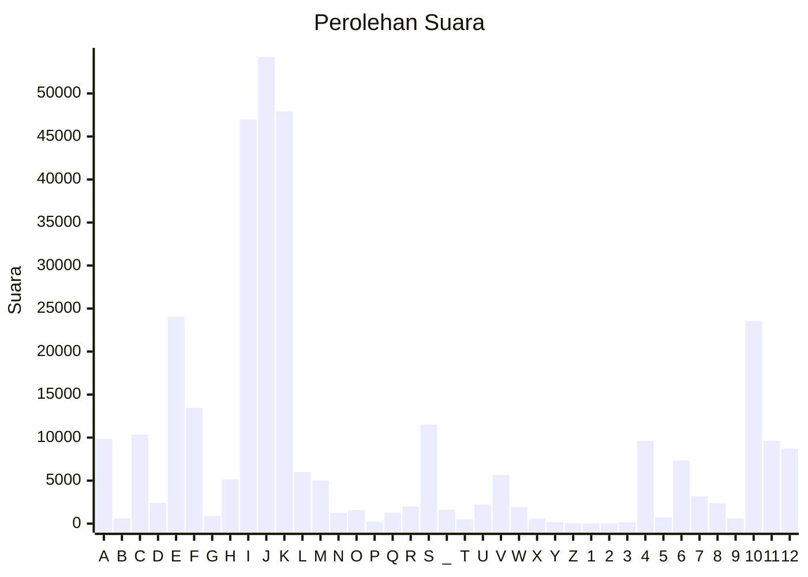

# Hasil

Partai **Partai Ummat**

## Grafik

## Tabel

| #  | Label | Kode Wilayah | Nama Wilayah              | Suara  | Suara (raw) | Persentase |
|:-- |:----- |:------------ |:------------------------- | ------:| -----------:| ----------:|
| 1  | A     | 11           | ACEH                      | 9.842  | 9842        | 3,04       |
| 2  | B     | 51           | BALI                      | 604    | 604         | 0,19       |
| 3  | C     | 36           | BANTEN                    | 10.371 | 10371       | 3,21       |
| 4  | D     | 17           | BENGKULU                  | 2.421  | 2421        | 0,75       |
| 5  | E     | 34           | DI YOGYAKARTA             | 24.043 | 24043       | 7,43       |
| 6  | F     | 31           | DKI JAKARTA               | 13.470 | 13470       | 4,16       |
| 7  | G     | 75           | GORONTALO                 | 882    | 882         | 0,27       |
| 8  | H     | 15           | JAMBI                     | 5.142  | 5142        | 1,59       |
| 9  | I     | 32           | JAWA BARAT                | 46.949 | 46949       | 14,52      |
| 10 | J     | 33           | JAWA TENGAH               | 54.234 | 54234       | 16,77      |
| 11 | K     | 35           | JAWA TIMUR                | 47.881 | 47881       | 14,81      |
| 12 | L     | 61           | KALIMANTAN BARAT          | 6.002  | 6002        | 1,86       |
| 13 | M     | 63           | KALIMANTAN SELATAN        | 4.994  | 4994        | 1,54       |
| 14 | N     | 62           | KALIMANTAN TENGAH         | 1.244  | 1244        | 0,38       |
| 15 | O     | 64           | KALIMANTAN TIMUR          | 1.565  | 1565        | 0,48       |
| 16 | P     | 65           | KALIMANTAN UTARA          | 231    | 231         | 0,07       |
| 17 | Q     | 19           | KEPULAUAN BANGKA BELITUNG | 1.268  | 1268        | 0,39       |
| 18 | R     | 21           | KEPULAUAN RIAU            | 1.998  | 1998        | 0,62       |
| 19 | S     | 18           | LAMPUNG                   | 11.526 | 11526       | 3,56       |
| 20 | _     | 99           | Luar Negeri               | 1.626  | 1626        | 0,50       |
| 21 | T     | 81           | MALUKU                    | 495    | 495         | 0,15       |
| 22 | U     | 82           | MALUKU UTARA              | 2.238  | 2238        | 0,69       |
| 23 | V     | 52           | NUSA TENGGARA BARAT       | 5.676  | 5676        | 1,76       |
| 24 | W     | 53           | NUSA TENGGARA TIMUR       | 1.931  | 1931        | 0,60       |
| 25 | X     | 91           | PAPUA                     | 585    | 585         | 0,18       |
| 26 | Y     | 92           | PAPUA BARAT               | 173    | 173         | 0,05       |
| 27 | Z     | 96           | PAPUA BARAT DAYA          | 47     | 47          | 0,01       |
| 28 | 1     | 95           | PAPUA PEGUNUNGAN          | 0      | 0           | 0,00       |
| 29 | 2     | 93           | PAPUA SELATAN             | 35     | 35          | 0,01       |
| 30 | 3     | 94           | PAPUA TENGAH              | 157    | 157         | 0,05       |
| 31 | 4     | 14           | RIAU                      | 9.614  | 9614        | 2,97       |
| 32 | 5     | 76           | SULAWESI BARAT            | 736    | 736         | 0,23       |
| 33 | 6     | 73           | SULAWESI SELATAN          | 7.341  | 7341        | 2,27       |
| 34 | 7     | 72           | SULAWESI TENGAH           | 3.193  | 3193        | 0,99       |
| 35 | 8     | 74           | SULAWESI TENGGARA         | 2.356  | 2356        | 0,73       |
| 36 | 9     | 71           | SULAWESI UTARA            | 621    | 621         | 0,19       |
| 37 | 10    | 13           | SUMATERA BARAT            | 23.551 | 23551       | 7,28       |
| 38 | 11    | 16           | SUMATERA SELATAN          | 9.626  | 9626        | 2,98       |
| 39 | 12    | 12           | SUMATERA UTARA            | 8.742  | 8742        | 2,70       |

