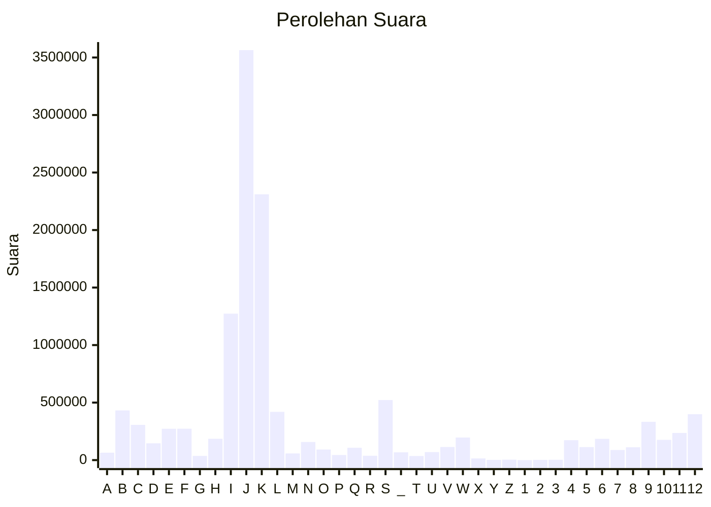

# Hasil

Partai **Partai Demokrasi Indonesia Perjuangan**

## Grafik

## Tabel

| #  | Label | Kode Wilayah | Nama Wilayah              | Suara     | Suara (raw) | Persentase |
|:-- |:----- |:------------ |:------------------------- | ---------:| -----------:| ----------:|
| 1  | A     | 11           | ACEH                      | 64.448    | 64448       | 0,51       |
| 2  | B     | 51           | BALI                      | 431.860   | 431860      | 3,42       |
| 3  | C     | 36           | BANTEN                    | 306.052   | 306052      | 2,42       |
| 4  | D     | 17           | BENGKULU                  | 145.952   | 145952      | 1,16       |
| 5  | E     | 34           | DI YOGYAKARTA             | 272.371   | 272371      | 2,16       |
| 6  | F     | 31           | DKI JAKARTA               | 272.956   | 272956      | 2,16       |
| 7  | G     | 75           | GORONTALO                 | 36.661    | 36661       | 0,29       |
| 8  | H     | 15           | JAMBI                     | 185.354   | 185354      | 1,47       |
| 9  | I     | 32           | JAWA BARAT                | 1.273.570 | 1273570     | 10,09      |
| 10 | J     | 33           | JAWA TENGAH               | 3.564.205 | 3564205     | 28,23      |
| 11 | K     | 35           | JAWA TIMUR                | 2.310.649 | 2310649     | 18,30      |
| 12 | L     | 61           | KALIMANTAN BARAT          | 419.437   | 419437      | 3,32       |
| 13 | M     | 63           | KALIMANTAN SELATAN        | 57.974    | 57974       | 0,46       |
| 14 | N     | 62           | KALIMANTAN TENGAH         | 157.708   | 157708      | 1,25       |
| 15 | O     | 64           | KALIMANTAN TIMUR          | 92.164    | 92164       | 0,73       |
| 16 | P     | 65           | KALIMANTAN UTARA          | 44.310    | 44310       | 0,35       |
| 17 | Q     | 19           | KEPULAUAN BANGKA BELITUNG | 106.923   | 106923      | 0,85       |
| 18 | R     | 21           | KEPULAUAN RIAU            | 37.775    | 37775       | 0,30       |
| 19 | S     | 18           | LAMPUNG                   | 522.211   | 522211      | 4,14       |
| 20 | _     | 99           | Luar Negeri               | 67.727    | 67727       | 0,54       |
| 21 | T     | 81           | MALUKU                    | 35.389    | 35389       | 0,28       |
| 22 | U     | 82           | MALUKU UTARA              | 69.469    | 69469       | 0,55       |
| 23 | V     | 52           | NUSA TENGGARA BARAT       | 113.785   | 113785      | 0,90       |
| 24 | W     | 53           | NUSA TENGGARA TIMUR       | 196.522   | 196522      | 1,56       |
| 25 | X     | 91           | PAPUA                     | 14.620    | 14620       | 0,12       |
| 26 | Y     | 92           | PAPUA BARAT               | 2.389     | 2389        | 0,02       |
| 27 | Z     | 96           | PAPUA BARAT DAYA          | 3.821     | 3821        | 0,03       |
| 28 | 1     | 95           | PAPUA PEGUNUNGAN          | 0         | 0           | 0,00       |
| 29 | 2     | 93           | PAPUA SELATAN             | 1.831     | 1831        | 0,01       |
| 30 | 3     | 94           | PAPUA TENGAH              | 3.007     | 3007        | 0,02       |
| 31 | 4     | 14           | RIAU                      | 173.217   | 173217      | 1,37       |
| 32 | 5     | 76           | SULAWESI BARAT            | 113.200   | 113200      | 0,90       |
| 33 | 6     | 73           | SULAWESI SELATAN          | 184.753   | 184753      | 1,46       |
| 34 | 7     | 72           | SULAWESI TENGAH           | 88.094    | 88094       | 0,70       |
| 35 | 8     | 74           | SULAWESI TENGGARA         | 111.840   | 111840      | 0,89       |
| 36 | 9     | 71           | SULAWESI UTARA            | 332.697   | 332697      | 2,63       |
| 37 | 10    | 13           | SUMATERA BARAT            | 176.115   | 176115      | 1,39       |
| 38 | 11    | 16           | SUMATERA SELATAN          | 236.440   | 236440      | 1,87       |
| 39 | 12    | 12           | SUMATERA UTARA            | 399.213   | 399213      | 3,16       |

