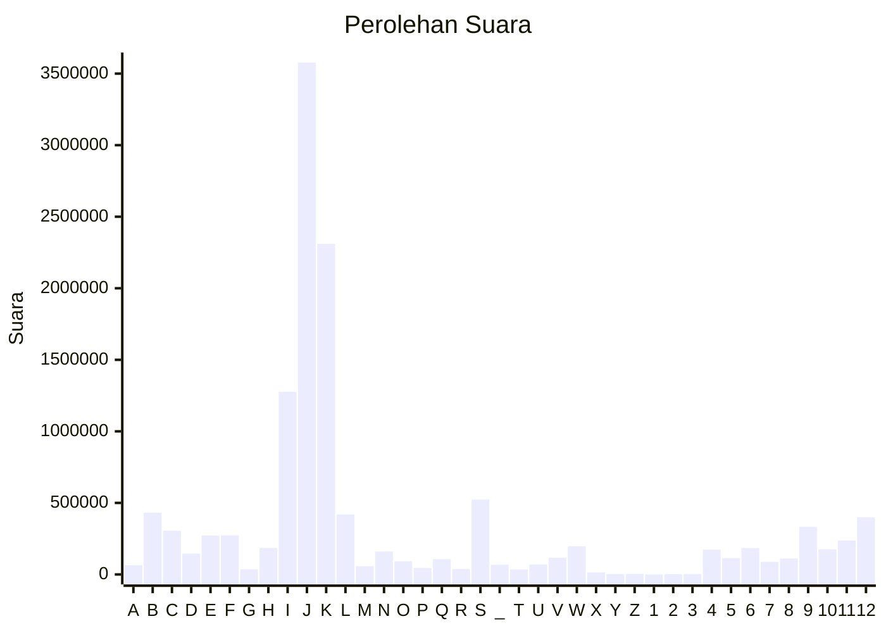

# Hasil

Partai **Partai Demokrasi Indonesia Perjuangan**

## Grafik

## Tabel

| #  | Label | Kode Wilayah | Nama Wilayah              | Suara     | Suara (raw) | Persentase |
|:-- |:----- |:------------ |:------------------------- | ---------:| -----------:| ----------:|
| 1  | A     | 11           | ACEH                      | 64.472    | 64472       | 0,51       |
| 2  | B     | 51           | BALI                      | 431.860   | 431860      | 3,41       |
| 3  | C     | 36           | BANTEN                    | 306.052   | 306052      | 2,42       |
| 4  | D     | 17           | BENGKULU                  | 145.952   | 145952      | 1,15       |
| 5  | E     | 34           | DI YOGYAKARTA             | 272.548   | 272548      | 2,15       |
| 6  | F     | 31           | DKI JAKARTA               | 272.956   | 272956      | 2,16       |
| 7  | G     | 75           | GORONTALO                 | 36.661    | 36661       | 0,29       |
| 8  | H     | 15           | JAMBI                     | 185.385   | 185385      | 1,47       |
| 9  | I     | 32           | JAWA BARAT                | 1.276.625 | 1276625     | 10,09      |
| 10 | J     | 33           | JAWA TENGAH               | 3.577.235 | 3577235     | 28,27      |
| 11 | K     | 35           | JAWA TIMUR                | 2.310.864 | 2310864     | 18,26      |
| 12 | L     | 61           | KALIMANTAN BARAT          | 419.437   | 419437      | 3,31       |
| 13 | M     | 63           | KALIMANTAN SELATAN        | 57.986    | 57986       | 0,46       |
| 14 | N     | 62           | KALIMANTAN TENGAH         | 160.358   | 160358      | 1,27       |
| 15 | O     | 64           | KALIMANTAN TIMUR          | 92.164    | 92164       | 0,73       |
| 16 | P     | 65           | KALIMANTAN UTARA          | 44.895    | 44895       | 0,35       |
| 17 | Q     | 19           | KEPULAUAN BANGKA BELITUNG | 106.923   | 106923      | 0,85       |
| 18 | R     | 21           | KEPULAUAN RIAU            | 37.839    | 37839       | 0,30       |
| 19 | S     | 18           | LAMPUNG                   | 523.276   | 523276      | 4,14       |
| 20 | _     | 99           | Luar Negeri               | 67.889    | 67889       | 0,54       |
| 21 | T     | 81           | MALUKU                    | 35.394    | 35394       | 0,28       |
| 22 | U     | 82           | MALUKU UTARA              | 69.469    | 69469       | 0,55       |
| 23 | V     | 52           | NUSA TENGGARA BARAT       | 116.984   | 116984      | 0,92       |
| 24 | W     | 53           | NUSA TENGGARA TIMUR       | 196.870   | 196870      | 1,56       |
| 25 | X     | 91           | PAPUA                     | 14.620    | 14620       | 0,12       |
| 26 | Y     | 92           | PAPUA BARAT               | 2.428     | 2428        | 0,02       |
| 27 | Z     | 96           | PAPUA BARAT DAYA          | 3.821     | 3821        | 0,03       |
| 28 | 1     | 95           | PAPUA PEGUNUNGAN          | 0         | 0           | 0,00       |
| 29 | 2     | 93           | PAPUA SELATAN             | 1.831     | 1831        | 0,01       |
| 30 | 3     | 94           | PAPUA TENGAH              | 3.007     | 3007        | 0,02       |
| 31 | 4     | 14           | RIAU                      | 173.217   | 173217      | 1,37       |
| 32 | 5     | 76           | SULAWESI BARAT            | 114.770   | 114770      | 0,91       |
| 33 | 6     | 73           | SULAWESI SELATAN          | 184.753   | 184753      | 1,46       |
| 34 | 7     | 72           | SULAWESI TENGAH           | 88.393    | 88393       | 0,70       |
| 35 | 8     | 74           | SULAWESI TENGGARA         | 111.840   | 111840      | 0,88       |
| 36 | 9     | 71           | SULAWESI UTARA            | 332.697   | 332697      | 2,63       |
| 37 | 10    | 13           | SUMATERA BARAT            | 176.115   | 176115      | 1,39       |
| 38 | 11    | 16           | SUMATERA SELATAN          | 236.511   | 236511      | 1,87       |
| 39 | 12    | 12           | SUMATERA UTARA            | 399.412   | 399412      | 3,16       |

