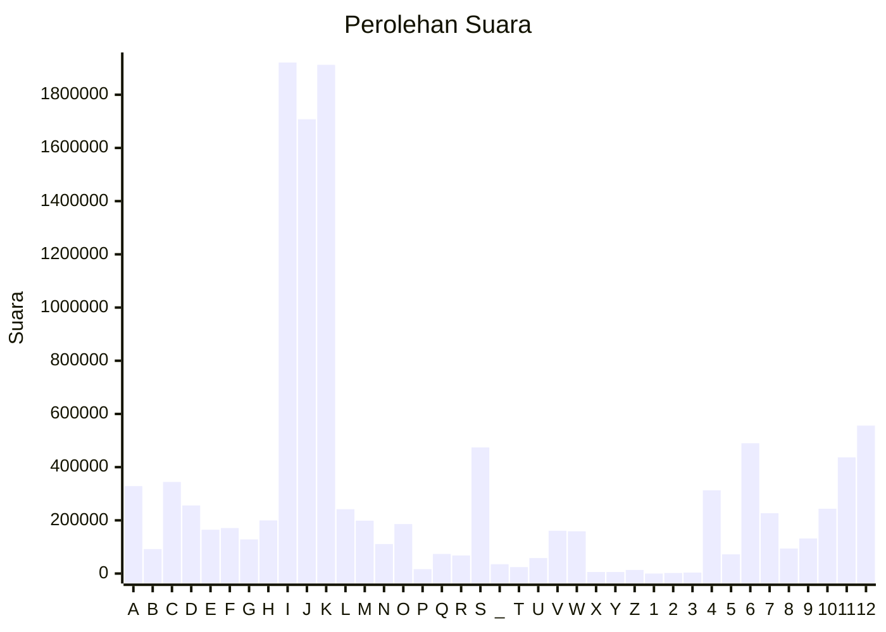

# Hasil

Partai **Partai Golongan Karya**

## Grafik

## Tabel

| #  | Label | Kode Wilayah | Nama Wilayah              | Suara     | Suara (raw) | Persentase |
|:-- |:----- |:------------ |:------------------------- | ---------:| -----------:| ----------:|
| 1  | A     | 11           | ACEH                      | 328.554   | 328554      | 2,83       |
| 2  | B     | 51           | BALI                      | 91.931    | 91931       | 0,79       |
| 3  | C     | 36           | BANTEN                    | 344.285   | 344285      | 2,96       |
| 4  | D     | 17           | BENGKULU                  | 255.921   | 255921      | 2,20       |
| 5  | E     | 34           | DI YOGYAKARTA             | 164.788   | 164788      | 1,42       |
| 6  | F     | 31           | DKI JAKARTA               | 171.101   | 171101      | 1,47       |
| 7  | G     | 75           | GORONTALO                 | 128.177   | 128177      | 1,10       |
| 8  | H     | 15           | JAMBI                     | 199.800   | 199800      | 1,72       |
| 9  | I     | 32           | JAWA BARAT                | 1.921.274 | 1921274     | 16,52      |
| 10 | J     | 33           | JAWA TENGAH               | 1.707.913 | 1707913     | 14,69      |
| 11 | K     | 35           | JAWA TIMUR                | 1.912.529 | 1912529     | 16,45      |
| 12 | L     | 61           | KALIMANTAN BARAT          | 241.842   | 241842      | 2,08       |
| 13 | M     | 63           | KALIMANTAN SELATAN        | 198.663   | 198663      | 1,71       |
| 14 | N     | 62           | KALIMANTAN TENGAH         | 110.830   | 110830      | 0,95       |
| 15 | O     | 64           | KALIMANTAN TIMUR          | 185.919   | 185919      | 1,60       |
| 16 | P     | 65           | KALIMANTAN UTARA          | 16.522    | 16522       | 0,14       |
| 17 | Q     | 19           | KEPULAUAN BANGKA BELITUNG | 73.541    | 73541       | 0,63       |
| 18 | R     | 21           | KEPULAUAN RIAU            | 68.053    | 68053       | 0,59       |
| 19 | S     | 18           | LAMPUNG                   | 474.282   | 474282      | 4,08       |
| 20 | _     | 99           | Luar Negeri               | 35.121    | 35121       | 0,30       |
| 21 | T     | 81           | MALUKU                    | 24.161    | 24161       | 0,21       |
| 22 | U     | 82           | MALUKU UTARA              | 58.415    | 58415       | 0,50       |
| 23 | V     | 52           | NUSA TENGGARA BARAT       | 160.957   | 160957      | 1,38       |
| 24 | W     | 53           | NUSA TENGGARA TIMUR       | 158.824   | 158824      | 1,37       |
| 25 | X     | 91           | PAPUA                     | 5.696     | 5696        | 0,05       |
| 26 | Y     | 92           | PAPUA BARAT               | 5.859     | 5859        | 0,05       |
| 27 | Z     | 96           | PAPUA BARAT DAYA          | 13.514    | 13514       | 0,12       |
| 28 | 1     | 95           | PAPUA PEGUNUNGAN          | 0         | 0           | 0,00       |
| 29 | 2     | 93           | PAPUA SELATAN             | 2.054     | 2054        | 0,02       |
| 30 | 3     | 94           | PAPUA TENGAH              | 3.632     | 3632        | 0,03       |
| 31 | 4     | 14           | RIAU                      | 312.998   | 312998      | 2,69       |
| 32 | 5     | 76           | SULAWESI BARAT            | 72.155    | 72155       | 0,62       |
| 33 | 6     | 73           | SULAWESI SELATAN          | 489.839   | 489839      | 4,21       |
| 34 | 7     | 72           | SULAWESI TENGAH           | 226.905   | 226905      | 1,95       |
| 35 | 8     | 74           | SULAWESI TENGGARA         | 94.054    | 94054       | 0,81       |
| 36 | 9     | 71           | SULAWESI UTARA            | 131.911   | 131911      | 1,13       |
| 37 | 10    | 13           | SUMATERA BARAT            | 243.606   | 243606      | 2,09       |
| 38 | 11    | 16           | SUMATERA SELATAN          | 436.822   | 436822      | 3,76       |
| 39 | 12    | 12           | SUMATERA UTARA            | 556.176   | 556176      | 4,78       |

