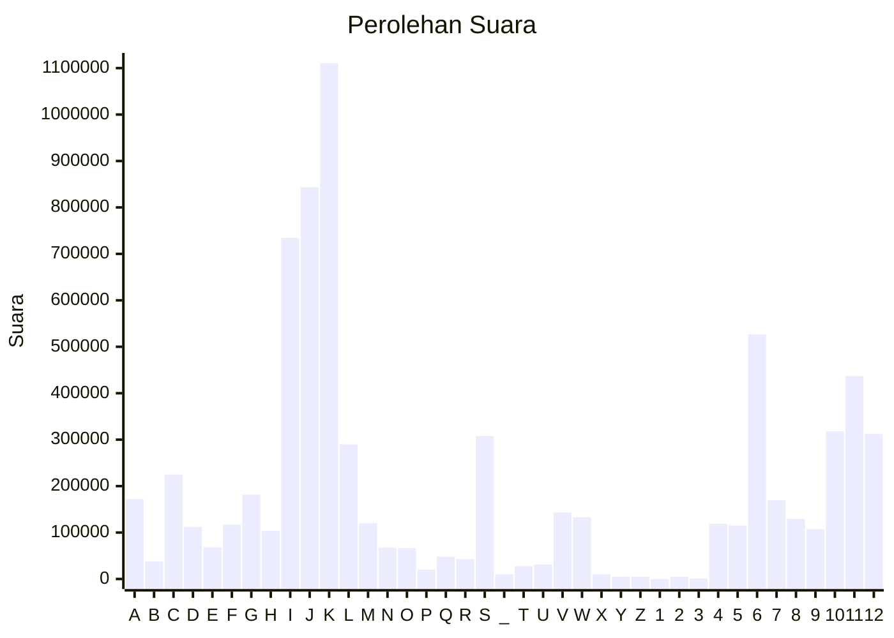

# Hasil

Partai **Partai NasDem**

## Grafik

## Tabel

| #  | Label | Kode Wilayah | Nama Wilayah              | Suara     | Suara (raw) | Persentase |
|:-- |:----- |:------------ |:------------------------- | ---------:| -----------:| ----------:|
| 1  | A     | 11           | ACEH                      | 172.407   | 172407      | 2,37       |
| 2  | B     | 51           | BALI                      | 38.076    | 38076       | 0,52       |
| 3  | C     | 36           | BANTEN                    | 225.126   | 225126      | 3,09       |
| 4  | D     | 17           | BENGKULU                  | 112.171   | 112171      | 1,54       |
| 5  | E     | 34           | DI YOGYAKARTA             | 68.531    | 68531       | 0,94       |
| 6  | F     | 31           | DKI JAKARTA               | 117.504   | 117504      | 1,61       |
| 7  | G     | 75           | GORONTALO                 | 181.572   | 181572      | 2,50       |
| 8  | H     | 15           | JAMBI                     | 103.301   | 103301      | 1,42       |
| 9  | I     | 32           | JAWA BARAT                | 734.581   | 734581      | 10,09      |
| 10 | J     | 33           | JAWA TENGAH               | 843.395   | 843395      | 11,59      |
| 11 | K     | 35           | JAWA TIMUR                | 1.110.830 | 1110830     | 15,27      |
| 12 | L     | 61           | KALIMANTAN BARAT          | 289.801   | 289801      | 3,98       |
| 13 | M     | 63           | KALIMANTAN SELATAN        | 120.401   | 120401      | 1,65       |
| 14 | N     | 62           | KALIMANTAN TENGAH         | 67.536    | 67536       | 0,93       |
| 15 | O     | 64           | KALIMANTAN TIMUR          | 66.705    | 66705       | 0,92       |
| 16 | P     | 65           | KALIMANTAN UTARA          | 20.138    | 20138       | 0,28       |
| 17 | Q     | 19           | KEPULAUAN BANGKA BELITUNG | 48.071    | 48071       | 0,66       |
| 18 | R     | 21           | KEPULAUAN RIAU            | 42.658    | 42658       | 0,59       |
| 19 | S     | 18           | LAMPUNG                   | 307.833   | 307833      | 4,23       |
| 20 | _     | 99           | Luar Negeri               | 10.674    | 10674       | 0,15       |
| 21 | T     | 81           | MALUKU                    | 27.351    | 27351       | 0,38       |
| 22 | U     | 82           | MALUKU UTARA              | 31.315    | 31315       | 0,43       |
| 23 | V     | 52           | NUSA TENGGARA BARAT       | 143.140   | 143140      | 1,97       |
| 24 | W     | 53           | NUSA TENGGARA TIMUR       | 132.919   | 132919      | 1,83       |
| 25 | X     | 91           | PAPUA                     | 10.684    | 10684       | 0,15       |
| 26 | Y     | 92           | PAPUA BARAT               | 4.766     | 4766        | 0,07       |
| 27 | Z     | 96           | PAPUA BARAT DAYA          | 4.999     | 4999        | 0,07       |
| 28 | 1     | 95           | PAPUA PEGUNUNGAN          | 0         | 0           | 0,00       |
| 29 | 2     | 93           | PAPUA SELATAN             | 4.947     | 4947        | 0,07       |
| 30 | 3     | 94           | PAPUA TENGAH              | 1.013     | 1013        | 0,01       |
| 31 | 4     | 14           | RIAU                      | 118.877   | 118877      | 1,63       |
| 32 | 5     | 76           | SULAWESI BARAT            | 115.196   | 115196      | 1,58       |
| 33 | 6     | 73           | SULAWESI SELATAN          | 527.076   | 527076      | 7,24       |
| 34 | 7     | 72           | SULAWESI TENGAH           | 169.775   | 169775      | 2,33       |
| 35 | 8     | 74           | SULAWESI TENGGARA         | 129.359   | 129359      | 1,78       |
| 36 | 9     | 71           | SULAWESI UTARA            | 107.030   | 107030      | 1,47       |
| 37 | 10    | 13           | SUMATERA BARAT            | 317.954   | 317954      | 4,37       |
| 38 | 11    | 16           | SUMATERA SELATAN          | 436.820   | 436820      | 6,00       |
| 39 | 12    | 12           | SUMATERA UTARA            | 312.269   | 312269      | 4,29       |

