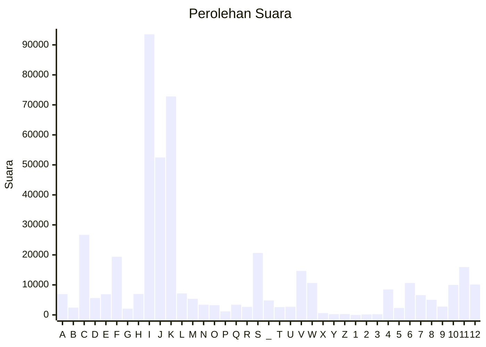

# Hasil

Partai **Partai Buruh**

## Grafik

## Tabel

| #  | Label | Kode Wilayah | Nama Wilayah              | Suara  | Suara (raw) | Persentase |
|:-- |:----- |:------------ |:------------------------- | ------:| -----------:| ----------:|
| 1  | A     | 11           | ACEH                      | 6.943  | 6943        | 1,54       |
| 2  | B     | 51           | BALI                      | 2.440  | 2440        | 0,54       |
| 3  | C     | 36           | BANTEN                    | 26.715 | 26715       | 5,91       |
| 4  | D     | 17           | BENGKULU                  | 5.606  | 5606        | 1,24       |
| 5  | E     | 34           | DI YOGYAKARTA             | 6.915  | 6915        | 1,53       |
| 6  | F     | 31           | DKI JAKARTA               | 19.373 | 19373       | 4,29       |
| 7  | G     | 75           | GORONTALO                 | 2.082  | 2082        | 0,46       |
| 8  | H     | 15           | JAMBI                     | 6.972  | 6972        | 1,54       |
| 9  | I     | 32           | JAWA BARAT                | 93.523 | 93523       | 20,70      |
| 10 | J     | 33           | JAWA TENGAH               | 52.480 | 52480       | 11,62      |
| 11 | K     | 35           | JAWA TIMUR                | 72.809 | 72809       | 16,12      |
| 12 | L     | 61           | KALIMANTAN BARAT          | 7.152  | 7152        | 1,58       |
| 13 | M     | 63           | KALIMANTAN SELATAN        | 5.373  | 5373        | 1,19       |
| 14 | N     | 62           | KALIMANTAN TENGAH         | 3.394  | 3394        | 0,75       |
| 15 | O     | 64           | KALIMANTAN TIMUR          | 3.235  | 3235        | 0,72       |
| 16 | P     | 65           | KALIMANTAN UTARA          | 1.165  | 1165        | 0,26       |
| 17 | Q     | 19           | KEPULAUAN BANGKA BELITUNG | 3.399  | 3399        | 0,75       |
| 18 | R     | 21           | KEPULAUAN RIAU            | 2.669  | 2669        | 0,59       |
| 19 | S     | 18           | LAMPUNG                   | 20.632 | 20632       | 4,57       |
| 20 | _     | 99           | Luar Negeri               | 4.812  | 4812        | 1,07       |
| 21 | T     | 81           | MALUKU                    | 2.591  | 2591        | 0,57       |
| 22 | U     | 82           | MALUKU UTARA              | 2.706  | 2706        | 0,60       |
| 23 | V     | 52           | NUSA TENGGARA BARAT       | 14.677 | 14677       | 3,25       |
| 24 | W     | 53           | NUSA TENGGARA TIMUR       | 10.649 | 10649       | 2,36       |
| 25 | X     | 91           | PAPUA                     | 601    | 601         | 0,13       |
| 26 | Y     | 92           | PAPUA BARAT               | 247    | 247         | 0,05       |
| 27 | Z     | 96           | PAPUA BARAT DAYA          | 283    | 283         | 0,06       |
| 28 | 1     | 95           | PAPUA PEGUNUNGAN          | 0      | 0           | 0,00       |
| 29 | 2     | 93           | PAPUA SELATAN             | 162    | 162         | 0,04       |
| 30 | 3     | 94           | PAPUA TENGAH              | 235    | 235         | 0,05       |
| 31 | 4     | 14           | RIAU                      | 8.487  | 8487        | 1,88       |
| 32 | 5     | 76           | SULAWESI BARAT            | 2.314  | 2314        | 0,51       |
| 33 | 6     | 73           | SULAWESI SELATAN          | 10.642 | 10642       | 2,36       |
| 34 | 7     | 72           | SULAWESI TENGAH           | 6.598  | 6598        | 1,46       |
| 35 | 8     | 74           | SULAWESI TENGGARA         | 5.026  | 5026        | 1,11       |
| 36 | 9     | 71           | SULAWESI UTARA            | 2.769  | 2769        | 0,61       |
| 37 | 10    | 13           | SUMATERA BARAT            | 9.986  | 9986        | 2,21       |
| 38 | 11    | 16           | SUMATERA SELATAN          | 15.926 | 15926       | 3,53       |
| 39 | 12    | 12           | SUMATERA UTARA            | 10.117 | 10117       | 2,24       |

