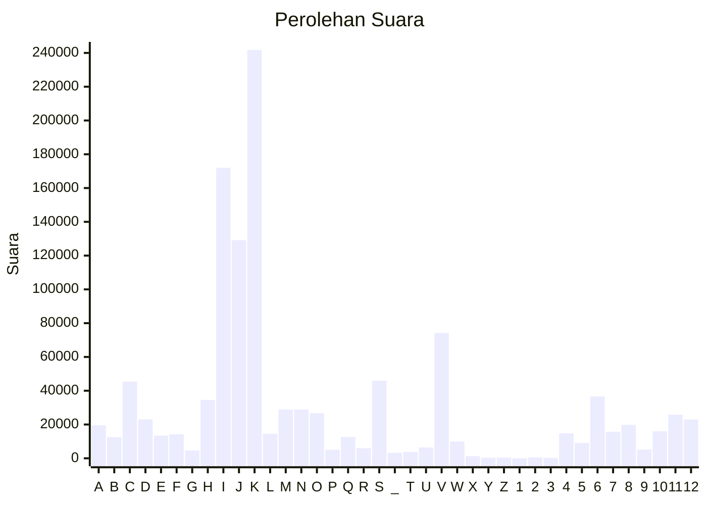

# Hasil

Partai **Partai Gelombang Rakyat Indonesia**

## Grafik

## Tabel

| #  | Label | Kode Wilayah | Nama Wilayah              | Suara   | Suara (raw) | Persentase |
|:-- |:----- |:------------ |:------------------------- | -------:| -----------:| ----------:|
| 1  | A     | 11           | ACEH                      | 19.546  | 19546       | 1,71       |
| 2  | B     | 51           | BALI                      | 12.538  | 12538       | 1,09       |
| 3  | C     | 36           | BANTEN                    | 45.409  | 45409       | 3,97       |
| 4  | D     | 17           | BENGKULU                  | 23.019  | 23019       | 2,01       |
| 5  | E     | 34           | DI YOGYAKARTA             | 13.445  | 13445       | 1,17       |
| 6  | F     | 31           | DKI JAKARTA               | 14.173  | 14173       | 1,24       |
| 7  | G     | 75           | GORONTALO                 | 4.598   | 4598        | 0,40       |
| 8  | H     | 15           | JAMBI                     | 34.557  | 34557       | 3,02       |
| 9  | I     | 32           | JAWA BARAT                | 171.943 | 171943      | 15,02      |
| 10 | J     | 33           | JAWA TENGAH               | 129.181 | 129181      | 11,28      |
| 11 | K     | 35           | JAWA TIMUR                | 241.779 | 241779      | 21,11      |
| 12 | L     | 61           | KALIMANTAN BARAT          | 14.564  | 14564       | 1,27       |
| 13 | M     | 63           | KALIMANTAN SELATAN        | 28.926  | 28926       | 2,53       |
| 14 | N     | 62           | KALIMANTAN TENGAH         | 28.886  | 28886       | 2,52       |
| 15 | O     | 64           | KALIMANTAN TIMUR          | 26.687  | 26687       | 2,33       |
| 16 | P     | 65           | KALIMANTAN UTARA          | 5.095   | 5095        | 0,44       |
| 17 | Q     | 19           | KEPULAUAN BANGKA BELITUNG | 12.612  | 12612       | 1,10       |
| 18 | R     | 21           | KEPULAUAN RIAU            | 5.992   | 5992        | 0,52       |
| 19 | S     | 18           | LAMPUNG                   | 45.940  | 45940       | 4,01       |
| 20 | _     | 99           | Luar Negeri               | 3.235   | 3235        | 0,28       |
| 21 | T     | 81           | MALUKU                    | 3.756   | 3756        | 0,33       |
| 22 | U     | 82           | MALUKU UTARA              | 6.409   | 6409        | 0,56       |
| 23 | V     | 52           | NUSA TENGGARA BARAT       | 74.189  | 74189       | 6,48       |
| 24 | W     | 53           | NUSA TENGGARA TIMUR       | 9.951   | 9951        | 0,87       |
| 25 | X     | 91           | PAPUA                     | 1.298   | 1298        | 0,11       |
| 26 | Y     | 92           | PAPUA BARAT               | 297     | 297         | 0,03       |
| 27 | Z     | 96           | PAPUA BARAT DAYA          | 426     | 426         | 0,04       |
| 28 | 1     | 95           | PAPUA PEGUNUNGAN          | 0       | 0           | 0,00       |
| 29 | 2     | 93           | PAPUA SELATAN             | 513     | 513         | 0,04       |
| 30 | 3     | 94           | PAPUA TENGAH              | 292     | 292         | 0,03       |
| 31 | 4     | 14           | RIAU                      | 14.732  | 14732       | 1,29       |
| 32 | 5     | 76           | SULAWESI BARAT            | 9.016   | 9016        | 0,79       |
| 33 | 6     | 73           | SULAWESI SELATAN          | 36.566  | 36566       | 3,19       |
| 34 | 7     | 72           | SULAWESI TENGAH           | 15.686  | 15686       | 1,37       |
| 35 | 8     | 74           | SULAWESI TENGGARA         | 19.795  | 19795       | 1,73       |
| 36 | 9     | 71           | SULAWESI UTARA            | 5.174   | 5174        | 0,45       |
| 37 | 10    | 13           | SUMATERA BARAT            | 16.045  | 16045       | 1,40       |
| 38 | 11    | 16           | SUMATERA SELATAN          | 25.831  | 25831       | 2,26       |
| 39 | 12    | 12           | SUMATERA UTARA            | 22.990  | 22990       | 2,01       |

