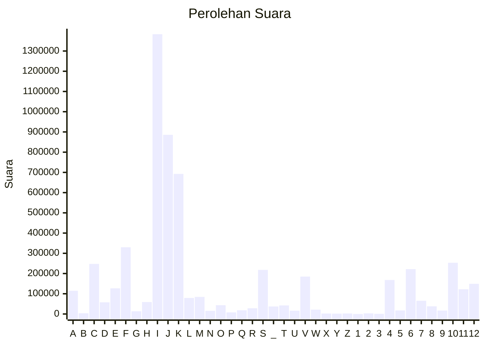

# Hasil

Partai **Partai Keadilan Sejahtera**

## Grafik

## Tabel

| #  | Label | Kode Wilayah | Nama Wilayah              | Suara     | Suara (raw) | Persentase |
|:-- |:----- |:------------ |:------------------------- | ---------:| -----------:| ----------:|
| 1  | A     | 11           | ACEH                      | 114.882   | 114882      | 1,99       |
| 2  | B     | 51           | BALI                      | 3.800     | 3800        | 0,07       |
| 3  | C     | 36           | BANTEN                    | 247.581   | 247581      | 4,29       |
| 4  | D     | 17           | BENGKULU                  | 57.940    | 57940       | 1,00       |
| 5  | E     | 34           | DI YOGYAKARTA             | 126.853   | 126853      | 2,20       |
| 6  | F     | 31           | DKI JAKARTA               | 330.068   | 330068      | 5,71       |
| 7  | G     | 75           | GORONTALO                 | 13.606    | 13606       | 0,24       |
| 8  | H     | 15           | JAMBI                     | 58.964    | 58964       | 1,02       |
| 9  | I     | 32           | JAWA BARAT                | 1.383.133 | 1383133     | 23,94      |
| 10 | J     | 33           | JAWA TENGAH               | 885.598   | 885598      | 15,33      |
| 11 | K     | 35           | JAWA TIMUR                | 692.551   | 692551      | 11,99      |
| 12 | L     | 61           | KALIMANTAN BARAT          | 79.240    | 79240       | 1,37       |
| 13 | M     | 63           | KALIMANTAN SELATAN        | 84.355    | 84355       | 1,46       |
| 14 | N     | 62           | KALIMANTAN TENGAH         | 15.589    | 15589       | 0,27       |
| 15 | O     | 64           | KALIMANTAN TIMUR          | 43.465    | 43465       | 0,75       |
| 16 | P     | 65           | KALIMANTAN UTARA          | 8.010     | 8010        | 0,14       |
| 17 | Q     | 19           | KEPULAUAN BANGKA BELITUNG | 18.676    | 18676       | 0,32       |
| 18 | R     | 21           | KEPULAUAN RIAU            | 28.512    | 28512       | 0,49       |
| 19 | S     | 18           | LAMPUNG                   | 217.911   | 217911      | 3,77       |
| 20 | _     | 99           | Luar Negeri               | 37.216    | 37216       | 0,64       |
| 21 | T     | 81           | MALUKU                    | 42.371    | 42371       | 0,73       |
| 22 | U     | 82           | MALUKU UTARA              | 16.293    | 16293       | 0,28       |
| 23 | V     | 52           | NUSA TENGGARA BARAT       | 184.866   | 184866      | 3,20       |
| 24 | W     | 53           | NUSA TENGGARA TIMUR       | 21.522    | 21522       | 0,37       |
| 25 | X     | 91           | PAPUA                     | 2.243     | 2243        | 0,04       |
| 26 | Y     | 92           | PAPUA BARAT               | 1.698     | 1698        | 0,03       |
| 27 | Z     | 96           | PAPUA BARAT DAYA          | 2.605     | 2605        | 0,05       |
| 28 | 1     | 95           | PAPUA PEGUNUNGAN          | 0         | 0           | 0,00       |
| 29 | 2     | 93           | PAPUA SELATAN             | 3.064     | 3064        | 0,05       |
| 30 | 3     | 94           | PAPUA TENGAH              | 1.102     | 1102        | 0,02       |
| 31 | 4     | 14           | RIAU                      | 167.955   | 167955      | 2,91       |
| 32 | 5     | 76           | SULAWESI BARAT            | 17.634    | 17634       | 0,31       |
| 33 | 6     | 73           | SULAWESI SELATAN          | 221.794   | 221794      | 3,84       |
| 34 | 7     | 72           | SULAWESI TENGAH           | 65.482    | 65482       | 1,13       |
| 35 | 8     | 74           | SULAWESI TENGGARA         | 37.988    | 37988       | 0,66       |
| 36 | 9     | 71           | SULAWESI UTARA            | 17.144    | 17144       | 0,30       |
| 37 | 10    | 13           | SUMATERA BARAT            | 253.225   | 253225      | 4,38       |
| 38 | 11    | 16           | SUMATERA SELATAN          | 122.496   | 122496      | 2,12       |
| 39 | 12    | 12           | SUMATERA UTARA            | 149.171   | 149171      | 2,58       |

