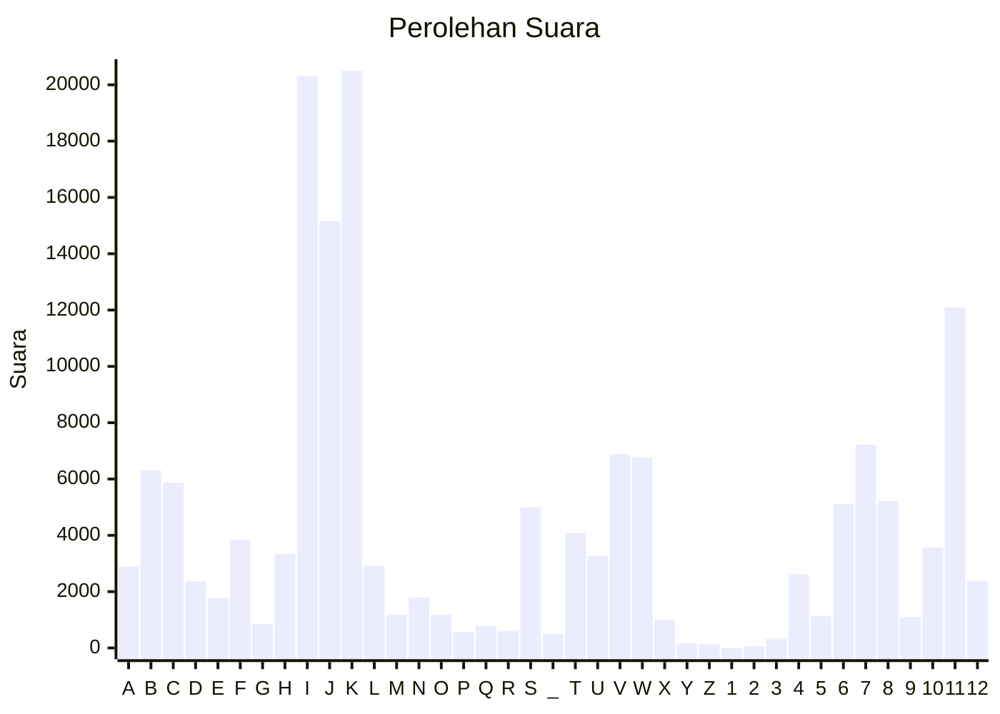

# Hasil

Partai **Partai Kebangkitan Nusantara**

## Grafik

## Tabel

| #  | Label | Kode Wilayah | Nama Wilayah              | Suara  | Suara (raw) | Persentase |
|:-- |:----- |:------------ |:------------------------- | ------:| -----------:| ----------:|
| 1  | A     | 11           | ACEH                      | 2.894  | 2894        | 1,80       |
| 2  | B     | 51           | BALI                      | 6.303  | 6303        | 3,92       |
| 3  | C     | 36           | BANTEN                    | 5.871  | 5871        | 3,65       |
| 4  | D     | 17           | BENGKULU                  | 2.368  | 2368        | 1,47       |
| 5  | E     | 34           | DI YOGYAKARTA             | 1.778  | 1778        | 1,11       |
| 6  | F     | 31           | DKI JAKARTA               | 3.843  | 3843        | 2,39       |
| 7  | G     | 75           | GORONTALO                 | 855    | 855         | 0,53       |
| 8  | H     | 15           | JAMBI                     | 3.332  | 3332        | 2,07       |
| 9  | I     | 32           | JAWA BARAT                | 20.296 | 20296       | 12,62      |
| 10 | J     | 33           | JAWA TENGAH               | 15.160 | 15160       | 9,43       |
| 11 | K     | 35           | JAWA TIMUR                | 20.505 | 20505       | 12,75      |
| 12 | L     | 61           | KALIMANTAN BARAT          | 2.920  | 2920        | 1,82       |
| 13 | M     | 63           | KALIMANTAN SELATAN        | 1.181  | 1181        | 0,73       |
| 14 | N     | 62           | KALIMANTAN TENGAH         | 1.797  | 1797        | 1,12       |
| 15 | O     | 64           | KALIMANTAN TIMUR          | 1.173  | 1173        | 0,73       |
| 16 | P     | 65           | KALIMANTAN UTARA          | 563    | 563         | 0,35       |
| 17 | Q     | 19           | KEPULAUAN BANGKA BELITUNG | 785    | 785         | 0,49       |
| 18 | R     | 21           | KEPULAUAN RIAU            | 609    | 609         | 0,38       |
| 19 | S     | 18           | LAMPUNG                   | 4.993  | 4993        | 3,10       |
| 20 | _     | 99           | Luar Negeri               | 503    | 503         | 0,31       |
| 21 | T     | 81           | MALUKU                    | 4.078  | 4078        | 2,54       |
| 22 | U     | 82           | MALUKU UTARA              | 3.277  | 3277        | 2,04       |
| 23 | V     | 52           | NUSA TENGGARA BARAT       | 6.879  | 6879        | 4,28       |
| 24 | W     | 53           | NUSA TENGGARA TIMUR       | 6.770  | 6770        | 4,21       |
| 25 | X     | 91           | PAPUA                     | 996    | 996         | 0,62       |
| 26 | Y     | 92           | PAPUA BARAT               | 165    | 165         | 0,10       |
| 27 | Z     | 96           | PAPUA BARAT DAYA          | 128    | 128         | 0,08       |
| 28 | 1     | 95           | PAPUA PEGUNUNGAN          | 0      | 0           | 0,00       |
| 29 | 2     | 93           | PAPUA SELATAN             | 54     | 54          | 0,03       |
| 30 | 3     | 94           | PAPUA TENGAH              | 332    | 332         | 0,21       |
| 31 | 4     | 14           | RIAU                      | 2.614  | 2614        | 1,63       |
| 32 | 5     | 76           | SULAWESI BARAT            | 1.127  | 1127        | 0,70       |
| 33 | 6     | 73           | SULAWESI SELATAN          | 5.120  | 5120        | 3,18       |
| 34 | 7     | 72           | SULAWESI TENGAH           | 7.214  | 7214        | 4,49       |
| 35 | 8     | 74           | SULAWESI TENGGARA         | 5.215  | 5215        | 3,24       |
| 36 | 9     | 71           | SULAWESI UTARA            | 1.102  | 1102        | 0,69       |
| 37 | 10    | 13           | SUMATERA BARAT            | 3.566  | 3566        | 2,22       |
| 38 | 11    | 16           | SUMATERA SELATAN          | 12.093 | 12093       | 7,52       |
| 39 | 12    | 12           | SUMATERA UTARA            | 2.381  | 2381        | 1,48       |

