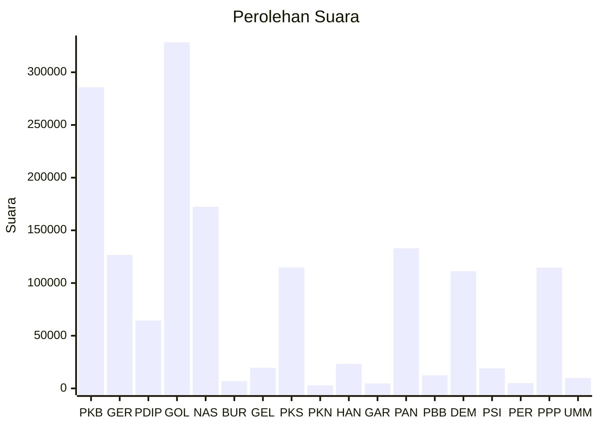

# Hasil

Wilayah **ACEH**

## Grafik

## Tabel

| No. | Nama Partai                           | Suara   | Suara (raw) | Persentase |
|:--- |:------------------------------------- | -------:| -----------:| ----------:|
| 1   | Partai Kebangkitan Bangsa             | 285.729 | 285729      | 18,37      |
| 2   | Partai Gerakan Indonesia Raya         | 126.658 | 126658      | 8,14       |
| 3   | Partai Demokrasi Indonesia Perjuangan | 64.447  | 64447       | 4,14       |
| 4   | Partai Golongan Karya                 | 328.431 | 328431      | 21,12      |
| 5   | Partai NasDem                         | 172.381 | 172381      | 11,08      |
| 6   | Partai Buruh                          | 6.943   | 6943        | 0,45       |
| 7   | Partai Gelombang Rakyat Indonesia     | 19.545  | 19545       | 1,26       |
| 8   | Partai Keadilan Sejahtera             | 114.860 | 114860      | 7,39       |
| 9   | Partai Kebangkitan Nusantara          | 2.894   | 2894        | 0,19       |
| 10  | Partai Hati Nurani Rakyat             | 23.320  | 23320       | 1,50       |
| 11  | Partai Garda Republik Indonesia       | 4.694   | 4694        | 0,30       |
| 12  | Partai Amanat Nasional                | 133.086 | 133086      | 8,56       |
| 13  | Partai Bulan Bintang                  | 12.437  | 12437       | 0,80       |
| 14  | Partai Demokrat                       | 111.279 | 111279      | 7,15       |
| 15  | Partai Solidaritas Indonesia          | 18.969  | 18969       | 1,22       |
| 16  | PARTAI PERINDO                        | 5.100   | 5100        | 0,33       |
| 17  | Partai Persatuan Pembangunan          | 114.689 | 114689      | 7,37       |
| 24  | Partai Ummat                          | 9.842   | 9842        | 0,63       |

## Metadata

| Key             | Value   |
| --------------- | ------- |
| Tipe Pemilu     | Reguler |
| Persentase      | 67,39   |
| Status Progress | On      |

