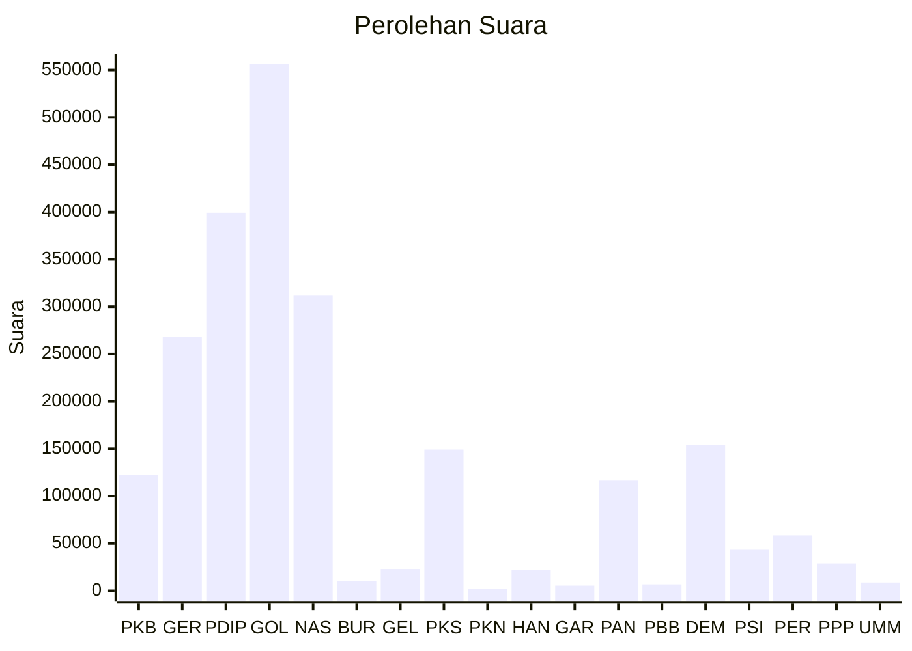

# Hasil

Wilayah **SUMATERA UTARA**

## Grafik

## Tabel

| No. | Nama Partai                           | Suara   | Suara (raw) | Persentase |
|:--- |:------------------------------------- | -------:| -----------:| ----------:|
| 1   | Partai Kebangkitan Bangsa             | 122.301 | 122301      | 5,35       |
| 2   | Partai Gerakan Indonesia Raya         | 268.199 | 268199      | 11,73      |
| 3   | Partai Demokrasi Indonesia Perjuangan | 399.258 | 399258      | 17,46      |
| 4   | Partai Golongan Karya                 | 555.989 | 555989      | 24,31      |
| 5   | Partai NasDem                         | 312.269 | 312269      | 13,65      |
| 6   | Partai Buruh                          | 10.117  | 10117       | 0,44       |
| 7   | Partai Gelombang Rakyat Indonesia     | 22.990  | 22990       | 1,01       |
| 8   | Partai Keadilan Sejahtera             | 149.173 | 149173      | 6,52       |
| 9   | Partai Kebangkitan Nusantara          | 2.381   | 2381        | 0,10       |
| 10  | Partai Hati Nurani Rakyat             | 22.074  | 22074       | 0,97       |
| 11  | Partai Garda Republik Indonesia       | 5.493   | 5493        | 0,24       |
| 12  | Partai Amanat Nasional                | 116.305 | 116305      | 5,09       |
| 13  | Partai Bulan Bintang                  | 6.804   | 6804        | 0,30       |
| 14  | Partai Demokrat                       | 154.142 | 154142      | 6,74       |
| 15  | Partai Solidaritas Indonesia          | 43.334  | 43334       | 1,89       |
| 16  | PARTAI PERINDO                        | 58.504  | 58504       | 2,56       |
| 17  | Partai Persatuan Pembangunan          | 28.821  | 28821       | 1,26       |
| 24  | Partai Ummat                          | 8.742   | 8742        | 0,38       |

## Metadata

| Key             | Value   |
| --------------- | ------- |
| Tipe Pemilu     | Reguler |
| Persentase      | 47,49   |
| Status Progress | On      |

