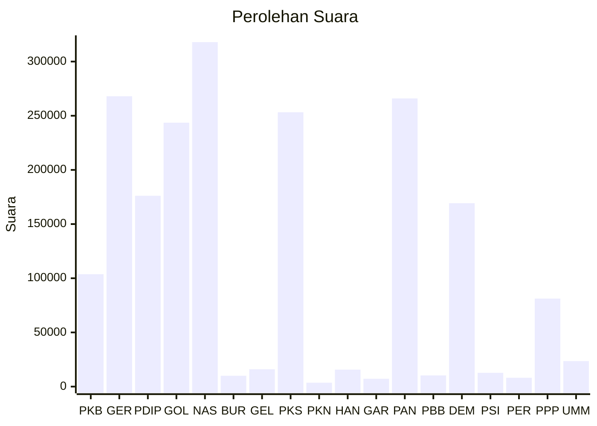

# Hasil

Wilayah **SUMATERA BARAT**

## Grafik

## Tabel

| No. | Nama Partai                           | Suara   | Suara (raw) | Persentase |
|:--- |:------------------------------------- | -------:| -----------:| ----------:|
| 1   | Partai Kebangkitan Bangsa             | 103.762 | 103762      | 5,22       |
| 2   | Partai Gerakan Indonesia Raya         | 267.992 | 267992      | 13,49      |
| 3   | Partai Demokrasi Indonesia Perjuangan | 176.115 | 176115      | 8,87       |
| 4   | Partai Golongan Karya                 | 243.606 | 243606      | 12,26      |
| 5   | Partai NasDem                         | 317.954 | 317954      | 16,01      |
| 6   | Partai Buruh                          | 9.986   | 9986        | 0,50       |
| 7   | Partai Gelombang Rakyat Indonesia     | 16.045  | 16045       | 0,81       |
| 8   | Partai Keadilan Sejahtera             | 253.225 | 253225      | 12,75      |
| 9   | Partai Kebangkitan Nusantara          | 3.566   | 3566        | 0,18       |
| 10  | Partai Hati Nurani Rakyat             | 15.651  | 15651       | 0,79       |
| 11  | Partai Garda Republik Indonesia       | 7.242   | 7242        | 0,36       |
| 12  | Partai Amanat Nasional                | 265.963 | 265963      | 13,39      |
| 13  | Partai Bulan Bintang                  | 10.297  | 10297       | 0,52       |
| 14  | Partai Demokrat                       | 169.272 | 169272      | 8,52       |
| 15  | Partai Solidaritas Indonesia          | 12.723  | 12723       | 0,64       |
| 16  | PARTAI PERINDO                        | 8.169   | 8169        | 0,41       |
| 17  | Partai Persatuan Pembangunan          | 81.244  | 81244       | 4,09       |
| 24  | Partai Ummat                          | 23.551  | 23551       | 1,19       |

## Metadata

| Key             | Value   |
| --------------- | ------- |
| Tipe Pemilu     | Reguler |
| Persentase      | 84,35   |
| Status Progress | On      |

