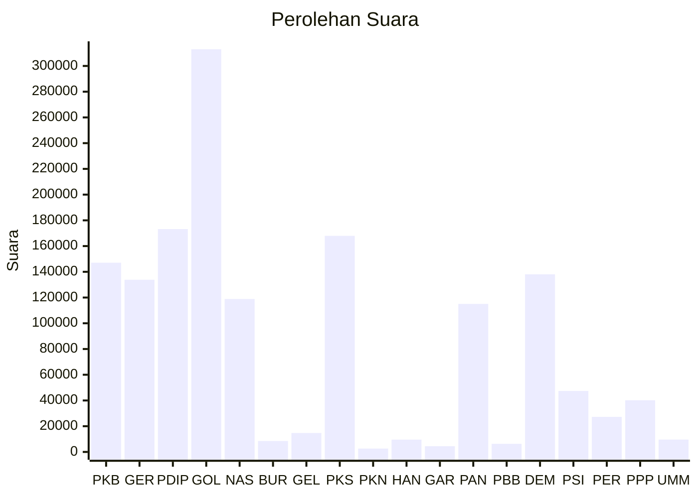

# Hasil

Wilayah **RIAU**

## Grafik

## Tabel

| No. | Nama Partai                           | Suara   | Suara (raw) | Persentase |
|:--- |:------------------------------------- | -------:| -----------:| ----------:|
| 1   | Partai Kebangkitan Bangsa             | 147.049 | 147049      | 9,95       |
| 2   | Partai Gerakan Indonesia Raya         | 133.843 | 133843      | 9,06       |
| 3   | Partai Demokrasi Indonesia Perjuangan | 173.217 | 173217      | 11,72      |
| 4   | Partai Golongan Karya                 | 312.998 | 312998      | 21,18      |
| 5   | Partai NasDem                         | 118.877 | 118877      | 8,04       |
| 6   | Partai Buruh                          | 8.487   | 8487        | 0,57       |
| 7   | Partai Gelombang Rakyat Indonesia     | 14.732  | 14732       | 1,00       |
| 8   | Partai Keadilan Sejahtera             | 167.955 | 167955      | 11,37      |
| 9   | Partai Kebangkitan Nusantara          | 2.614   | 2614        | 0,18       |
| 10  | Partai Hati Nurani Rakyat             | 9.540   | 9540        | 0,65       |
| 11  | Partai Garda Republik Indonesia       | 4.457   | 4457        | 0,30       |
| 12  | Partai Amanat Nasional                | 115.029 | 115029      | 7,78       |
| 13  | Partai Bulan Bintang                  | 6.323   | 6323        | 0,43       |
| 14  | Partai Demokrat                       | 138.086 | 138086      | 9,34       |
| 15  | Partai Solidaritas Indonesia          | 47.414  | 47414       | 3,21       |
| 16  | PARTAI PERINDO                        | 27.230  | 27230       | 1,84       |
| 17  | Partai Persatuan Pembangunan          | 40.211  | 40211       | 2,72       |
| 24  | Partai Ummat                          | 9.614   | 9614        | 0,65       |

## Metadata

| Key             | Value   |
| --------------- | ------- |
| Tipe Pemilu     | Reguler |
| Persentase      | 55,41   |
| Status Progress | On      |

