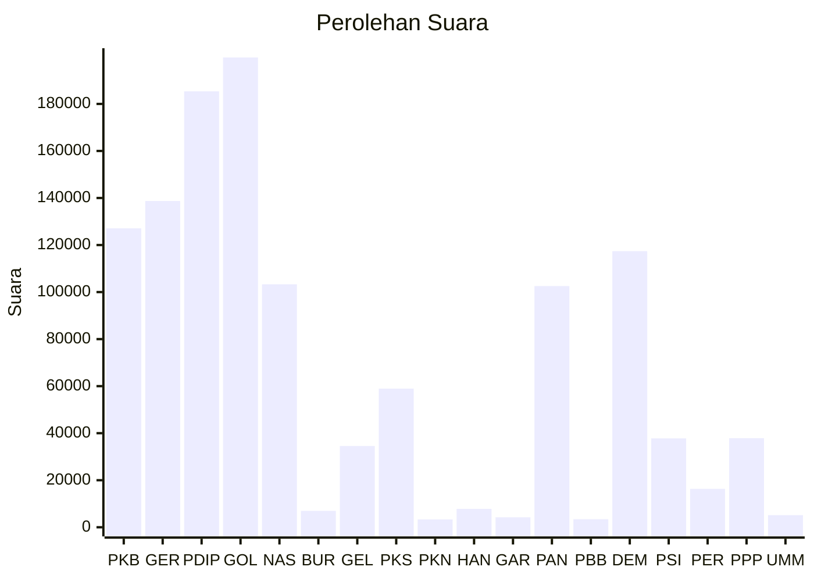

# Hasil

Wilayah **JAMBI**

## Grafik

## Tabel

| No. | Nama Partai                           | Suara   | Suara (raw) | Persentase |
|:--- |:------------------------------------- | -------:| -----------:| ----------:|
| 1   | Partai Kebangkitan Bangsa             | 127.087 | 127087      | 10,67      |
| 2   | Partai Gerakan Indonesia Raya         | 138.731 | 138731      | 11,65      |
| 3   | Partai Demokrasi Indonesia Perjuangan | 185.354 | 185354      | 15,57      |
| 4   | Partai Golongan Karya                 | 199.763 | 199763      | 16,78      |
| 5   | Partai NasDem                         | 103.301 | 103301      | 8,68       |
| 6   | Partai Buruh                          | 6.972   | 6972        | 0,59       |
| 7   | Partai Gelombang Rakyat Indonesia     | 34.557  | 34557       | 2,90       |
| 8   | Partai Keadilan Sejahtera             | 58.964  | 58964       | 4,95       |
| 9   | Partai Kebangkitan Nusantara          | 3.332   | 3332        | 0,28       |
| 10  | Partai Hati Nurani Rakyat             | 7.829   | 7829        | 0,66       |
| 11  | Partai Garda Republik Indonesia       | 4.243   | 4243        | 0,36       |
| 12  | Partai Amanat Nasional                | 102.550 | 102550      | 8,61       |
| 13  | Partai Bulan Bintang                  | 3.428   | 3428        | 0,29       |
| 14  | Partai Demokrat                       | 117.378 | 117378      | 9,86       |
| 15  | Partai Solidaritas Indonesia          | 37.807  | 37807       | 3,18       |
| 16  | PARTAI PERINDO                        | 16.329  | 16329       | 1,37       |
| 17  | Partai Persatuan Pembangunan          | 37.871  | 37871       | 3,18       |
| 24  | Partai Ummat                          | 5.142   | 5142        | 0,43       |

## Metadata

| Key             | Value   |
| --------------- | ------- |
| Tipe Pemilu     | Reguler |
| Persentase      | 71,79   |
| Status Progress | On      |

