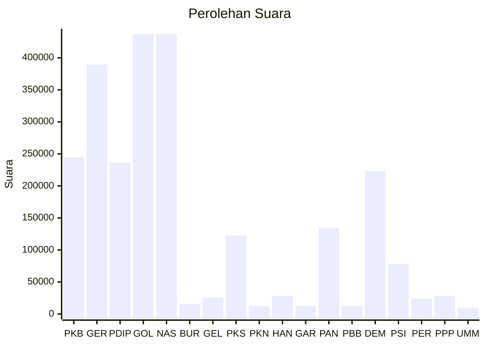

# Hasil

Wilayah **SUMATERA SELATAN**

## Grafik

## Tabel

| No. | Nama Partai                           | Suara   | Suara (raw) | Persentase |
|:--- |:------------------------------------- | -------:| -----------:| ----------:|
| 1   | Partai Kebangkitan Bangsa             | 244.765 | 244765      | 9,90       |
| 2   | Partai Gerakan Indonesia Raya         | 389.480 | 389480      | 15,75      |
| 3   | Partai Demokrasi Indonesia Perjuangan | 236.451 | 236451      | 9,56       |
| 4   | Partai Golongan Karya                 | 436.778 | 436778      | 17,67      |
| 5   | Partai NasDem                         | 436.820 | 436820      | 17,67      |
| 6   | Partai Buruh                          | 15.926  | 15926       | 0,64       |
| 7   | Partai Gelombang Rakyat Indonesia     | 25.831  | 25831       | 1,04       |
| 8   | Partai Keadilan Sejahtera             | 122.503 | 122503      | 4,96       |
| 9   | Partai Kebangkitan Nusantara          | 12.093  | 12093       | 0,49       |
| 10  | Partai Hati Nurani Rakyat             | 28.093  | 28093       | 1,14       |
| 11  | Partai Garda Republik Indonesia       | 12.594  | 12594       | 0,51       |
| 12  | Partai Amanat Nasional                | 134.591 | 134591      | 5,44       |
| 13  | Partai Bulan Bintang                  | 12.947  | 12947       | 0,52       |
| 14  | Partai Demokrat                       | 223.049 | 223049      | 9,02       |
| 15  | Partai Solidaritas Indonesia          | 78.340  | 78340       | 3,17       |
| 16  | PARTAI PERINDO                        | 23.910  | 23910       | 0,97       |
| 17  | Partai Persatuan Pembangunan          | 28.420  | 28420       | 1,15       |
| 24  | Partai Ummat                          | 9.626   | 9626        | 0,39       |

## Metadata

| Key             | Value   |
| --------------- | ------- |
| Tipe Pemilu     | Reguler |
| Persentase      | 69,72   |
| Status Progress | On      |

