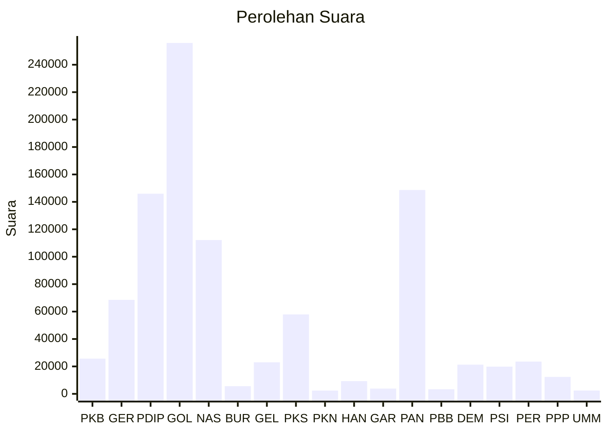

# Hasil

Wilayah **BENGKULU**

## Grafik

## Tabel

| No. | Nama Partai                           | Suara   | Suara (raw) | Persentase |
|:--- |:------------------------------------- | -------:| -----------:| ----------:|
| 1   | Partai Kebangkitan Bangsa             | 25.656  | 25656       | 2,72       |
| 2   | Partai Gerakan Indonesia Raya         | 68.533  | 68533       | 7,28       |
| 3   | Partai Demokrasi Indonesia Perjuangan | 145.952 | 145952      | 15,50      |
| 4   | Partai Golongan Karya                 | 255.921 | 255921      | 27,17      |
| 5   | Partai NasDem                         | 112.171 | 112171      | 11,91      |
| 6   | Partai Buruh                          | 5.606   | 5606        | 0,60       |
| 7   | Partai Gelombang Rakyat Indonesia     | 23.019  | 23019       | 2,44       |
| 8   | Partai Keadilan Sejahtera             | 57.940  | 57940       | 6,15       |
| 9   | Partai Kebangkitan Nusantara          | 2.368   | 2368        | 0,25       |
| 10  | Partai Hati Nurani Rakyat             | 9.269   | 9269        | 0,98       |
| 11  | Partai Garda Republik Indonesia       | 3.838   | 3838        | 0,41       |
| 12  | Partai Amanat Nasional                | 148.668 | 148668      | 15,79      |
| 13  | Partai Bulan Bintang                  | 3.347   | 3347        | 0,36       |
| 14  | Partai Demokrat                       | 21.287  | 21287       | 2,26       |
| 15  | Partai Solidaritas Indonesia          | 19.868  | 19868       | 2,11       |
| 16  | PARTAI PERINDO                        | 23.517  | 23517       | 2,50       |
| 17  | Partai Persatuan Pembangunan          | 12.386  | 12386       | 1,32       |
| 24  | Partai Ummat                          | 2.421   | 2421        | 0,26       |

## Metadata

| Key             | Value   |
| --------------- | ------- |
| Tipe Pemilu     | Reguler |
| Persentase      | 88,20   |
| Status Progress | On      |

