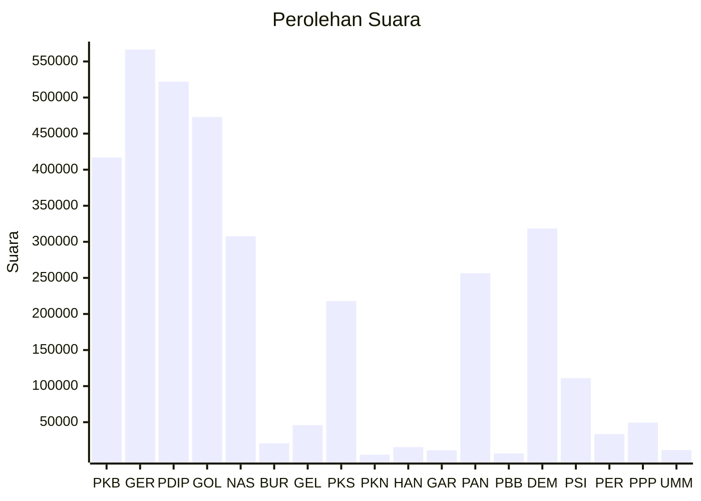

# Hasil

Wilayah **LAMPUNG**

## Grafik

## Tabel

| No. | Nama Partai                           | Suara   | Suara (raw) | Persentase |
|:--- |:------------------------------------- | -------:| -----------:| ----------:|
| 1   | Partai Kebangkitan Bangsa             | 416.844 | 416844      | 12,30      |
| 2   | Partai Gerakan Indonesia Raya         | 566.541 | 566541      | 16,72      |
| 3   | Partai Demokrasi Indonesia Perjuangan | 522.017 | 522017      | 15,40      |
| 4   | Partai Golongan Karya                 | 472.985 | 472985      | 13,96      |
| 5   | Partai NasDem                         | 307.732 | 307732      | 9,08       |
| 6   | Partai Buruh                          | 20.623  | 20623       | 0,61       |
| 7   | Partai Gelombang Rakyat Indonesia     | 45.931  | 45931       | 1,36       |
| 8   | Partai Keadilan Sejahtera             | 217.873 | 217873      | 6,43       |
| 9   | Partai Kebangkitan Nusantara          | 4.991   | 4991        | 0,15       |
| 10  | Partai Hati Nurani Rakyat             | 15.494  | 15494       | 0,46       |
| 11  | Partai Garda Republik Indonesia       | 10.866  | 10866       | 0,32       |
| 12  | Partai Amanat Nasional                | 256.452 | 256452      | 7,57       |
| 13  | Partai Bulan Bintang                  | 6.618   | 6618        | 0,20       |
| 14  | Partai Demokrat                       | 318.553 | 318553      | 9,40       |
| 15  | Partai Solidaritas Indonesia          | 111.105 | 111105      | 3,28       |
| 16  | PARTAI PERINDO                        | 33.589  | 33589       | 0,99       |
| 17  | Partai Persatuan Pembangunan          | 49.513  | 49513       | 1,46       |
| 24  | Partai Ummat                          | 11.520  | 11520       | 0,34       |

## Metadata

| Key             | Value   |
| --------------- | ------- |
| Tipe Pemilu     | Reguler |
| Persentase      | 84,64   |
| Status Progress | On      |

