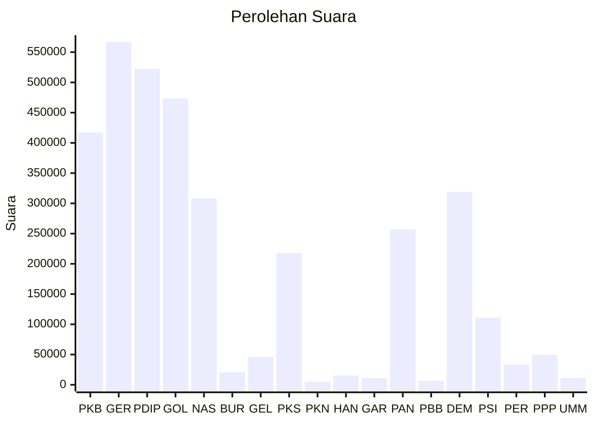

# Hasil

Wilayah **LAMPUNG**

## Grafik

## Tabel

| No. | Nama Partai                           | Suara   | Suara (raw) | Persentase |
|:--- |:------------------------------------- | -------:| -----------:| ----------:|
| 1   | Partai Kebangkitan Bangsa             | 417.245 | 417245      | 12,30      |
| 2   | Partai Gerakan Indonesia Raya         | 566.956 | 566956      | 16,72      |
| 3   | Partai Demokrasi Indonesia Perjuangan | 522.407 | 522407      | 15,40      |
| 4   | Partai Golongan Karya                 | 473.318 | 473318      | 13,96      |
| 5   | Partai NasDem                         | 307.861 | 307861      | 9,08       |
| 6   | Partai Buruh                          | 20.644  | 20644       | 0,61       |
| 7   | Partai Gelombang Rakyat Indonesia     | 45.946  | 45946       | 1,35       |
| 8   | Partai Keadilan Sejahtera             | 217.947 | 217947      | 6,43       |
| 9   | Partai Kebangkitan Nusantara          | 4.993   | 4993        | 0,15       |
| 10  | Partai Hati Nurani Rakyat             | 15.500  | 15500       | 0,46       |
| 11  | Partai Garda Republik Indonesia       | 10.874  | 10874       | 0,32       |
| 12  | Partai Amanat Nasional                | 256.779 | 256779      | 7,57       |
| 13  | Partai Bulan Bintang                  | 6.619   | 6619        | 0,20       |
| 14  | Partai Demokrat                       | 318.787 | 318787      | 9,40       |
| 15  | Partai Solidaritas Indonesia          | 111.163 | 111163      | 3,28       |
| 16  | PARTAI PERINDO                        | 33.597  | 33597       | 0,99       |
| 17  | Partai Persatuan Pembangunan          | 49.536  | 49536       | 1,46       |
| 24  | Partai Ummat                          | 11.528  | 11528       | 0,34       |

## Metadata

| Key             | Value   |
| --------------- | ------- |
| Tipe Pemilu     | Reguler |
| Persentase      | 84,71   |
| Status Progress | On      |

