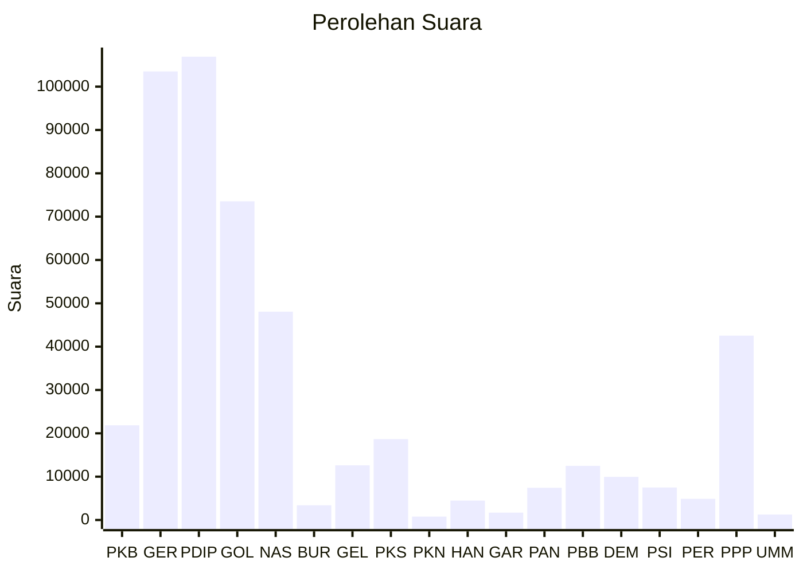

# Hasil

Wilayah **KEPULAUAN BANGKA BELITUNG**

## Grafik

## Tabel

| No. | Nama Partai                           | Suara   | Suara (raw) | Persentase |
|:--- |:------------------------------------- | -------:| -----------:| ----------:|
| 1   | Partai Kebangkitan Bangsa             | 21.862  | 21862       | 4,54       |
| 2   | Partai Gerakan Indonesia Raya         | 103.508 | 103508      | 21,49      |
| 3   | Partai Demokrasi Indonesia Perjuangan | 106.923 | 106923      | 22,20      |
| 4   | Partai Golongan Karya                 | 73.541  | 73541       | 15,27      |
| 5   | Partai NasDem                         | 48.071  | 48071       | 9,98       |
| 6   | Partai Buruh                          | 3.399   | 3399        | 0,71       |
| 7   | Partai Gelombang Rakyat Indonesia     | 12.612  | 12612       | 2,62       |
| 8   | Partai Keadilan Sejahtera             | 18.676  | 18676       | 3,88       |
| 9   | Partai Kebangkitan Nusantara          | 785     | 785         | 0,16       |
| 10  | Partai Hati Nurani Rakyat             | 4.479   | 4479        | 0,93       |
| 11  | Partai Garda Republik Indonesia       | 1.694   | 1694        | 0,35       |
| 12  | Partai Amanat Nasional                | 7.443   | 7443        | 1,55       |
| 13  | Partai Bulan Bintang                  | 12.502  | 12502       | 2,60       |
| 14  | Partai Demokrat                       | 9.952   | 9952        | 2,07       |
| 15  | Partai Solidaritas Indonesia          | 7.509   | 7509        | 1,56       |
| 16  | PARTAI PERINDO                        | 4.883   | 4883        | 1,01       |
| 17  | Partai Persatuan Pembangunan          | 42.546  | 42546       | 8,83       |
| 24  | Partai Ummat                          | 1.268   | 1268        | 0,26       |

## Metadata

| Key             | Value   |
| --------------- | ------- |
| Tipe Pemilu     | Reguler |
| Persentase      | 75,56   |
| Status Progress | On      |

