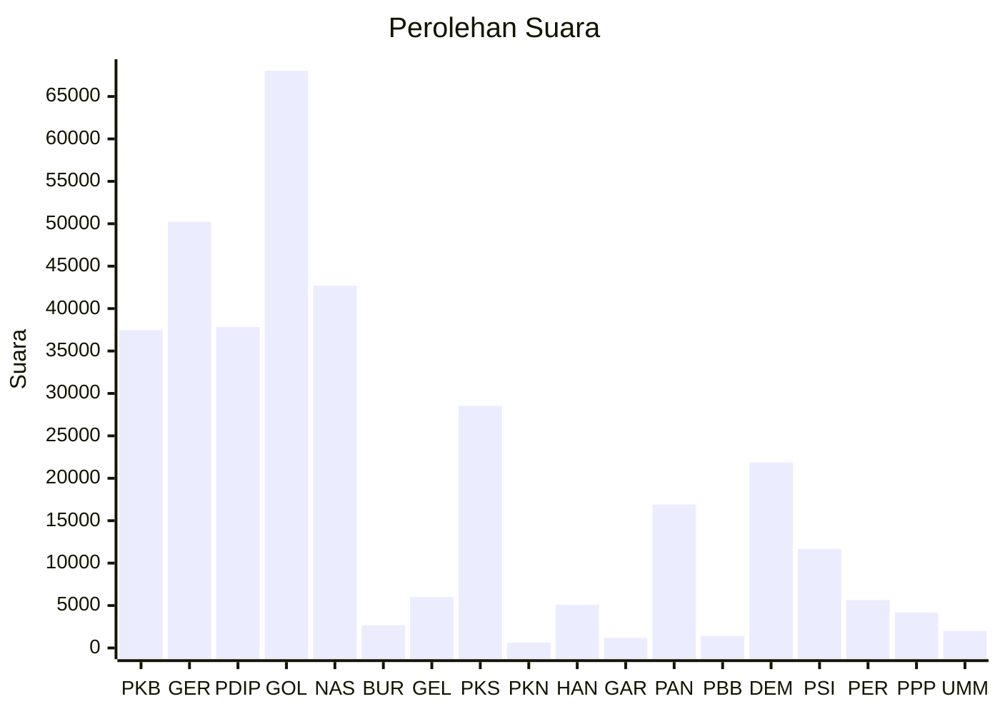

# Hasil

Wilayah **KEPULAUAN RIAU**

## Grafik

## Tabel

| No. | Nama Partai                           | Suara  | Suara (raw) | Persentase |
|:--- |:------------------------------------- | ------:| -----------:| ----------:|
| 1   | Partai Kebangkitan Bangsa             | 37.466 | 37466       | 10,89      |
| 2   | Partai Gerakan Indonesia Raya         | 50.222 | 50222       | 14,60      |
| 3   | Partai Demokrasi Indonesia Perjuangan | 37.839 | 37839       | 11,00      |
| 4   | Partai Golongan Karya                 | 68.053 | 68053       | 19,78      |
| 5   | Partai NasDem                         | 42.700 | 42700       | 12,41      |
| 6   | Partai Buruh                          | 2.670  | 2670        | 0,78       |
| 7   | Partai Gelombang Rakyat Indonesia     | 5.998  | 5998        | 1,74       |
| 8   | Partai Keadilan Sejahtera             | 28.537 | 28537       | 8,29       |
| 9   | Partai Kebangkitan Nusantara          | 613    | 613         | 0,18       |
| 10  | Partai Hati Nurani Rakyat             | 5.080  | 5080        | 1,48       |
| 11  | Partai Garda Republik Indonesia       | 1.185  | 1185        | 0,34       |
| 12  | Partai Amanat Nasional                | 16.903 | 16903       | 4,91       |
| 13  | Partai Bulan Bintang                  | 1.416  | 1416        | 0,41       |
| 14  | Partai Demokrat                       | 21.887 | 21887       | 6,36       |
| 15  | Partai Solidaritas Indonesia          | 11.692 | 11692       | 3,40       |
| 16  | PARTAI PERINDO                        | 5.650  | 5650        | 1,64       |
| 17  | Partai Persatuan Pembangunan          | 4.189  | 4189        | 1,22       |
| 24  | Partai Ummat                          | 2.002  | 2002        | 0,58       |

## Metadata

| Key             | Value   |
| --------------- | ------- |
| Tipe Pemilu     | Reguler |
| Persentase      | 48,14   |
| Status Progress | On      |

