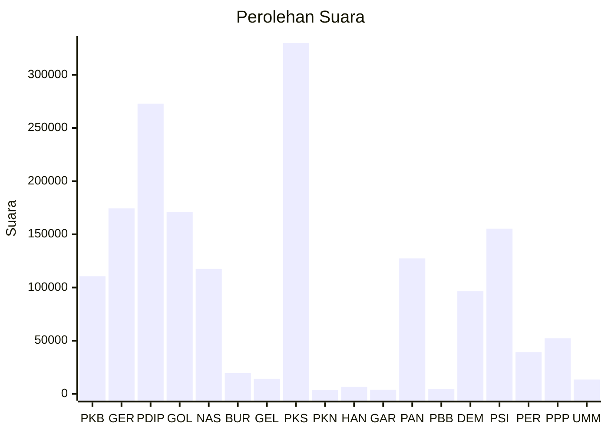

# Hasil

Wilayah **DKI JAKARTA**

## Grafik

## Tabel

| No. | Nama Partai                           | Suara   | Suara (raw) | Persentase |
|:--- |:------------------------------------- | -------:| -----------:| ----------:|
| 1   | Partai Kebangkitan Bangsa             | 110.637 | 110637      | 6,46       |
| 2   | Partai Gerakan Indonesia Raya         | 174.408 | 174408      | 10,18      |
| 3   | Partai Demokrasi Indonesia Perjuangan | 272.956 | 272956      | 15,93      |
| 4   | Partai Golongan Karya                 | 171.101 | 171101      | 9,98       |
| 5   | Partai NasDem                         | 117.504 | 117504      | 6,86       |
| 6   | Partai Buruh                          | 19.373  | 19373       | 1,13       |
| 7   | Partai Gelombang Rakyat Indonesia     | 14.173  | 14173       | 0,83       |
| 8   | Partai Keadilan Sejahtera             | 330.068 | 330068      | 19,26      |
| 9   | Partai Kebangkitan Nusantara          | 3.843   | 3843        | 0,22       |
| 10  | Partai Hati Nurani Rakyat             | 6.743   | 6743        | 0,39       |
| 11  | Partai Garda Republik Indonesia       | 3.930   | 3930        | 0,23       |
| 12  | Partai Amanat Nasional                | 127.402 | 127402      | 7,43       |
| 13  | Partai Bulan Bintang                  | 4.663   | 4663        | 0,27       |
| 14  | Partai Demokrat                       | 96.478  | 96478       | 5,63       |
| 15  | Partai Solidaritas Indonesia          | 155.409 | 155409      | 9,07       |
| 16  | PARTAI PERINDO                        | 39.267  | 39267       | 2,29       |
| 17  | Partai Persatuan Pembangunan          | 52.287  | 52287       | 3,05       |
| 24  | Partai Ummat                          | 13.470  | 13470       | 0,79       |

## Metadata

| Key             | Value   |
| --------------- | ------- |
| Tipe Pemilu     | Reguler |
| Persentase      | 55,90   |
| Status Progress | On      |

