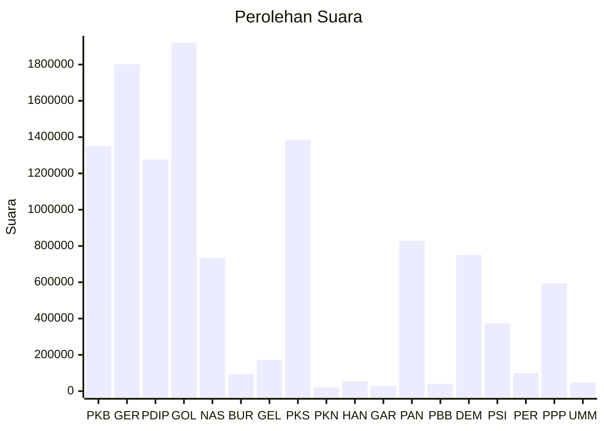

# Hasil

Wilayah **JAWA BARAT**

## Grafik

## Tabel

| No. | Nama Partai                           | Suara     | Suara (raw) | Persentase |
|:--- |:------------------------------------- | ---------:| -----------:| ----------:|
| 1   | Partai Kebangkitan Bangsa             | 1.351.345 | 1351345     | 11,67      |
| 2   | Partai Gerakan Indonesia Raya         | 1.802.148 | 1802148     | 15,57      |
| 3   | Partai Demokrasi Indonesia Perjuangan | 1.275.974 | 1275974     | 11,02      |
| 4   | Partai Golongan Karya                 | 1.920.858 | 1920858     | 16,59      |
| 5   | Partai NasDem                         | 735.325   | 735325      | 6,35       |
| 6   | Partai Buruh                          | 93.604    | 93604       | 0,81       |
| 7   | Partai Gelombang Rakyat Indonesia     | 172.038   | 172038      | 1,49       |
| 8   | Partai Keadilan Sejahtera             | 1.385.201 | 1385201     | 11,96      |
| 9   | Partai Kebangkitan Nusantara          | 20.308    | 20308       | 0,18       |
| 10  | Partai Hati Nurani Rakyat             | 54.461    | 54461       | 0,47       |
| 11  | Partai Garda Republik Indonesia       | 29.085    | 29085       | 0,25       |
| 12  | Partai Amanat Nasional                | 829.787   | 829787      | 7,17       |
| 13  | Partai Bulan Bintang                  | 40.917    | 40917       | 0,35       |
| 14  | Partai Demokrat                       | 750.655   | 750655      | 6,48       |
| 15  | Partai Solidaritas Indonesia          | 374.059   | 374059      | 3,23       |
| 16  | PARTAI PERINDO                        | 99.276    | 99276       | 0,86       |
| 17  | Partai Persatuan Pembangunan          | 595.373   | 595373      | 5,14       |
| 24  | Partai Ummat                          | 46.978    | 46978       | 0,41       |

## Metadata

| Key             | Value   |
| --------------- | ------- |
| Tipe Pemilu     | Reguler |
| Persentase      | 61,16   |
| Status Progress | On      |

