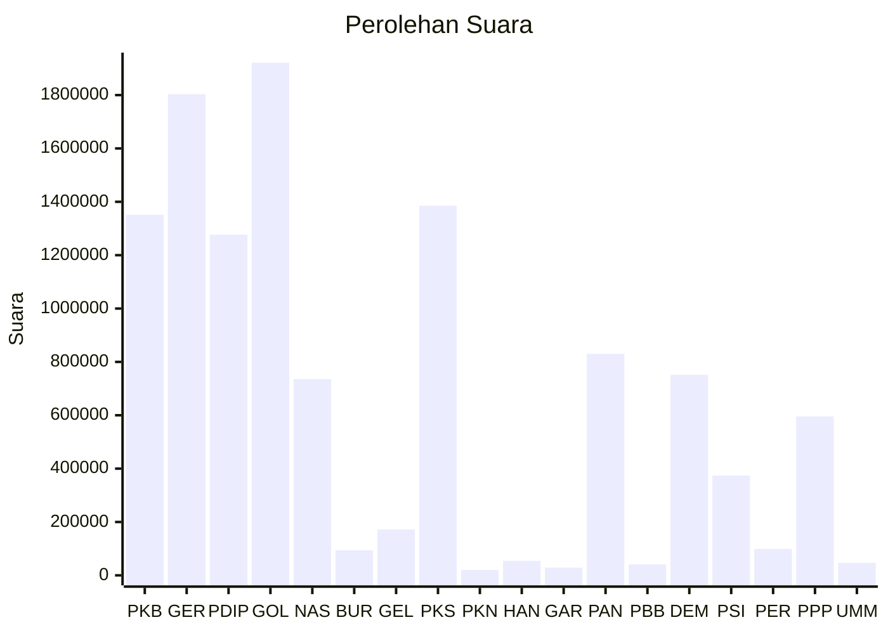

# Hasil

Wilayah **JAWA BARAT**

## Grafik

## Tabel

| No. | Nama Partai                           | Suara     | Suara (raw) | Persentase |
|:--- |:------------------------------------- | ---------:| -----------:| ----------:|
| 1   | Partai Kebangkitan Bangsa             | 1.351.900 | 1351900     | 11,67      |
| 2   | Partai Gerakan Indonesia Raya         | 1.803.280 | 1803280     | 15,57      |
| 3   | Partai Demokrasi Indonesia Perjuangan | 1.276.823 | 1276823     | 11,02      |
| 4   | Partai Golongan Karya                 | 1.921.462 | 1921462     | 16,59      |
| 5   | Partai NasDem                         | 735.808   | 735808      | 6,35       |
| 6   | Partai Buruh                          | 93.645    | 93645       | 0,81       |
| 7   | Partai Gelombang Rakyat Indonesia     | 172.087   | 172087      | 1,49       |
| 8   | Partai Keadilan Sejahtera             | 1.385.586 | 1385586     | 11,96      |
| 9   | Partai Kebangkitan Nusantara          | 20.317    | 20317       | 0,18       |
| 10  | Partai Hati Nurani Rakyat             | 54.522    | 54522       | 0,47       |
| 11  | Partai Garda Republik Indonesia       | 29.104    | 29104       | 0,25       |
| 12  | Partai Amanat Nasional                | 830.211   | 830211      | 7,17       |
| 13  | Partai Bulan Bintang                  | 40.924    | 40924       | 0,35       |
| 14  | Partai Demokrat                       | 751.480   | 751480      | 6,49       |
| 15  | Partai Solidaritas Indonesia          | 374.097   | 374097      | 3,23       |
| 16  | PARTAI PERINDO                        | 99.310    | 99310       | 0,86       |
| 17  | Partai Persatuan Pembangunan          | 595.714   | 595714      | 5,14       |
| 24  | Partai Ummat                          | 46.989    | 46989       | 0,41       |

## Metadata

| Key             | Value   |
| --------------- | ------- |
| Tipe Pemilu     | Reguler |
| Persentase      | 61,19   |
| Status Progress | On      |

