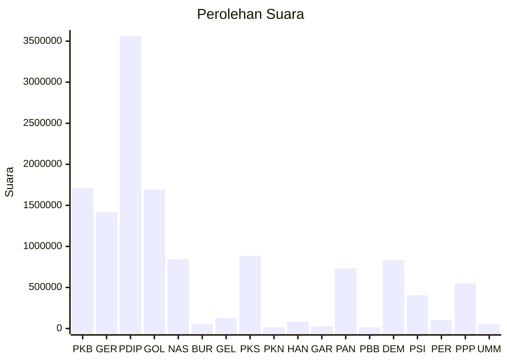

# Hasil

Wilayah **JAWA TENGAH**

## Grafik

## Tabel

| No. | Nama Partai                           | Suara     | Suara (raw) | Persentase |
|:--- |:------------------------------------- | ---------:| -----------:| ----------:|
| 1   | Partai Kebangkitan Bangsa             | 1.710.538 | 1710538     | 13,04      |
| 2   | Partai Gerakan Indonesia Raya         | 1.419.378 | 1419378     | 10,82      |
| 3   | Partai Demokrasi Indonesia Perjuangan | 3.565.385 | 3565385     | 27,18      |
| 4   | Partai Golongan Karya                 | 1.693.731 | 1693731     | 12,91      |
| 5   | Partai NasDem                         | 843.266   | 843266      | 6,43       |
| 6   | Partai Buruh                          | 52.476    | 52476       | 0,40       |
| 7   | Partai Gelombang Rakyat Indonesia     | 129.171   | 129171      | 0,98       |
| 8   | Partai Keadilan Sejahtera             | 885.962   | 885962      | 6,75       |
| 9   | Partai Kebangkitan Nusantara          | 15.160    | 15160       | 0,12       |
| 10  | Partai Hati Nurani Rakyat             | 84.626    | 84626       | 0,65       |
| 11  | Partai Garda Republik Indonesia       | 26.253    | 26253       | 0,20       |
| 12  | Partai Amanat Nasional                | 731.638   | 731638      | 5,58       |
| 13  | Partai Bulan Bintang                  | 16.468    | 16468       | 0,13       |
| 14  | Partai Demokrat                       | 834.093   | 834093      | 6,36       |
| 15  | Partai Solidaritas Indonesia          | 405.336   | 405336      | 3,09       |
| 16  | PARTAI PERINDO                        | 101.777   | 101777      | 0,78       |
| 17  | Partai Persatuan Pembangunan          | 548.774   | 548774      | 4,18       |
| 24  | Partai Ummat                          | 54.223    | 54223       | 0,41       |

## Metadata

| Key             | Value   |
| --------------- | ------- |
| Tipe Pemilu     | Reguler |
| Persentase      | 76,45   |
| Status Progress | On      |

