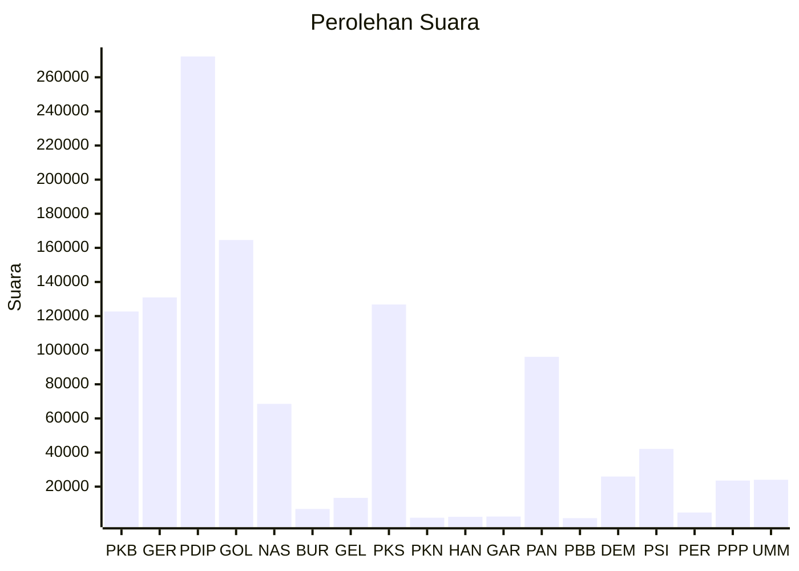

# Hasil

Wilayah **DI YOGYAKARTA**

## Grafik

## Tabel

| No. | Nama Partai                           | Suara   | Suara (raw) | Persentase |
|:--- |:------------------------------------- | -------:| -----------:| ----------:|
| 1   | Partai Kebangkitan Bangsa             | 122.708 | 122708      | 10,85      |
| 2   | Partai Gerakan Indonesia Raya         | 130.942 | 130942      | 11,58      |
| 3   | Partai Demokrasi Indonesia Perjuangan | 272.217 | 272217      | 24,07      |
| 4   | Partai Golongan Karya                 | 164.617 | 164617      | 14,56      |
| 5   | Partai NasDem                         | 68.514  | 68514       | 6,06       |
| 6   | Partai Buruh                          | 6.910   | 6910        | 0,61       |
| 7   | Partai Gelombang Rakyat Indonesia     | 13.438  | 13438       | 1,19       |
| 8   | Partai Keadilan Sejahtera             | 126.807 | 126807      | 11,21      |
| 9   | Partai Kebangkitan Nusantara          | 1.777   | 1777        | 0,16       |
| 10  | Partai Hati Nurani Rakyat             | 2.308   | 2308        | 0,20       |
| 11  | Partai Garda Republik Indonesia       | 2.493   | 2493        | 0,22       |
| 12  | Partai Amanat Nasional                | 96.113  | 96113       | 8,50       |
| 13  | Partai Bulan Bintang                  | 1.507   | 1507        | 0,13       |
| 14  | Partai Demokrat                       | 25.930  | 25930       | 2,29       |
| 15  | Partai Solidaritas Indonesia          | 42.093  | 42093       | 3,72       |
| 16  | PARTAI PERINDO                        | 4.825   | 4825        | 0,43       |
| 17  | Partai Persatuan Pembangunan          | 23.544  | 23544       | 2,08       |
| 24  | Partai Ummat                          | 24.033  | 24033       | 2,13       |

## Metadata

| Key             | Value   |
| --------------- | ------- |
| Tipe Pemilu     | Reguler |
| Persentase      | 67,74   |
| Status Progress | On      |

