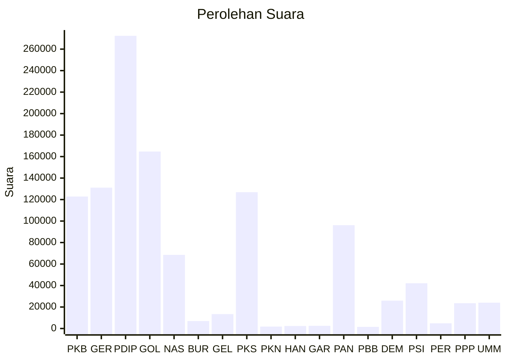

# Hasil

Wilayah **DI YOGYAKARTA**

## Grafik

## Tabel

| No. | Nama Partai                           | Suara   | Suara (raw) | Persentase |
|:--- |:------------------------------------- | -------:| -----------:| ----------:|
| 1   | Partai Kebangkitan Bangsa             | 122.845 | 122845      | 10,86      |
| 2   | Partai Gerakan Indonesia Raya         | 131.070 | 131070      | 11,58      |
| 3   | Partai Demokrasi Indonesia Perjuangan | 272.413 | 272413      | 24,07      |
| 4   | Partai Golongan Karya                 | 164.691 | 164691      | 14,55      |
| 5   | Partai NasDem                         | 68.530  | 68530       | 6,06       |
| 6   | Partai Buruh                          | 6.914   | 6914        | 0,61       |
| 7   | Partai Gelombang Rakyat Indonesia     | 13.445  | 13445       | 1,19       |
| 8   | Partai Keadilan Sejahtera             | 126.897 | 126897      | 11,21      |
| 9   | Partai Kebangkitan Nusantara          | 1.777   | 1777        | 0,16       |
| 10  | Partai Hati Nurani Rakyat             | 2.309   | 2309        | 0,20       |
| 11  | Partai Garda Republik Indonesia       | 2.499   | 2499        | 0,22       |
| 12  | Partai Amanat Nasional                | 96.129  | 96129       | 8,50       |
| 13  | Partai Bulan Bintang                  | 1.512   | 1512        | 0,13       |
| 14  | Partai Demokrat                       | 25.938  | 25938       | 2,29       |
| 15  | Partai Solidaritas Indonesia          | 42.120  | 42120       | 3,72       |
| 16  | PARTAI PERINDO                        | 4.827   | 4827        | 0,43       |
| 17  | Partai Persatuan Pembangunan          | 23.563  | 23563       | 2,08       |
| 24  | Partai Ummat                          | 24.041  | 24041       | 2,12       |

## Metadata

| Key             | Value   |
| --------------- | ------- |
| Tipe Pemilu     | Reguler |
| Persentase      | 67,91   |
| Status Progress | On      |

